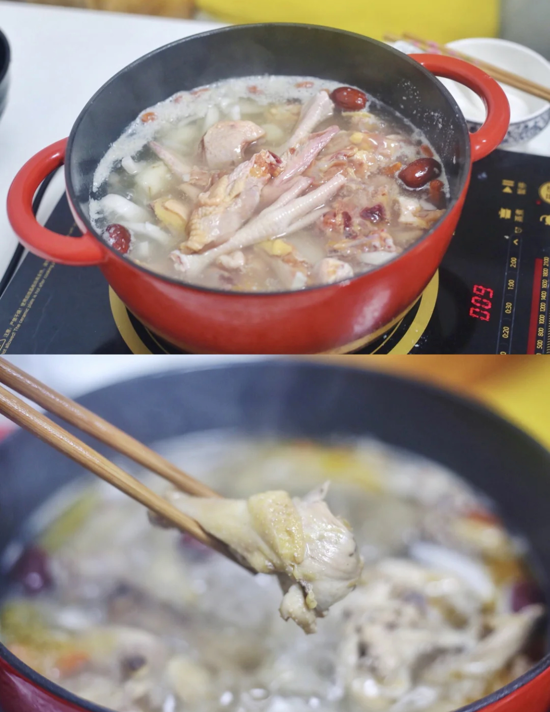
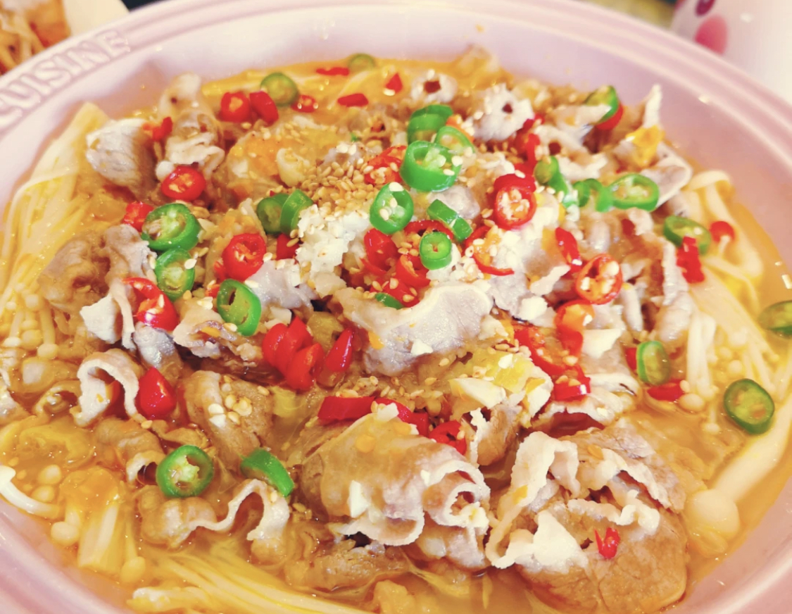
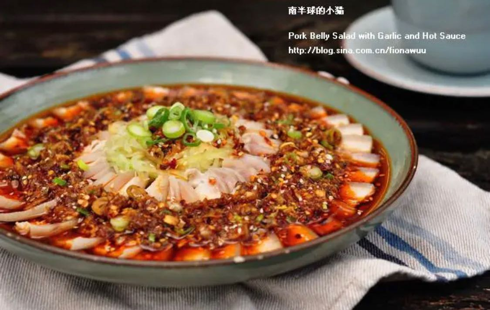
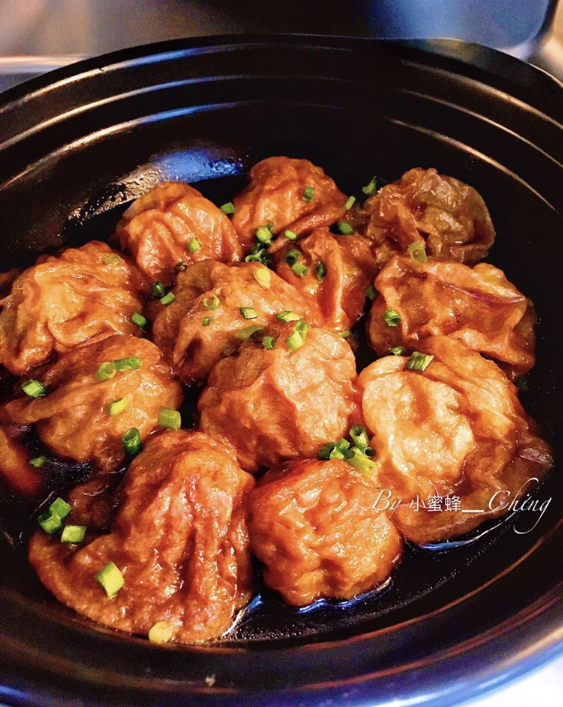

# Menu of Friday's dinner

## if go to Shovel's place
1. 红烧肉 Pork belly
2. 椰子鸡 
   + Chicken boiled by Coconut water. 
   + Eat with soy sauce. 
   + Can be a hot pot
   + Sweet (main) & salty 

3. Desert: 桂花糖藕
   + Put sticky rice in lotus root
   + Boiled with brown sugar
   + Drizzle with osmanthus syrup  

4. Drink: 柠檬水
   + Speical lemon tea
   + *May not be done due to lack of juicer*

## If in my/Chef's place
5. 金汤肥牛 (one of my favorite)
    + Beef slice with vegetables
    + sour, salty, a bit spicy

6. 蒜泥白肉
    + Pork belly with garlic sauce
    + Looks spicy but not really

7. 包菜粉丝
    + fried cabbage with bean noodle  
8. 油面筋塞肉
    + Put meat inside something like tofu

