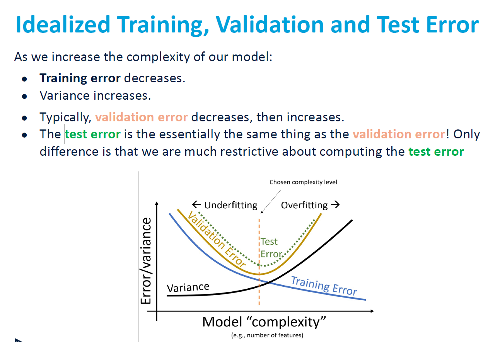
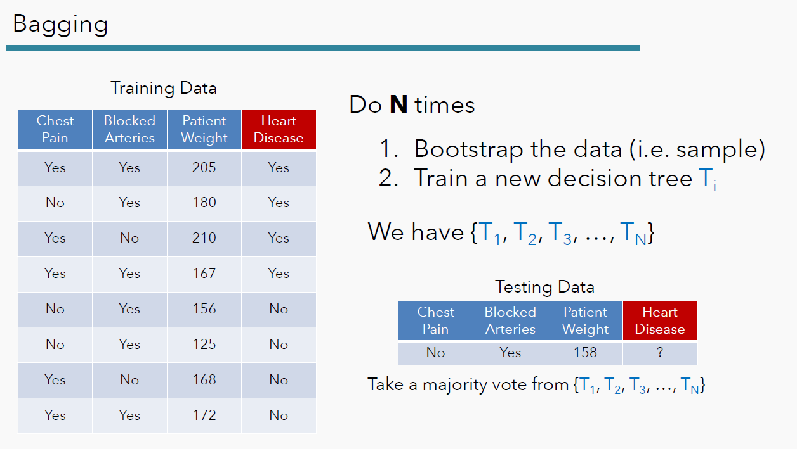
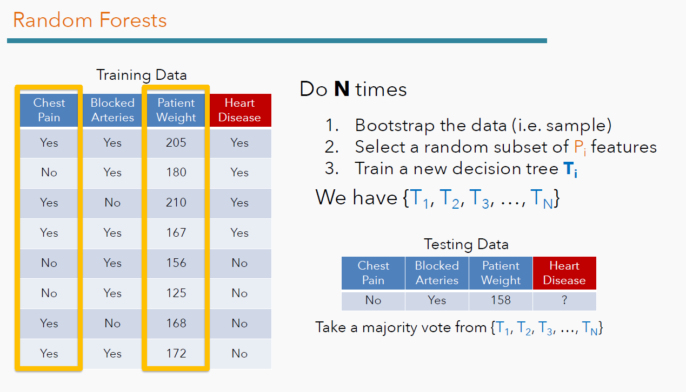
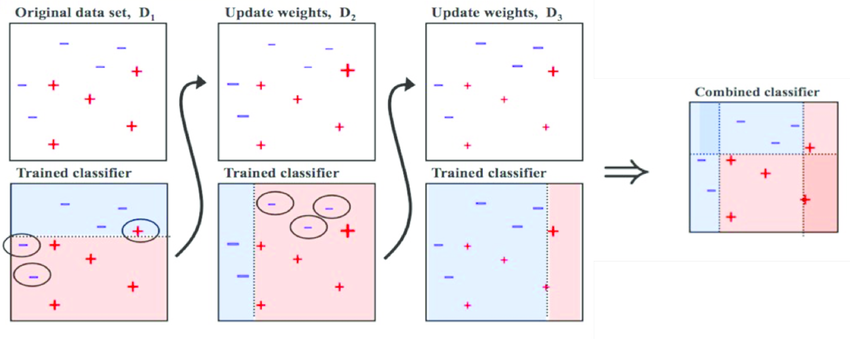
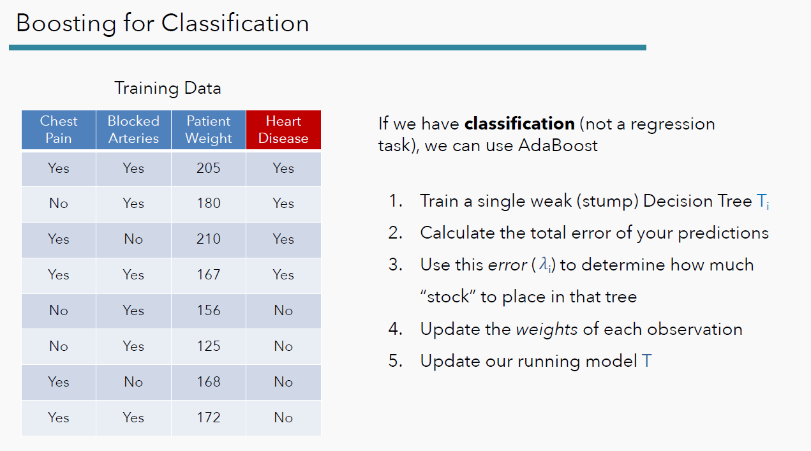
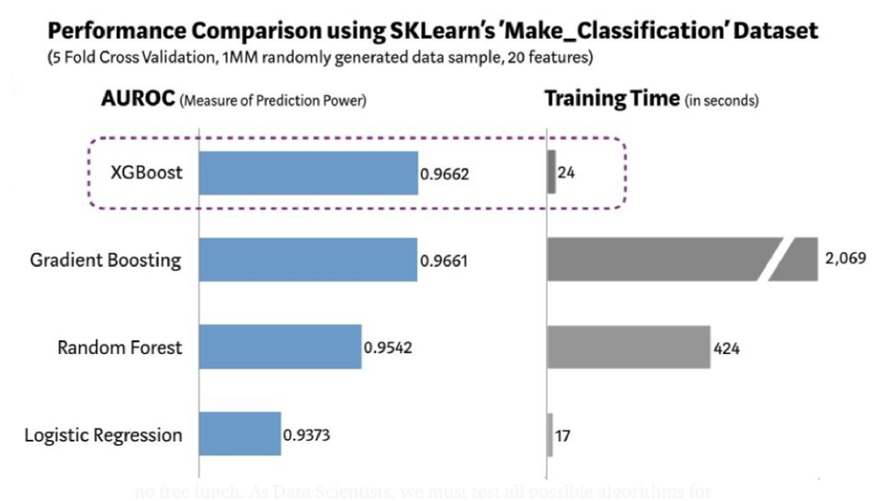

# Chapter 1: Exploratory Data Analysis & Effective Visualizations

## Data science lifecycle
1. Question/Problem Formulation
2. Data acquisition习得 and cleaning
3. Exploratory Data Analysis (EDA)
4. Prediction and Inference
5. Communicate and Visualize

## EDA & Visualizations
+ Key data properties in EDA:
  + Structure: the “shape” of a data file
  + Granularity颗粒度: how fine/coarse is each datum
  + Scope: how (in)complete is the data
  + Temporality: how is the data situated in time
  + Faithfulness: how well does the data capture “reality”
+ Missing/Default values
  + Ignore the records: probably most common
  + Fill in the missing value manually
  + Fill in it automatically with: global constant/mean/mean for all records belonging to the same group/the most probable value
+ EDA:
  + Examine data and metadata
  + Examine each field/attribute/dimension/column individually
  + Examine pairs of related dimensions (e.g. correlations)
  + Along the way:
    + Visualize/summarize the data
    + Validate assumptions about data and collection
    + Identify and address anomalies
    + Apply data transformations and corrections
    + RECORD EVERYTHING YOU DO

## Visualization
+ Identify hidden patterns and trends
+ Formulate/test hypotheses
+ Communicate any modeling results
  + Present information and ideas succinctly
  + Provide evidence and support
  + Influence and persuade
+ Determine the next step in analysis/modeling

### Effective visualizations
1. Have graphical integrity
   + Show data variation, not design variation
   + Clear, detailed and thorough labeling and appropriate scales
   + Plot all the data
   + Be proportional (Problems: scale distortions比例不对)
2. Keep it simple…enough
   + Size of the graphic effect should be directly proportional to the numerical quantities (“lie factor”)
   + Maximize data-ink ratio 
3. Use sensible design
   + Use color strategically
    +  For quantitative variables: Do not use color
    +  For ordinal data: Try varying luminance & saturation
    +  For categorical data: Do not use more than 5-8 colors
   + Avoid Rainbow Colors
   + Color blindness
4. Use the right display
   + **Distribution**: how a variable or variables in the dataset distribute over a range of possible values
   + **Relationship**: how the values of multiple variables in the dataset relate
   + **Composition**: how the dataset breaks down into subgroups
   + **Comparison**: how trends in multiple variable or datasets
compare

## Summary
+ Reality check on your dataset
+ Per variable:
  - Consistency check, missing data, outliers, noise…
  - Histograms, barplots, boxplots, etc.
  - Transformations possible
+ Per pairs of variables (or more):
  - Associations (conditional tables)
  - Correlations (linearity check) for quantitative variables
+ Tell your story via scientific, verbal and visual means

# Data collection & Sampling on our way to probability distributions

## Key concepts in sampling
+ **Population**: The group that you want to learn something about
+ **Sampling frame**: The list from which the sample is drawn
+ **Sample**: A subset of the sampling frame (or who you actually end up sampling)

## Sampling from a finite population
+ A census (sample all the population) is great, but expensive and difficult to execute.
+ A sample is a subset of the population
  + Samples are often used to make **inferences about the population**
  + How you draw the sample will affect your accuracy
  + Two common sources of error:
    + chance error: random samples can vary from what is expected, in any direction.
    + bias: a systematic error in one direction

### *Not* random samples
+ A **convenience sample** is whoever you can get ahold of联系到.
  + Not a good idea for inference
  + Sources of bias can introduce themselves in ways you may not
think of
+ In a **quota sample**, you first specify your desired breakdown of various subgroups, and then reach those targets however you can
  + For example: you may want to sample individuals in your town, and you may want the age distribution of your sample to match that of your town’s census results.
  + But what about other characteristics, e.g. race, ethnicity

### Common Biases
Big samples are not always good, you need a representative sample!  
+ **Selection Bias**
  + Systematically excluding (or favoring) particular groups.
  + How to avoid: Examine the sampling frame and the method of sampling.
+ **Response Bias**
  + People don’t always respond truthfully.
  + How to avoid: Examine the nature of questions and the method of surveying
+ **Non-response Bias**
  + People don’t always respond
  + How to avoid: Keep your surveys short, and be persistent
  + People who don’t respond aren’t like the people who do!

## Statistical inference and hypothesis testing
+ An empirical distribution is a distribution that is based on observational data, e.g. think about your answers to a poll. It shows us values and proportions
+ A probability distribution would give us a model for how the sample is generated, e.g. think about what the polling of a student in class would be.
+ In short, empirical distributions show us "what it is" (or "was"), but probability distributions show us "what it could be"

# Modeling, Regression, Cross-validation, Regularization
+ Why do we build models?
  + Understanding complex phenomena occurring in the world
  + Make accurate predictions for unseen data

## The Modeling Process
1. Choose a model: How should we represent the world?
2. Choose a loss function: How do we quantify prediction error?
3. Fit the model: How do we choose the best parameters of our model given our data?
4. Evaluate model performance: How do we evaluate whether this process gave rise to a good model?

## Simple Linear Regression (SLR)
+ The **regression line** is the unique straight line that minimizes the **mean squared error** of estimation among all straight lines
  + regression line: $\hat{y} = \hat{a} + \hat{b}x$
  + $\hat{b} = r\frac{\sigma_y}{\sigma_x}$
  + $\hat{a} =  \hat{y}- \hat{b}x$
  + $e_o = y_i - \hat{y_i}$ Error for the i-th datapoint

### Loss functions
A loss function characterizes the cost, error, or fit resulting from a particular choice of model or model parameters.  
+ Loss quantifies how bad a prediction is for a single observation: $L(y, \hat{y})$
+ If our prediction $\hat{y}$ is **close** to the actual value y, we want **low loss**.
+ If our prediction $\hat{y}$ is **far** from the actual value y, we want **high loss**.

#### The choice of loss function:
+ Affects the accuracy and computational cost of estimation
+ Depends on the estimation/prediction task
  + quantitative or qualitative? Outliers? Are all errors equally costly? 

#### Common loss functions
+ Squared Loss(L2 Loss): $L(y, \hat{y}) = (y - \hat{y})^2$
+ Absolute Loss(L1 Loss): $L(y, \hat{y}) = |y - \hat{y}|$
+ In Linear Regression: L1: $L(y, \hat{y}) = (y - (a+bx))^2$

#### Empirical经验主义的 Risk is Average Loss over Data
+ We care about how bad our model’s predictions are for our
entire data set, not just for one point. A natural measure, then,
is of the** average loss** (aka **empirical risk**) across all points.
+ Given data $D = {(x_1,y_1), (x_2,y_2),...}$:
  + $R(\theta) = \frac{1}{n} \sum^n_{i=1}L(y_i, \hat{y_i})$
  + When using L1: Mean Absolute Error (MAE)
  + When using L2: Mean Squared Error (MSE)
+ **The average loss of a model tells us how well it fits the given data**. We want to find the parameter(s) that minimize average loss to best predict the data.

### Minimize MSE for SLR
+ MSE for SLE: $R(\theta) = \frac{1}{n} \sum^n_{i=1} (y - (a+bx_i))^2$
+ We can optimize this simplified objective with calculus
  + A function is minimized when the derivative is 0
  + Take the derivatives (partial for a and b) and do the math
  + Check **pdf** for the full proof (highly recommended)

### Evaluation: Checking a good linear model
+ $R^2$, Sum of Squared Residuals (SSR) or Mean Square Error (MSE) or Root Mean Squared Error (RMSE)
  + A lower {SSR,(R)MSE} indicates more “accurate” predictions (lower “average loss” across data)
+ Linearity checks: Plot original data, compute correlation, check for linearity
+ Check the residuals: Look at the residual plot of to visualize the difference between the $e_i = y_i \hat{y_i}$ actual and predicted values
+ Check your data: Outliers and/or high leverage points will affect the model
+ e.g.: A professor runs a regression to see how students’ exam scores (Y) are related to their homework grades (X). The R2 of the regression is 21%. What does R2 tell us?
  + 21% of the variation in the exam scores is explained by the regression analysis.

## Multiple Linear Regression
+ Define the multiple linear regression model:
+ $\hat{y} = \theta_0 + \theta_1 x_1 + ... + \theta_p x_p$
+ This is a linear model because it is a linear combination of parameters: $\theta = (\theta_0, \theta_1, ..., \theta_p)$
+ $(x_1,...,x_p) \rightarrow \theta = (\theta_0 ,\theta_1, ...,\theta_p) \rightarrow \hat{y}$
+ $\mathbf{\hat{Y} = X\theta}$
+ $\mathbf{\hat{Y}}$: Predication Vector,  $\mathbf{\theta}$: Parameter vector, $\mathbf{X}$: Design matrix

### The Modeling Process
1. Choose a model: Multiple Linear Regression $\mathbf{\hat{Y} = X\theta}$
2. Choose a loss function: L2 Loss MSE $R(\theta) = \frac{1}{n}||\mathbf{Y-X\theta}||^2_2$
3. Fit the model: $\hat{\theta} = (X^TX)^{-1}X^TY$ (Gradient Descent)
4. Evaluate model performance: Adjusted $R^2$, Visualize

## Feature Engineering
+ Feature engineering is the process of transforming the raw features (input) into more informative features that can be used in modeling or EDA tasks.
+ Feature engineering allows us to:
  + Capture domain knowledge (e.g. periodicity or relationships between features)
  + Express non-linear relationships using simple linear models
  + Encode non-numeric features to be used as inputs to models
    + Example: Using the gender or race of a person in a mode

## Cross-validation
+ The *bias* of the method is the error caused by the simplifying assumptions built into the method.
+ The *variance* of the method is how much the model will change based on the sampled data.
+ There is a trade-off between the bias and variance of a model.

### Detecting Overfitting
+ **Holdout Method**: We train our models on all 25/35 of the available data points. Then we evaluate the models’ performance on the remaining 10 data points.
  + Data used to train is called the “training set”.
  + Held out data is often called the “validation set” or “development set” or “dev set”. These terms are all synonymous and used by different authors.
+ As we increase the complexity of our model:
  + **Training error** decreases
  + Variance increases
  + Typically, **error on validation data** decreases, then increases
+ We pick the model complexity that minimizes validation set error

### Another view of the validation split
+ In machine learning, a hyperparameter is a value that controls the learning process itself.
+ To determine the quality of a particular hyperparameter:
  + **Train model** on **ONLY** the **training set**. **Quality** is model’s error on ONLY the **validation set**.

#### K-Fold Cross Validation
+ In the k-fold cross-validation approach, we shuffle our dataset and split it into k equally sized groups (often called folds).

## The problem of overfitting
+ Underfit: does not fit the training set well/ high bias
+ Just right: fits the training set pretty well / generalization
+ Overfit: fits the training set extremely well / high variance

### Addressing overfitting
+ Collect more training examples
+ Select features to include/exclude
  + Con: useful features could be lost
+ Regularization: Reduce the size(weight) of parameters $w_j$
+ Decrease the model complexity (lower variance)
+ Reduce the noise in the training data.

## Regularization: slides
+ Logistic regression with regularization parameter: Increasing $\lambda$ means more regularization
+ Decision tree with an upper limit on the number of nodes in the tree n: Higher n means less regularization.
+ Boosting with n number of iterations: Higher n means less regularization

## characteristics of a good regression model
+ relatively few predictor variables
+ a relatively high R2
+ relatively small p-values for the F- and t-statistics
+ a relatively low value of s (the standard deviation of the residuals)

# Classification
The parametric model $\hat{y} = f_\theta(x)$, uses a feature x to predict a response $\hat{y}$ (true response y).  

## Classification types
+ Binary classification: Responses y are either 0 or 1
+ Multiclass classification
+ Structured prediction tasks: E.g.:Examples: Translation, voice recognition

## Extra Contents:

### Decision Tree
Usually we say that the 'optimal' predictor is the one that creates a partition of data that the *error is minimized*. But what is an error?

Let's say we're building a classification tree by considering a list of predictors. In the Titanic example we want to be able to classify whether people have survived based on things like gender, age, the booked fare, etc. Let's call the variables $X_{i,p}$ ($i$ for passengers, $p$ for predictors). Initially, for the first split, we consider all the passengers and all the predictors. We also have an observed label $Y_i$ for each passenger. 

We can calculate the *mean error*, 
$$
ME = \frac{1}{N}\sum_{i=1}^N \ell(\hat{Y}_i, Y_i),
$$ 
where $\ell(\hat{Y}_i, Y_i)$ is the error for sample $i$. Here, the error would be 
* squared error for regression, *i.e.*, $\ell(\hat{Y}_i, Y_i) = (\hat{Y}_i - Y_i)^2$ and 
* either *Entropy* or *Gini impurity* for classification. See accompanying notebook for more info on e.g. how entropy works.

We want to achieve two things: pick the **best split** for the **best predictor**.

- At **each step** of the algorithm we consider a list of possible decisions or splits, *e.g.*, $X_{i,6} > 9$ (age is greater than 9), or $X_{i,5} = female$.
- For each possible decision we recalculate the predictor for that rule, for example $\hat{Y}_i = 1$ if $X_{i,6} > 9$ and $0$ otherwise.
- We recalculate the mean error for each possible decision
- We choose the decision that reduces the error by the largest amount.
- Then continue with the next step on the reduced input set.

In building decision trees, it is easy to overfit the data. There are several methods for avoiding this, which we'll discuss more below. Simple strategies include limiting the depth of a tree or only splitting when we have more than $N$ samples left. 

### Advantages of decision trees
* Decision trees are simple to explain and interpret
* There is a nice graphical display for trees
* Easy to handle categorical predictors (no dummy variables needed)

### Disadvantages of decision trees
* Decision trees generally don't have the predictive accuracy of other approaches as they tend to overfit the data. 
* Decision trees are non-robust, *i.e.*, sensitive to small changes in the data. They demonstrate high variance.

Both of these disadvantages are addressed by the following, more advanced methods. 

### Ensemble Methods based on Decision Trees
Ensemble Methods (Ensemble Learning) use multiple algorithms at the same time and then come to a consensus of a predictive label. 

Two main directions can be identified here (with many variations):

1. **Bagging** (Bootstrap Aggregating). The idea of [bagging](https://en.wikipedia.org/wiki/Bootstrap_aggregating) is to generate several trained models (e.g., decision trees) based on subsets of the data and let the decision trees vote to arrive at a prediction. Commonly the subset is chosen through bootstrapping, i.e., random sampling with replacement. Since averaging a set of observations reduces variance, this increases the predictive accuracy of the method. 

+ [**Boosting**](https://en.wikipedia.org/wiki/Boosting_(machine_learning)) is similar to bagging, except that the trees are grown sequentially and are trained specifically to address errors we make in early steps.  

Ensemble methods are generally of higher accuracy, but also take a lot longer to train. 

#### Pros of Bagging

Bagging enjoys the benefits of 
1. High expressiveness - by using full trees each model is able to approximate complex functions and decision boundaries. 
2. Low variance -averaging the prediction of all the models reduces the variance in the final prediction, assuming that we choose a sufficiently large number oftrees. 

An added bonus of bagging (and bootstrapping) is that the left off data points can be used as a "natural" validation set. That is called the *Out Of Bag* (OOB) sample. 

#### Cons of Bagging

The major drawback of bagging (and other ensemble methods ) is that the averaged model is no longer easily or directly interpretable - i.e. one can no longer trace the ‘logic’ of an output through a series of decisions based on predictor values! 

Moreover, in practice, the ensembles of trees in bagging tend to be highly correlated. Suppose we have an extremely strong predictor, $x_j$, in the training set amongst moderate predictors. Then the greedy learning algorithm ensures that most of the models in the ensemble will choose to split on $x_j$ in early iterations. That is, each tree in the ensemble is identically distributed, with the expected output of the averaged model the same as the expected output of any one of the trees. 

### Random Forests (RF)

Bagging alone is not enough randomization, because even after bootstrapping, we are mainly training on the same data points using the same variables and that might lead to correlated trees.

Random Forest is a modified form of bagging, where we will build each tree by splitting on a "random" subset of predictors at each split (hence, each is a 'random tree'!).  This can't be done in with just one predictor, but with more predictors we can choose which predictors to split on randomly and how many to do this on.  Then we combine many 'random trees' together by averaging their predictions, and this gets us a forest of random trees: a **random forest**.

#### Hyperparameters of Random Forests

Random forest models have multiple hyper-parameters to tune: 
1. the number of predictors $m$ to randomly select at each split (typically, $m= \sqrt p$, where $p$ is the number of predictors) (`max_features` in `sklearn`)
2. the total number of trees in the ensemble (`n_estimators` in `sklearn`)
3. the minimum leaf node size / max depth / minimum samples split (same as decision trees).

#### Variable importance: Why we love Random Forests

For bagged/RF regression trees, we *record* the total amount that the RSS is decreased due to splits over a given predictor, averaged over all trees. A large value indicates an important predictor. 

Similarly, for bagged/RF classification trees, we add up the total amount that the metric (used for splitting e.g. Entropy) is improved by splits over a given predictor, averaged over all trees. 
Most likely, you want to do cross-validation for identifying the first two hyperparameters and for the third one: in theory, each tree in the random forest is full, but in practice this can be computationally expensive (and adds redundancies to the model), thus, imposing a minimum node size is not unusual. 

### Boosting 

So far, none of the ensemble models we discussed has the ability to learn from its final predictions (or mistakes on these), which is what boosting allows us to do. In bagging/RF, we train different models iteratively over data (possibly multiple iterations), but the final predictions/errors are never used to train new models.

Boosting allows us to do exactly this, and it tends to use a bunch of 'weak' models. The reason for using weak models is that if we used very expressive models, our combined models would likely overfit pretty quickly. In short, we should learn from our models' mistakes.

Boosting is a general approach that can be applied to many statistical learning methods for regression or classification (It's like regularization: they are techniques applied to any learning model).

Gradient Boosting is typically used for regression tasks, as this method models the residuals (errors) and tries to improve them. AdaBoost is typically used for classification tasks.

AdaBoost explicitly weights the data points in the dataset based on the previous model's misclassifications. That is, our dataset is constantly being "re-weighted" (so practically changed) after each model, based on the misclassification from our accumulative model. Moreover, the model's accuracy is used for determining how much weight (aka, how much stock or faith) we should place on that given model. In the figure below, you see how AdaBoost works.

Let's see the parameters of boosting, before we do a review of all algorithms we saw today via the slides accompanying this notebook.

#### Parameters of boosting

1. The number of trees $q$. Unlike bagging and random forests, boosting can overfit if $q$ is too large, although this overfitting tends to occur slowly if at all. We use cross-validation to select $q$.

+ The shrinkage parameter $\lambda$, a small positive number (in `sklearn` that is called `learning_rate`). This controls the rate at which boosting learns (i.e. how much I take into account each new iteration). Typical values are 0.01 or 0.001, and the right choice can depend on the problem. Very small $\lambda$ can require using a very large value of $q$ in order to achieve good performance. 

+ The number of splits $d$ in each tree, which controls the complexity of the boosted ensemble. Often $d = 1$ works well, in which case each tree is a stump, consisting of a single split and resulting in an additive model. More generally $d$ is the interaction depth, and controls the interaction order of the boosted model, since $d$ splits can involve at most $d$ variables.

### A note on XGBoost

XGBoost is a highly scalable implementation of gradient boosting for decision trees. The implementation of the algorithm was engineered for efficiency of computing time and memory resources (by actually taking into account which resources are available to train the model). 

XGBoost has "destroyed" competition in tabularized datasets for regression or classification, however, there are cases that you should consider its use: 

* For image, NLP tasks 
* When few data points are available
* When # of features > # data points 

# Time Series - Temporal data analysis
A *time series* is a series of data points indexed by time, $x_i = x(t_i)$, for $i=1,\ldots,n$.   
*Temporal data analysis* or *time series analysis* is just the study of such data.  

We want to observe the timeseries and draw conclusions: 
+ Descriptive/Exploratory, e.g. estimating summary measures (e.g. mean, variance)
+ Inferential: Understanding / Modeling
+ Prediction/Forecasting

## Problems with timeseries

The main problem we have can be summarized as follows:

If correlation is present between the observations (data points), then our typical approaches are not “really correct” (as they assume independence). Most likely we need to check our timeseries for such patterns and remove any structure before proceeding with any model. We refer to this problem as (weak) stationarity of the series.

For being able to do statistics with time series, we require that the series “doesn’t change its probabilistic character” over time. This is mathematically formulated by weak stationarity.

The simplest model to describe some time series would be to have a random variable $X_t$ ($t=1,2,3...$) derived from a gaussian distribution $\mathcal{N}(0,\sigma^2)$. That defines a purely random process.

**Definition:** A time series $X_t$ is said to be weakly stationary, if :
+ $E[X_t]=\mu$: all $X$ have identical expected mean
+ $Var(X_t)=\sigma^2$: all $X_t$ have identical variance
+ $Cov(X_t,X_{t+h}) = \gamma_h$: autocovariance depends only on lag $h$

Stationarity is a key assumption, but real data will demonstrate trends, seasonalities and as such they are non-stationary. We can (often) deal with that using the additive (or multiplicative) decomposition model:

$$
x_t = m_t + s_t + r_t\\
= \text{trend + seasonal effect + stationary remainder}
$$

## The Seasonality
There are many types of seasonality, e.g. time of day, daily, weekly, monthy, yearly, etc. As such, identifying whether there is a seasonality component in a time series depends on the specific context. Once we identify the seasonality pattern, we can remove it from the data by differencing accordingly.

## The Residual
Once we remove the trend and the seasonality, we are left with the remainder (or residual) part of the timeseries, that we expect it satisfies the properties of stationarity (see below) and we can do further modeling on it.

## AR,MA
+ AR模型对偏自相关函数（PACF）截尾，对自相关函数(ACF)拖尾。所谓截尾指的是从某阶开始均为（接近）0的性质，拖尾指的是并不存在某一阶突然跳变到0而是逐渐衰减为0。
+ MA模型对偏自相关函数（PACF）拖尾，对自相关函数(ACF)截尾。在金融模型中，MA常用来刻画冲击效应，例如预期之外的事件。
