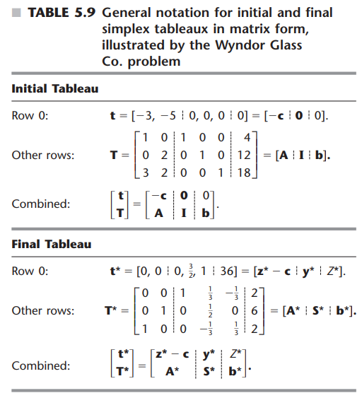

# Chapter 5

## ...
Maximize $Z = \textbf{cx}$  
subject to $\textbf{Ax}\leq \textbf{b}$ and $\textbf{x} \geq 0$  
$\bf{x_S}$: slack variables  
$\bf{x_B}$: vector of basic variables  
$\bf{Bx_B = b}$  ==> $\bf{x_B = B^{-1}b}$   
$\bf{B}$ basis matrix  
$Z = \bf{c_Bx_B} = \bf{c_BB^{-1}b}$
$\bf{c_B}$: the vector whose elements are the objective function coefficients (including zeros for slack variables) for the corresponding elements of $\bf{x_B}$  
Shadow prices: $\bf{c_BB^{-1}}$ '

## Fundamental Insight
+ $\bf{S^* = B^{-1}}$
+ $\bf{A^* = B^{-1}A}$
+ $\bf{y^* = c_BB^{-1}}$
+ $\bf{z^* = c_BB^{-1}A}$, so $\bf{z^* - c}$ is coefficients of the original variables in row 0
+ $Z^* = \bf{c_BB^{-1}b}$
+ $\bf{b^* = B^{-1}b}$

### Iteration with Matrix form
1. Find $\bf{B}$ or $\bf{B^{-1}}$. Initial status: $\bf{B = B^{-1} = I}$
2. Calculate $\bf{x_B = B^{-1}b}$  the values of basic variables (slack variables at the first stage)
3. Find $\bf{c_B}$, the coefficients of basic variables
4. Revised row 0: $\bf{c_BB^{-1}[A,I] - [c, 0]}$ 
5. Find the new basic variable, 
6. Revised new basic variable coefficients: $\bf{B^{-1}}*$the column of this variable in A
7. The biggest one is replaced this basic variable
8. New iteration: $\bf{B_{new}}$ 是把原本B的第几列换A里新basic的那一列 换第几列是换上一步在xB里第几个被换掉的