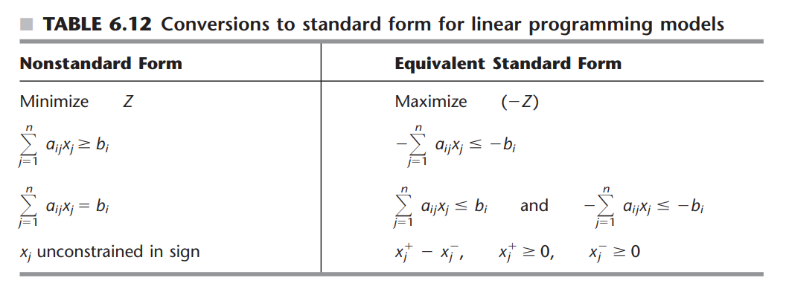
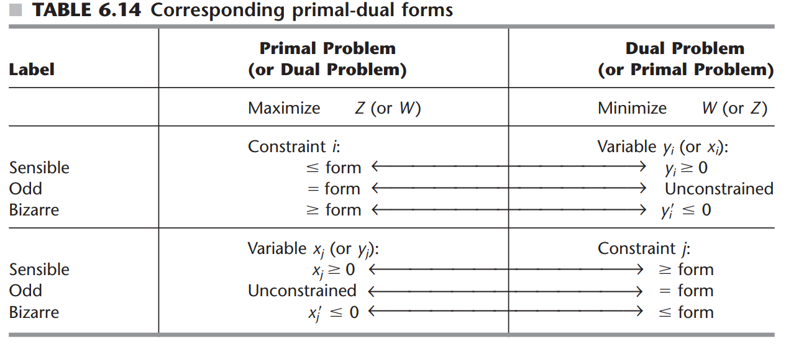

# Duality

## Standard form trans
+ Maximization
+ All constraints ≤
+ All variables non-negative

### Standard transfrm

### Primal:
Mazimize $Z = cx$  
Subject To: $Ax \leq b$  
and $x \geq 0$
### Dual:
Minimize: $W = yb$
Subject To: $yA \geq c$
and $y \geq 0$

## Strong Duality Theorem:
|  |  F(Dual)   | U  |  I  |
|---- |  ----  | ----  | ---- |
| F(Primal) |  Yes   | No  |  No  |
| U |  No   | No |  Yes  |
| I |  No   | Yes  |  Yes  |

F = feasible with finite optimum
U = unbounded
I = infeasible

## SOB

### Simplex
Primal  -> Associated Dual
Decision variable $x_j$ -> surplus variable $z_j-c_j$
Slack variable $x_{n+i}$ -> decision variable $y_i$
Basic -> Nonbasic
Nonbasic -> Basic

+ In row 0, coeffs of decision variables (x1…xn) are the values of the surplus variables for the constraints of the dual. Coeffs of slack variables (xn+1…xn+m) are the values of the dual decision variables.
+ test for optimality is that row 0 is completely non-negative.But this is equivalent to saying: the complementary dual solution is FEASIBLE (i.e. all dual decision variables, dual surplus variables are non-negative). Primal optimality = complementary dual feasibility!
+ the top-row of the Simplex method is non-negative, the top-row encodes a dual solution that is feasible for the dual, and which achieves objective function

#### Classification of basic solutions
+ **optimal**: all basic variables non-negative, top row non-negative
+ **suboptimal**: feasible but not yet optimal
  + all basic variables non-negative
+ **superoptimal**: "beyond optimality" and not feasible
  + at least one basic variable is negative, top row non-negative
+ Neither feasible nor superoptimal: at least one basic variable is negative, at least one element in the top row is negative