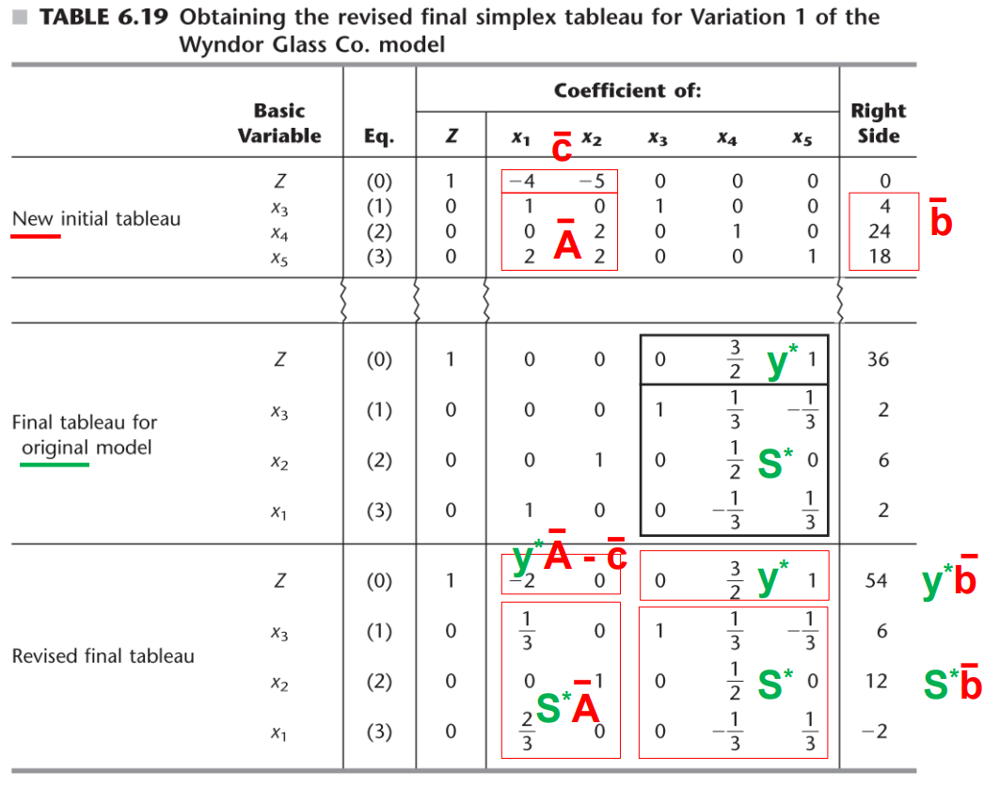
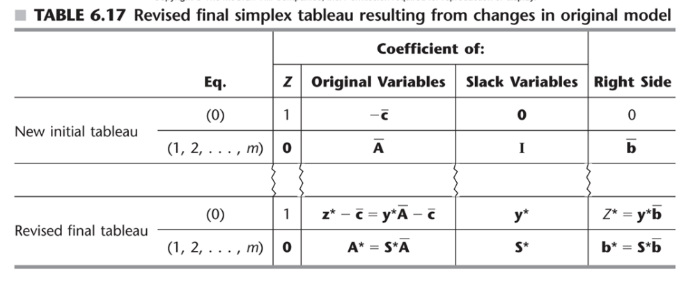
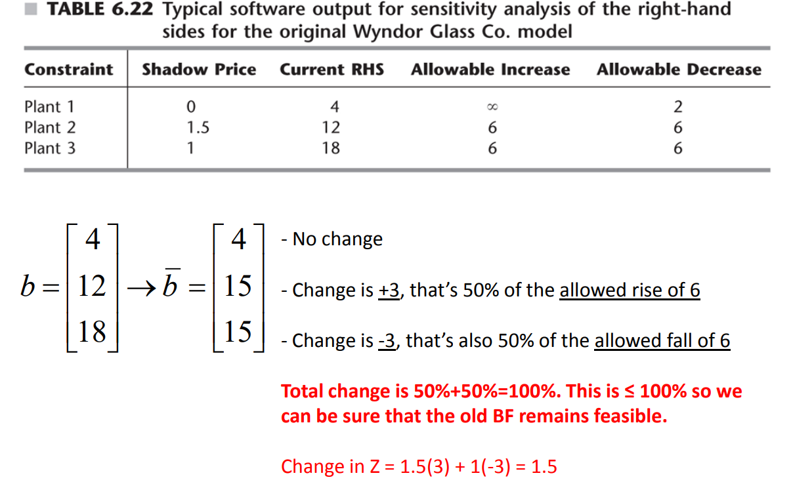

# Duality
$y = \bf{c_BB^{-1}}$

## Standard form trans
+ Maximization
+ All constraints ≤
+ All variables non-negative

### Standard transfrm

### Primal:
Mazimize $Z = cx$  
Subject To: $Ax \leq b$  
and $x \geq 0$
### Dual:
Minimize: $W = yb$
Subject To: $yA \geq c$
and $y \geq 0$

## Strong Duality Theorem:
|  |  F(Dual)   | U  |  I  |
|---- |  ----  | ----  | ---- |
| F(Primal) |  Yes   | No  |  No  |
| U |  No   | No |  Yes  |
| I |  No   | Yes  |  Yes  |

F = feasible with finite optimum
U = unbounded
I = infeasible

## SOB

### Simplex
Primal  -> Associated Dual
Decision variable $x_j$ -> surplus variable $z_j-c_j$
Slack variable $x_{n+i}$ -> decision variable $y_i$
Basic -> Nonbasic
Nonbasic -> Basic

+ In row 0, coeffs of decision variables (x1…xn) are the values of the surplus variables for the constraints of the dual. Coeffs of slack variables (xn+1…xn+m) are the values of the dual decision variables.
+ test for optimality is that row 0 is completely non-negative.But this is equivalent to saying: the complementary dual solution is FEASIBLE (i.e. all dual decision variables, dual surplus variables are non-negative). Primal optimality = complementary dual feasibility!
+ the top-row of the Simplex method is non-negative, the top-row encodes a dual solution that is feasible for the dual, and which achieves objective function

#### Classification of basic solutions
+ **optimal**: all basic variables non-negative, top row non-negative
+ **suboptimal**: feasible but not yet optimal
  + all basic variables non-negative
+ **superoptimal**: "beyond optimality" and not feasible
  + at least one basic variable is negative, top row non-negative
+ Neither feasible nor superoptimal: at least one basic variable is negative, at least one element in the top row is negative

#### which is the more efficient way
Less constraints has more efficient

## Complementary Slackness Property
surplus variable of y * decision variable of x = 0  
decision variable of y * slack variable of x = 0

## Sensitivity Analysis ( Bloom's note)
Assume we already have an optional solution for an LP
+ Changing the coefficients of a non-basic variable:
  + Feasibility: maintained
  + Optimality: we only need the top row to stay non-negative
    + check whether the dual constraint is satisfied
+ Add a new variable
  + Feasibility: maintained
  + Optimality: The dual gets a new constraint. If the surplus on that constraint is non-negative, we maintain optimality

### Sensitivity Analysis part 2
+ For the following changes
  + $\bf{b} \rightarrow \overline{\bf{b}}$
  + $\bf{c} \rightarrow \overline{\bf{c}}$
  + $\bf{A} \rightarrow \overline{\bf{A}}$

+ 2 methods:
  + Applying old transformation $\bf{B^{-1}, c_B}$ to $\overline{\bf{A}}$
  + Incremental analysis
+ If the coefficients change in $\bf{A}$ or $\overline{\bf{c}}$, then $\bf{B}$ and $\bf{B^{-1}}$ changes as well leading to the basic vars not having identity form 
  + corrective Geussion elimination needed to restore proper form
+ Also allows for prediction of how changes would propagate

#### Allowable Range
+ Maintain **optimal**(change c): Keep the first row all be non-negative (all coefficients $\geq$ 0)
  + Remember to turn it be standard form first (Geussion elimination)
+ Maintain **feasible**(change b): keep the RHS all be non-nega

#### Case 1: changes to b vector
$\bf{b^* = S^*\overline{b}}$
+ If we only change the RHS, we won’t have to apply corrective Gaussian elimination. We will also still be optimal! But we might lose feasibility
  + If suboptimal, continue pivoting
  + If superoptimal, pivot on the dual
  + Use dual simplex if the solution has negatives

+ Computing allowable range for RHS -> Use increment analysis
  + $\bf{S^*\overline{b} = S^*b+S^*(\Delta b)}$ (Delta b: change to b vector)
  + old values of basic vars + some change
  + Allowable range: a maximum increase (decrease) to maintain feasibility

+ change multiple $b_i$: 100% rule
  + 

#### Cases 2a: changes to coefficients of a nonbasic variable
+ Feasibility: maintained
+ Optimality: not sure
+ Duality Theory: In the dual there is a constraint which is  constructed from column xj of the original LP. If we change  this column, we change only this constraint in the dual. The  coefficient of xj in the new tableaux is the surplus for this  revised dual constraint (when evaluated at y*).
  + 验证feasible: 代入新的constraint看是否violated或者↓
  + 验证optimal:观察表格，RHS全正但top row有负就是suboptimal， RHS有负就是superoptimal

#### Case 2b: Introduction of a new variable
Same as 2a, but the original coefficients of this new variable are 0.  
Dual: add one more constraint

#### Case 3: Change A/c

#### Case 4: Introduction of a new constraint
Add the constraint directly to be the last row and turn it to be proper form (Geussion elimination)