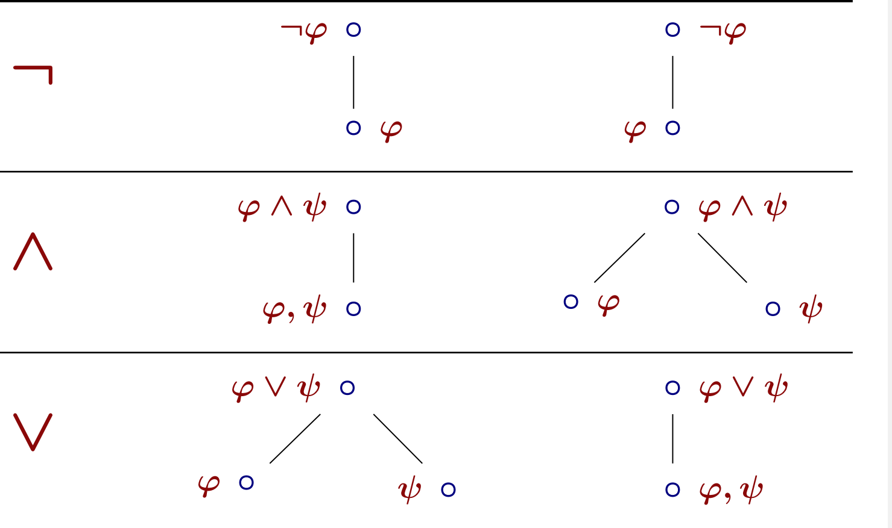
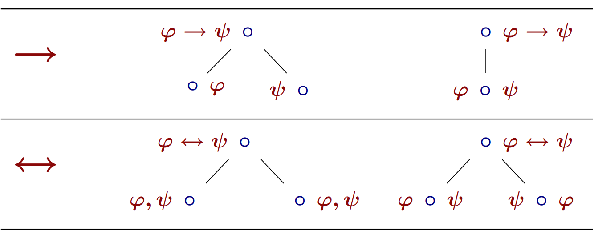

# semantic tableaux

## Valid
$\frac{\varphi _ 1, ... \varphi _n}{ψ}$
An inference is valid iff in every situation in which all premises $\varphi_1, . . . , \varphi_n$ are true, ψ is also true

i.e.: 
A formula is valid
iff
it is true in every situation.

i.e.:
A formula is valid
iff
there is no situation in which ϕ is false.

e.g.:
¬(p ∧ q) ==> p ∧ q ==> p,q

### Tableau calculation:

### Terminology
+ Sequent: Each node of the tree is called a sequent
+ Closed branch: A branch is ***closed*** if in its end sequent *there is a formula* that appears on both the left and the right side.
+ Open branch: not closed and no rule can be applied
+ Closed tableau: A tableau is ***closed*** if *all* its branches are closed
+ Open tableau: *at least* one open branch
+ *The formula is valid when tabeau is closed*
+ *Can also be used to check satisfiable/contradiction*
+ counterexample 反例
+ propositional 命题的

---------
### Important observations
$\circ$ F           closed -> valid
$\circ$ F           At least one branch closed -> satisfiable
F $\circ$	        closed -> contradiction
 
 ## How to do the exam:
 To prove: A |= B   
 if $A \circ B $ is valid/satisfiable: has a counterexample ==> there's ***at least a*** branch is closed
 So A cannot |= B
 
 
