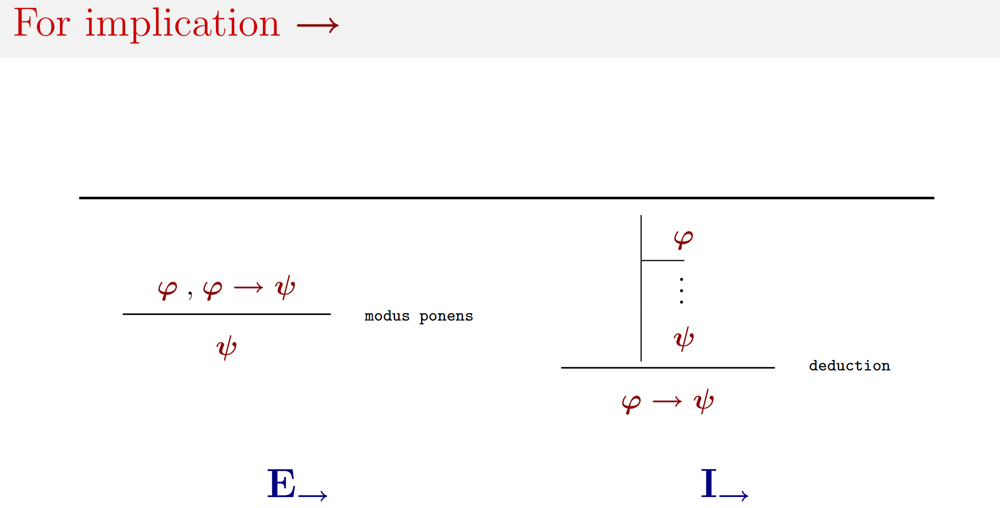
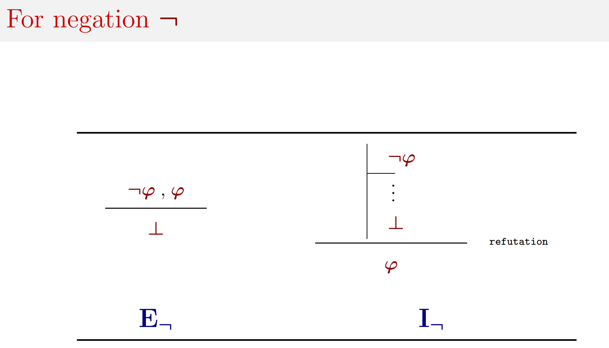
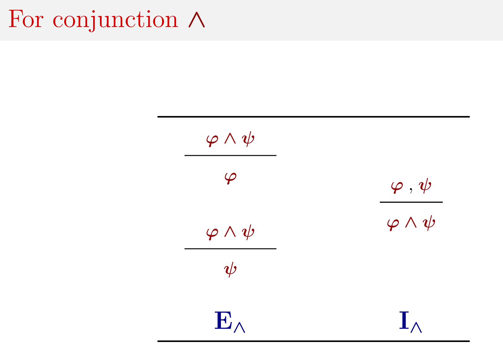
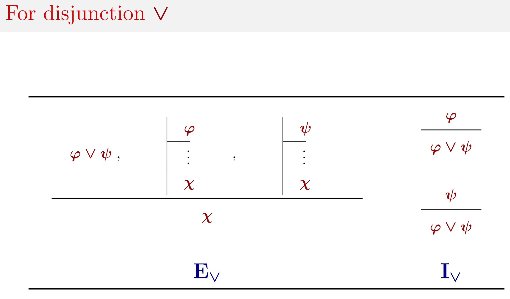

# Proof

Tableau method:
* It is a refutation method
* Does not follow the way humans reason

## The Deduction property 演绎法
Σ, ϕ |= ψ if and only if Σ |= ϕ → ψ

## The refutation rule ⊥
+ Prove ϕ by proving ¬ϕ
+ "¬ϕ" can be interpreted as $ϕ\Rightarrow⊥$
+ ¬ϕ ... ⊥ $\Rightarrow$ ϕ
+ + 横线：假设 竖线：由假设推出的结论
+ E is modus ponens. I is deduction.

