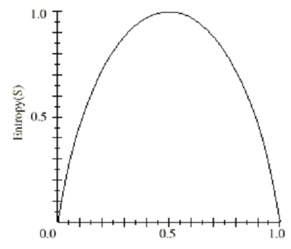
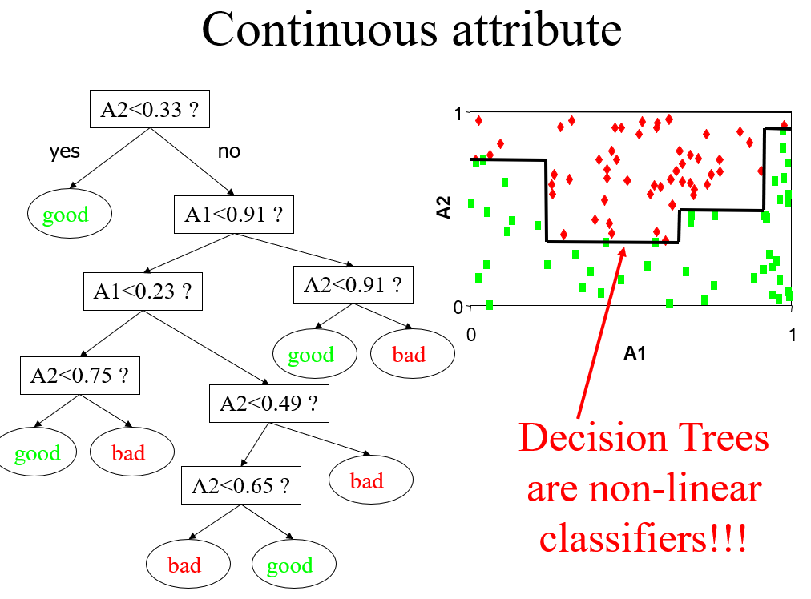

# Decision Trees
+ A decision tree is a tree where:
  + Each interior node tests an attribute
  + Each branch corresponds to an attribute value
  + Each leaf node is labelled with a class (class node)

## Measuring purity/impurity (proportioning)
Entropy: 信息熵  
某一种分类越多，信息熵越低  
Information Gain: 信息增益  
从这一分类中可以获得多少信息  
### Entropy
+ $p^+$ is the proportion of positive examples in S
+ $p^-$  is the proportion of negative examples in S
+ Entropy: $E(S) = p_{yes} + p_{no} = -p^+log_2p^+ - p^-log_wp^-$

全是yes/no时为0，一半yes一半no时1

### Information Gain (IG)
Choosing a proportion: which split is better?

$Gain(S,A) = E(S) - \sum_{v \in Values(A) \frac{|S_v|}{S}E(S_V)}$  
Where $S_V = \{s \in S | A(s) = V\}$  

E.g.: Ear shape (10 animals):  
+ At root node: $p_1^{root} = \frac{5}{10} = 0.5$, $E(0.5) = 1$  
+ Pointy: 5 and 4 are cats: $p_1^{left} = \frac{4}{5} = 0.8$,$w_1^{left} = \frac{5}{10}$, $E(0.8) = 0.72$  
+ Floppy: 5 and 1 are cats: $p_1^{right} = \frac{1}{5} = 0.2$,$w_1^{right} = \frac{5}{10}$, $E(0.2) = 0.72$  
Information gain: $E(p_1^{root}) - (w^{left}E(p_1^{left}) + w^{right}E(p_1^{right}))$  

### ID3 algorithm
算是一种greedy算法，并不能找到最小树
- Determine the attribute with the highest information gain on the training set 找到具有最高IG的属性
- Use this attribute as the root, create a branch for each of the values the attribute can have 用这个属性作为根创建分支
- For each branch, repeat the process with subset of the training set that is classified by that branch 对每个分支这么做

#### Occam’s Razor (why we use this simple algorithm)
+ roughly: do not make things more complicated than necessary  

## Continuous Attributes
Two solutions:  
- Pre-discretize: Cold if Temp < 70, mind between 70 and 75, Hot if Temperature > 75
- Discretize during tree growing:
  - Calculate IG in different cut points

## Overfitting
Definition: Given a hypothesis space $H$, a hypothesis $h \in H$ is said to overfit the training data if there exists some hypothesis $h’ \in H$, such that $h$ has smaller error that $h’$ over the training instances, but $h’$ has a smaller error that $h$ over the entire distribution of instances. 
### Avoiding Overfitting
+ Pre-pruning: stop growing the tree earlier, before it reaches the point where it perfectly classifies the training data
+ Post-pruning: Allow the tree to overfit the data, and then post-prune the tree.
+ Usually before pruning the training data is split randomly into a growing set and a validation set.

### Reduced-Error Pruning (Sub-tree replacement)
+ Split data into growing and validation sets.
+ Pruning a decision node d consists of:
  1. removing the subtree rooted at d
  2. making d a leaf node
  3. assigning d the most common classification of the training instances associated with d
+ Do until fur there pruning is harmful
  1. Evaluate impact on validation set of pruning each possible node
  2. Greedily remove the one that most improves validation set accuracy

## Attributes with Many Values  
### Disadvantage:
+ Not good splits
+ The reduction of impurity of such test is often high
### Two Solutions:
- Change the splitting criterion to penalize attributes with many values 一个node有过多分叉以后就引入惩罚
- Consider only binary splits 只二分 

### Attributes with Many Values
+ $SplitInfo(S,A) = -\sum^c_{i=1} \frac{|S_i|}{S}log_2\frac{|S_i|}{S}$  
+ $GainRatio = \frac{Gain(S,A)}{SplitInfo(S,A)}$