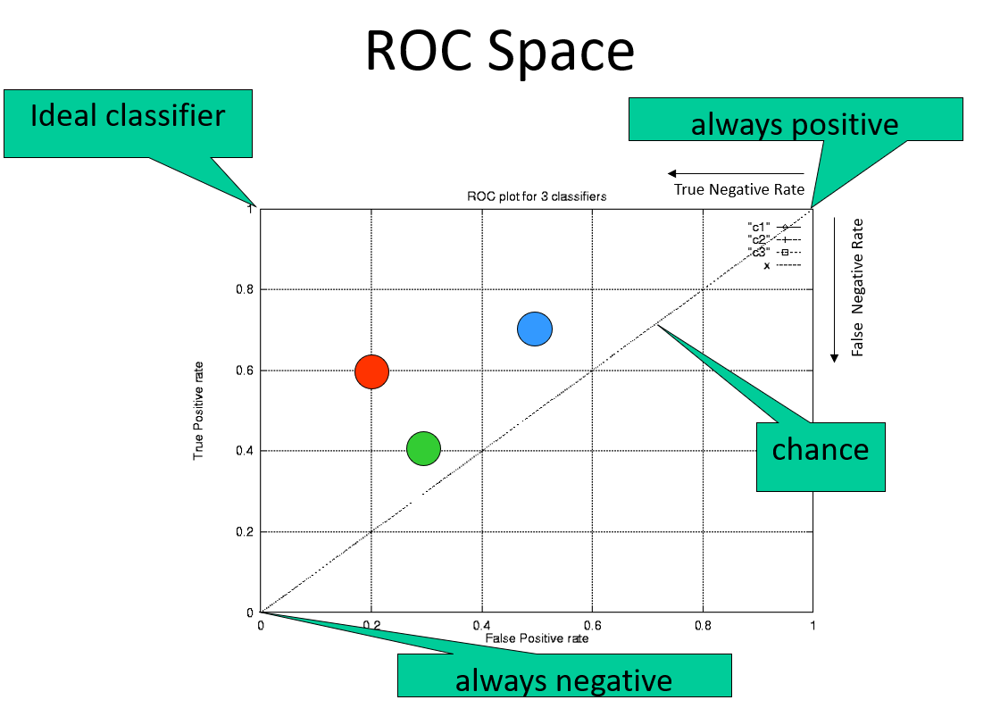
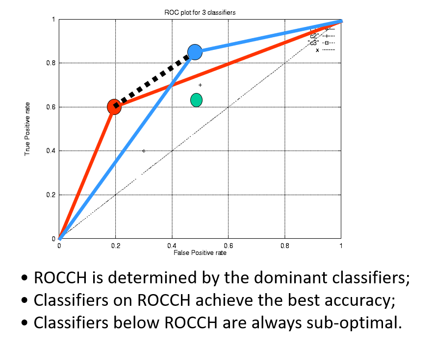
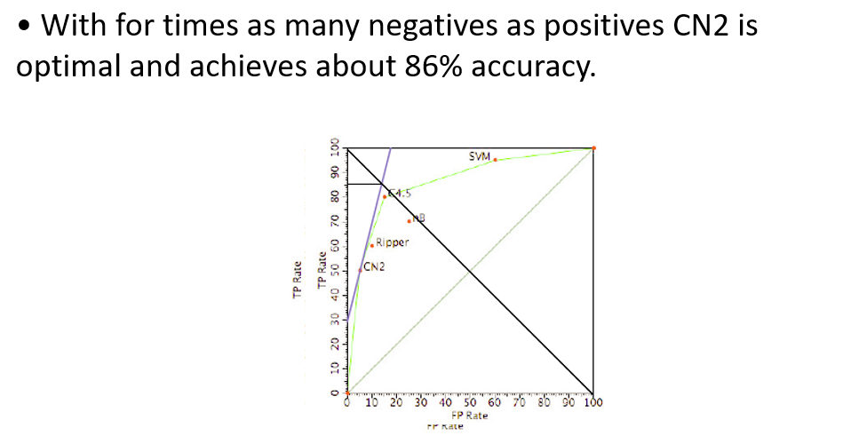

# Model Validation

## Motivation
+ Determine whether to employ the classifier
+ Optimize the classifier

## Classifier’s Validation
predicted/actual|Pos | Neg|
|:--:|:--:|:--:|
Pos|TP|FP
Neg|FP|TN
+ Accuracy = (TP+TN)/(P+N)
+ Error = (FP+FN)(P+N)
+ Precision = TP/(TP+FP)
+ Recall/TP rate = TP/P
+ FP rate = FP/N

### Summary:
+ use tests sets and hold-out method for "large" data
+ use cross-validation method for "middle-sized" data
+ use the leave-one-out and boostrap methods for "small" data

### Hold-out Method
splits the data into training set and test set (e.g.: 66% training, 34% testing)
#### Problem
+ The hold-out method is unstable. 
+ Thus, to reduce the variance of the hold-out method has to be repeated and the performance estimates to be averaged
+ 但是训练和测试集总会重叠，有些案例可能只被用于测试/训练

### k-Fold Cross-Validation

+ k-fold cross-validation avoids overlapping test sets:
  + First step: data is split into k subsets of equal size;
  + Second step: each subset in turn is used for testing and the remainder for training.
  + 将数据分成k份，不重复的取其中一份做测试，另外四份做训练，最后取平均
+ The subsets are stratified before the cross-validation.

#### More
+ Standard method for validation: stratified 10-fold cross-validation.
+ To reduce further variance you can use repeated stratified cross-validation.

### Leave-One-Out Cross-Validation
我愿翻译成 留一手交叉验证  
**一个**数据作为验证集，把每一个都作为验证集试一遍  
- set number of folds to number of training instances
- For n training instances, build classifier n times

#### Pros:
+ Makes best use of the data.
+ Involves no random sub-sampling.

#### Cons:
+ Very computationally expensive
+ stratification is not possible
  + It guarantees a non-stratified sample because there is only one instance in the test set

#### Confidence intervals
+ If 
  + test data contain n examples, drawn independently of each other,
  + $n \geq 30$
+ Then with approximately $N%$ probability, $error_D(h)$ lies in the interval
  + $error_S(h) \pm z_N \sqrt{\frac{error_S(h)(1-error_S(h))}{n}}$

## Counting the Costs
### Cost Matrices
Hypothesized class/True class|Pos | Neg|
|:--:|:--:|:--:|
Pos|TP cost|FP cost
Neg|FP cost|TN cost

### ROC Curves and Analysis
Predicted/True class|Pos | Neg|
|:--:|:--:|:--:|
Pos|70|30
Neg|50|50
TPr = 0.7  
FPr = 0.5

#### ROC space

#### ROC Convex Hull (ROCCH)

#### Iso-Accuracy Lines
+ Iso-accuracy line connects ROC points with the same accuracy A
  + $A = \frac{P TPr + N TNr}{P+N}$
+ Thus,
  + $TPr = \frac{N}{P}FPr + \frac{A(P+N)-N}{P}$
+ Iso-accuracy lines have slope N/P.
+ Higher iso-accuracy lines are better.
