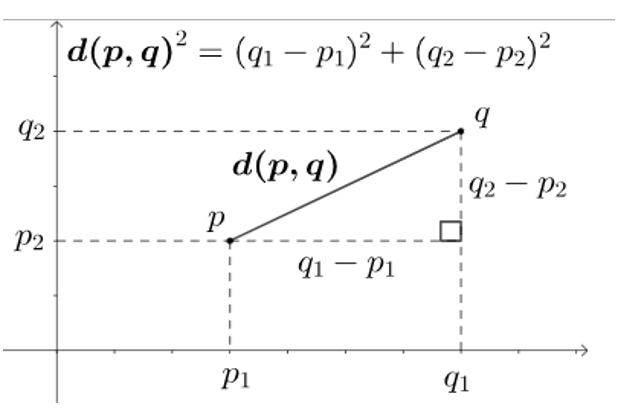

# Instance-based Learning
根据最近的几个元素的class来确定当前元素的class

## Instance Space and Distances
Let us denote the value of p-th variable $𝑋_𝑝$ for instance $𝑥_𝑖$ by $𝑥_𝑖𝑝$. Then:
+ If the p-th variable is **numeric**, then the distance $𝑑_𝑝$ between instances $𝑥_𝑖$ and $𝑥_𝑗$ for the p-th variable is equal to
  + $d_p(x_i,x_j) = \frac{|x_{ip}-x_{jp}|}{range of X_p}$
+ If the p-th variable is **discrete**, then the distance $d_p$ between instances $x_i$ and $x_j$ for of p-th variable is equal to:
  + $$f(x)= \begin{cases} 0 & if & x_ip=x_jp\\ 1&if & x_ip\not =x_jp \end{cases}$$

### Minkowski Distance
+ the distance between 2 instances $x_i$ and $x_j$, all the P variables that define the instance space X:
  + $d(x_i,x_j) = \sqrt[m]{d_1(x_i,x_j)^m+d_2(x_i,x_j)^m+...+d_P(x_i,x_j)^m}$
+ Properties:
  + Positive definiteness: $d(x_i,x_j) > 0$ if $i \not ={j}$, and $d(x_i,x_j) = 0$
  + Symmetry: $d(x_i,x_j) = d(x_j,x_i)$
  + Triangle Inequality: $d(x_i,x_j) \leq d(x_i,x_k) + d(x_k,x_j)$
+ A distance that satisfies these properties is a metric.

#### special m
+ m = 1: Manhattan distance ($L_1$ norm)
+ m = 2: Euclidean distance ($L_2$ norm)
  + $d(x_i,x_j) = \sqrt{d_1(x_i,x_j)^2+d_2(x_i,x_j)^2+...+d_P(x_i,x_j)^2}$
+ $m \rightarrow \infin$: "supremum" distance ($L_{max}$ norm, $L_{\infin}$ norm)
  + This is the maximum difference between any component (variable) of the vectors
  + $d(x_i,x_j) = max_p d_p(x_i,x_j)$

## k-NN Classifier
+ To estimate a class value y for a given test instance x, find a set NN of the k closest instances to x in training data D. 
  + Discrete Classification 直接输出class
  + Scoring Classification 输出属于各种class的概率
+ The value of k controls the complexity and locality of the decision border of the k-NN classifier. 

### Distances for Nearest Neighbor
+ Continuous variables should be normalized

### Advantages
+ can estimate complex class borders locally and differently for each new test instance
+ Classifier provides good generalization performance on many domains
+ learns very quickly
+ Is robust to noisy training data
+ is intuitive and easy to understand which facilitates implementation and modification

### Disadvantages
+ has large storage requirements because it has to store all the data
+ is slow during instance classification because all the training instances have to be visited
+ The generalization performance degrades with increase of noise in the training data
+ The generalization degrades with increase of irrelevant variables

## Extension NN algorithms

### Condensing
Aim is to reduce the number of training instances
+ **Retain set S** of instances needed to define the decision boundary
+ The Set S is **Decision Boundary Consistent** – if the instances in S impose a decision boundary that is identical to the boundary of the entire training set D.
+ The Set S is a **Minimum Consistent Set** if  it is the smallest subset of the training data that correctly classifies all of the original training data

#### Condensed NN Classifier
The CNN algorithm is sensitive to noise

### Selecting attribute weights
+ Search in the space of possible weights. 
+ Each set of weights for all the input variables test using cross-validating k-NN  

### Edited NN Classifier
+ 噪音多的时候增加nn分类的准确性
+ The algorithm starts with the set S equal to the training data D, and then each instance in S is removed if it does not agree with the majority of its k nearest neighbors (with k=3, typically). 如果实例和他k个最近的邻居中大部分都不一样就被删掉
