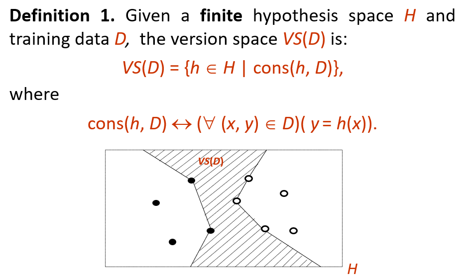
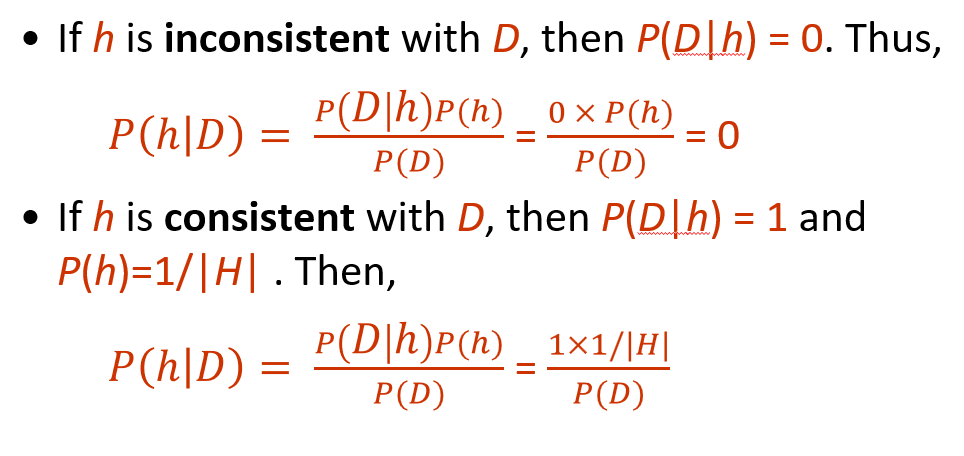
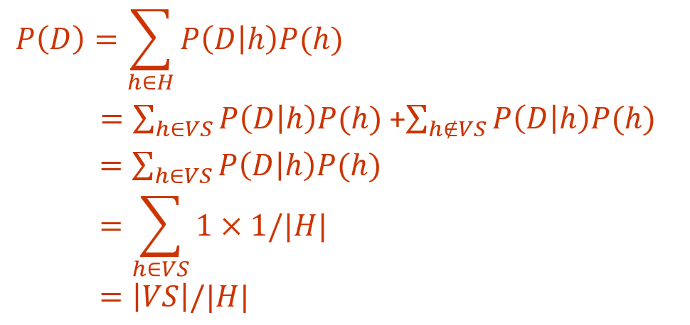
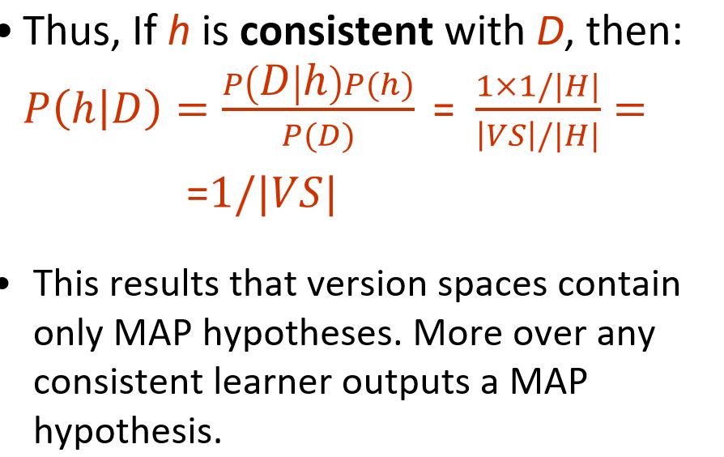

# Bayesian Learning
先验知识：instance space X and a discrete variable Y with some unknown joint probability distribution p(x,y)
训练数据集IID于X x Y
根据先验知识 p(x,y) 找到最有可能的分类y
## Why IID
+ **Independent** sampling ensures that training instances are selected independently according to the unknown distribution $p(x,y)$. Thus, 
  + We don’t need to model the dependency between training instances in the training data $Tr$.
  + 数据和测试数据无关
+ **Identically distributed** sampling ensures that the new instances to be classified will be generated by the same distribution p(x,y); i.e., we have a bridge between the past (the training data D) and the future (new instances to be classified).
  + 训练集就是用来找到先验知识的分布，然后用这个分布来预测数据。

## Optimal Bayes Rule
+ To solve the classification problem for an new instance x ∈ X we can assume that we know:
  + the prior distribution $p(y)$
  + the distribution $p(x|y)$ for each $y \in Y$
  + the distribution $p(x)$
+ Then, we can compute the posterior probability $p(y|x)$ for each $y∈Y$ according to the Bayes rule
+ The winning class is determined by the Optimal Bayes rule: 
  + $y_{OB} = arg max_{y \in Y} P(y|x)$

## Maximum a Posteriori Hypothesis (MAP)
搞一堆假设，选一个觉得最有可能的验证，这些假设就是MAP  
$h_{MAP} = argmax_{h \in H} P(h|D) = argmax_{h \in H} P(D|h)P(h)$  
如果p是均匀分布：$h_{MAP} = argmax_{h \in H} P(D|h)$

### Brute Force MAP Hypothesis Learner
1. For each hypothesis h, calculate posterior probability: $P(h|D) = \frac{P(D|h)P(h)}{P(D)}$
2. Output the hypothesis $h_{MAP}$ with the highest posterior probability: $h_{MAP} = argmax_{h \in H} P(h|D)$

## Version Spaces
https://www.cnblogs.com/HongjianChen/p/8383816.html
### Definition 1.
VS(D): 对于D中所有训练数据，y都符合H假设中的预测值

### Theorem: 
+ The Inductive Bias of Version Spaces is the assumption that the hypothesis space H is incomplete. 
+ The Inductive Bias of Version Spaces is correct if the target hypothesis t is in the hypothesis space H and the training data are noise-free. 

## Version Spaces and MAP Learning
To specify a learning problem for the Brute-Force MAP learning algorithm, we have to specify the probabilities P(h), P(D | h) and P(D) given a finite hypothesis space H.  One way is as follows:
+ $P(h) = 1/|H|$ (uniform distribution)
+ $$P(D|h)= \begin{cases} 1 &\text{if  h correctly classifies all the instances in D} \\ 0&\text{otherwise}\end{cases}$$
+ $P(D)$ is constant

