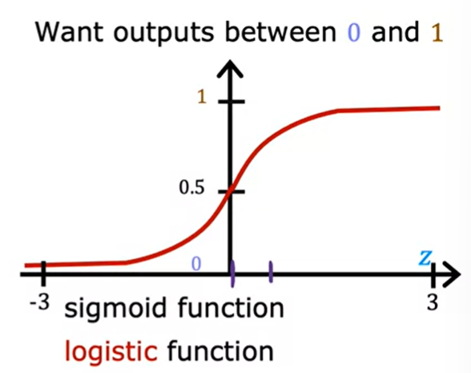

# Course 1 Week 3

## Logistic regression: classification
Sigmoid function/Logistic function

$z = f_{\overrightarrow{w},b}(\overrightarrow{x}) = \overrightarrow{w}·\overrightarrow{x} + b$  
$g(z) = \frac{1}{q + e^{-z}}$  
$0< g(z) < 1$  

---
$f_{\overrightarrow{w},b}(\overrightarrow{x}) = \frac{1}{q + e^{-(\overrightarrow{w}·\overrightarrow{x} + b)}}$
Since either 0 or 1 (True or False), Probability:
$f_{\overrightarrow{w},b}(\overrightarrow{x}) = P(y=1|\overrightarrow{x};\overrightarrow{w},b)$
Probability that y is 1, given input $\overrightarrow{x}$, parameters $\overrightarrow{w}, b$
P(y = 0) + P(y = 1) = 1