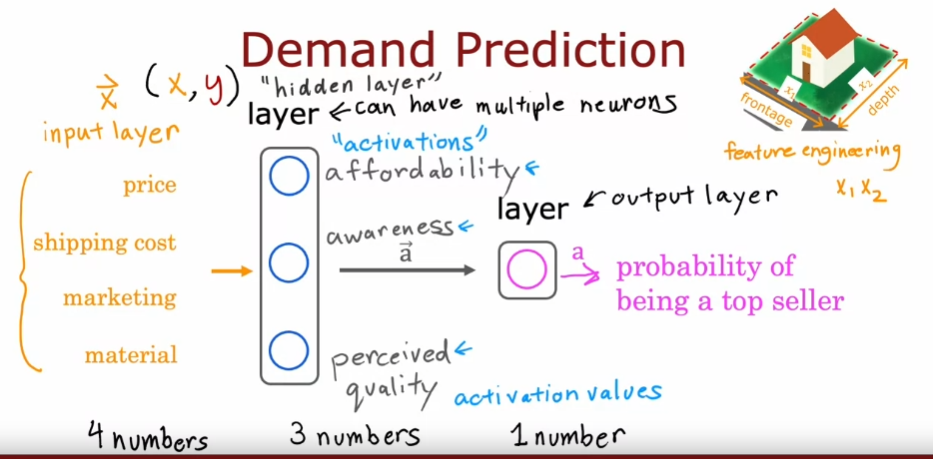

# Course 2 Week 1: Neural Networks

## AI
### ANI (artificial narrow intelligence)
e.g.: smart speaker, 
AI in farming and factories

### AGI (rtificial general intelligence)
Do anything a human can do

## Neural networks intuition

### Neural Networks
+ inference (prediction using models)
+ training

### Notations
+ $\overrightarrow{x}$: input
+ $\overrightarrow{a}$ or $a$: activation / output
+ $f(x)$: final output

+ Multilayer perceptron: neural networks with multiple layers

## Neural network model
$a_j^{[l]} = g(\overrightarrow{w}_j^{[l]}·\overrightarrow{a}^{[l-1]}+b_j^{[l]})$
+ $a_j^{[l]}$: Activation value of layer $l$
+ unit(neuron) $j$
+ $(\overrightarrow{w}_j^{[l]}·\overrightarrow{a}^{[l-1]}+b_j^{[l]})$: output of layer $l-1$
+ $\overrightarrow{w}_j^{[l]},b_j^{[l]}$: Parameters w & b of layer $l$, unit $j$
+ $g$: sigmoid / activation function

### Inference (forward propagation)
$\overrightarrow{x}$   ->   $\overrightarrow{a}^{[1]}$   ->   $\overrightarrow{a}^{[2]}$   ->   $\overrightarrow{a}^{[3]}$
25 units -> 15 units -> 1 units
layer 1 -> layer 2 -> layer 3

## Tensorflow
```
x = np.array([[0.0,245,...240]])
layer_1 = Dense(units=25, activation = 'sigmoid')
a1 = layer_1(x)

layer_2 = Dense(units=15, activation = 'sigmoid')
a2 = layer_2(a1)

layer_3 = Dense(units=1, activation = 'sigmoid')
a3 = layer_3(a2)
```
Layer 1:
`tf.Tensor([[0.2 0.7 0.3]], shape = (1,3), dtype = float32)`
Layer 2:
`tf.Tensor([[0.8]], shape = (1,1), dtype = float32)`

### NumPy arrays
Matrix: 2 by 3 matrix: 2 rows, 3 columns
`x = np.array([[1,2,3],[4,5,6]])` (2D array)

### Building a neural network
```
layer_1 = Dense(units=3, activation = 'sigmoid')
layer_2 = Dense(units=1, activation = 'sigmoid')
model = Sequential([layer_1, layer_2])
x = np.array([[...]])
y = np.array([1,0,0,1])
model.compile(...)
model.fit(x,y)
model.predict(x_new)
```

`model.compile` : defines a loss function and specifies a compile optimization
`model.fit`: runs gradient descent and fits the weights to the data

## Vectorization
Before:
```
x = np.array([...])
W = np.array([[...],[...]])
b = np.array([-1,1,2])
def dense(a_in,W,b):
    units = W.shape[1]
    a_out = np.zeros(units)
    for j in range(units):
        w = W[:j]
        z = np.dot(w, a_in) + b[j]
        a[j] = g(z)
    return a
```
output: [1, 0, 1]
Vecorized:
```
X = np.array([[...]]) #2D array
W = np.array([[...],[...]])
B = np.array([[-1,1,2]]) #2D array
def dense(A_in, W, B):
    Z = np.matmul(A_in, W) + B #matrix multiplication
    A_out = g(Z)
    return A_out
```

## Matrix multiplication
`AT = A.T` Transpose
`Z = np.matmul(AT,W)` or `Z = AT @ W`