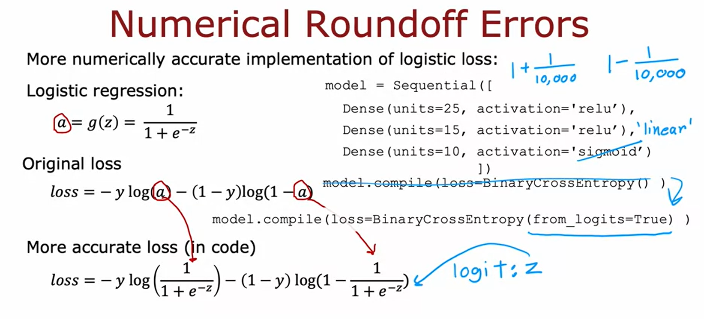

# Course 2 Week 2: Neural Network Training

## Tensorflow implement

```
import tensorflow as tf
from tensorflow.keras import Seqiential
from tensorflow.keras.layers import Dense

model = Sequential({
    Dense(units=25, acrtivation='sigmoid'),
    Dense(units=15, activation= 'sigmoid'),
    Dense(units=1, activation= 'sigmoid'), #specify the model
})
from tensorflow.keras.losses import BinaryCrossentropy
model.compile(loss=BinaryCrossentropy()) # compiles the model using a specific loss function
model.fit(X, Y, epochs=100) # train the model
```

### Training details
1. Define model
   + Specify how to compute output given input $x$ and parameters $w,b$
   + i.e.: $f_{\overrightarrow{w},b}(\overrightarrow{x}) = ?$
   + e.g.: Logistic regression: `z = np.dot(w,x)+b; f_x = 1/(1+np.exp(-z))`
2. Specify loss and cost
   + $L(f_{\overrightarrow{w},b}(\overrightarrow{x}),y)$
   + $J(\overrightarrow{w},b) = \frac{1}{m}\sum^m_{i=1}L(f_{\overrightarrow{w},b}(\overrightarrow{x^{(i)}}),y^{(i)})$
   + e.g.: Logistic loss: `loss = -y * np.log(f_x) -(1-y)  * np.log(1-f_x)` (also known as Binary Cross Entropy)
3. Train on data to minimize $J(\overrightarrow{w},b)$
   + e.g.: Gradient Descent `w = w - alpha*dj_dw` `b = b - alpha * dj_db`
   + Tensorflow: backpropagation (model.fit)

## Item Navigation
### Examples of Activation Functions
#### Linear Activation Function
+ $g(z) = z$
+ Tensorflow: `activation = 'linear'`

#### Sigmoid
+ $g(z) = \frac{1}{1+e^{-z}}$
+ Property: $0 < g(z) < 1$
+ Tensorflow: `activation = 'sigmoid'`

### ReLU (Rectified Linear Unit)
+ $g(z) = max(0,z)$
+ Proeprty: $g(z) = 0  (z< 0); g(z) = z (z >= 0)$
+ Tensorflow: `activation = 'relu'`

### Hidden layer
```
from tf.keras.layers import Dense
model = Sequential([
    Dense(units=25, acrtivation='sigmoid'),
    Dense(units=15, activation= 'sigmoid'),
    Dense(units=1, activation= 'relu')
])
```

## Multiclass Classification
Input $x$
Output $y$
Target y can take on more than 2 possible values(分不止两个类，只会输出一个结果但这个结果可能是0,1,2,3,4,5... multilabel classification是输出多个结果)

### Softmax regression
e.g.: 4 possible outputs:
+ The 1st item:
  + $z_1 = \overrightarrow{w}_1·\overrightarrow{x}+b_1$
  + $a_1 = \frac{e^{z_1}}{e^{z_1}+e^{z_2}+e^{z_3}+e^{z_4}} = P(y=1|\overrightarrow{x})$
+ The 2nd item:
  + $z_2 = \overrightarrow{w}_2·\overrightarrow{x}+b_2$
  + $a_2 = \frac{e^{z_2}}{e^{z_1}+e^{z_2}+e^{z_3}+e^{z_4}} = P(y=2|\overrightarrow{x})$
+ The 3rd item:
  + $z_3 = \overrightarrow{w}_3·\overrightarrow{x}+b_3$
  + $a_3 = \frac{e^{z_3}}{e^{z_1}+e^{z_2}+e^{z_3}+e^{z_4}} = P(y=3|\overrightarrow{x})$
+ The 4th item:
  + $z_4 = \overrightarrow{w}_4·\overrightarrow{x}+b_4$
  + $a_4 = \frac{e^{z_4}}{e^{z_1}+e^{z_2}+e^{z_3}+e^{z_4}} = P(y=4|\overrightarrow{x})$
+ $P(y=1|\overrightarrow{x}+P(y=4|\overrightarrow{x}+P(y=2|\overrightarrow{x}+P(y=3|\overrightarrow{x} = 1$

#### General equation
N possible outputs:
$z_j = \overrightarrow{w}_j·\overrightarrow{x} + b_j$ $j = 1,..., N$  
Parameters: $w_1, w_2..., w_N$, $b_1, b_2...,b_N$  
$a_j = \frac{e^{z_j}}{\sum^N_{k=1}e^{z_k}} = P(y=j|\overrightarrow{x})$

### Cost
$loss(a_1,...,a_N,y) = -log(a_j)$ if $y=j$

### implementation
Don't use this in real life
```
import tensorflow as tf
from tensorflow.keras import Sequential
from tensorflow.keras.layers import Dense
model = Sequential([
    Dense(units=25, activation='relu'),
    Dense(units=15, activation='relu'),
    Dense(units=10, activation='softmax)
])
from tensorflow.keras.losses import SparseCategoricalCrossentropy
model.compile(loss= SparseCategoricalCrossentropy())
model.fit(X, Y, epochs=100)
```

## Improved implementation
+ Logistic:

+ Softmax:
```
import tensorflow as tf #model
from tensorflow.keras import Sequential
from tensorflow.keras.layers import Dense
model = Sequential([
    Dense(units=25, activation='relu'),
    Dense(units=15, activation='relu'),
    Dense(units=10, activation='softmax)
])
from tensorflow.keras.losses import SparseCategoricalCrossentropy #loss
model.compile(loss= SparseCategoricalCrossentropy(from_logits=True))
model.fit(X, Y, epochs=100) #fit
logits = model(X) #predict
f_x = tf.nn.softmax(logits)
```

### Advanced Optimization
#### Adam Algorithm (Adaptive Moment estimate)
(Like gradient descent) If $w_j$ (or $b$) keeps moving in same direction, increase $a_j$
If $w_j$ (or $b$) keeps oscillating, reduce $a_j$
```
model = Sequential([
   tf.keras.layers.Dense(units=25, activation='sigmoid'),
   tf.keras.layers.Dense(units=15, activation='sigmoid'),
   tf.keras.layers.Dense(units=10, activation='linear'),
])
model.compile(optimize=tf.keras.optimizer.Adam(learning_rate=1e-3), loss=tf.keras.losses.SparseCategoricalCrossentrop(from_logits=True)) # Compile is different
model.fit(X,Y,epochs=100)
```

### Additional Layer Types
#### Convolutional Layer
Let layer only analyse part of input