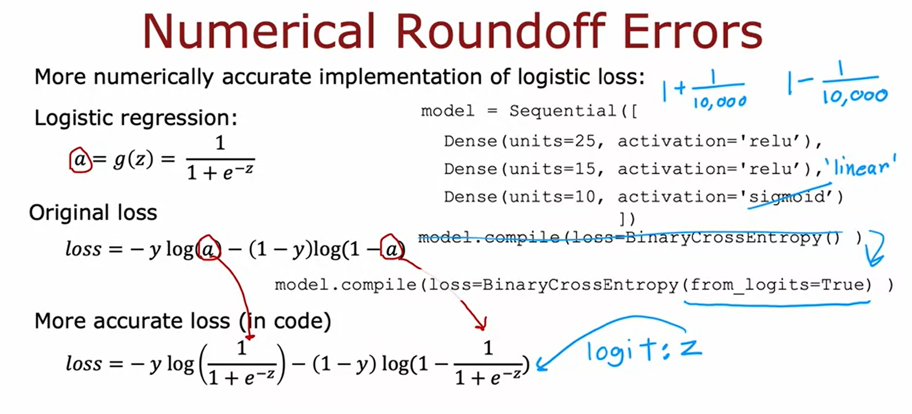

## Multiclass Classification
Input $x$
Output $y$
Target y can take on more than 2 possible values(分不止两个类，只会输出一个结果但这个结果可能是0,1,2,3,4,5... multilabel classification是输出多个结果)

### Softmax regression
e.g.: 4 possible outputs:
+ The 1st item:
  + $z_1 = \overrightarrow{w}_1·\overrightarrow{x}+b_1$
  + $a_1 = \frac{e^{z_1}}{e^{z_1}+e^{z_2}+e^{z_3}+e^{z_4}} = P(y=1|\overrightarrow{x})$
+ The 2nd item:
  + $z_2 = \overrightarrow{w}_2·\overrightarrow{x}+b_2$
  + $a_2 = \frac{e^{z_2}}{e^{z_1}+e^{z_2}+e^{z_3}+e^{z_4}} = P(y=2|\overrightarrow{x})$
+ The 3rd item:
  + $z_3 = \overrightarrow{w}_3·\overrightarrow{x}+b_3$
  + $a_3 = \frac{e^{z_3}}{e^{z_1}+e^{z_2}+e^{z_3}+e^{z_4}} = P(y=3|\overrightarrow{x})$
+ The 4th item:
  + $z_4 = \overrightarrow{w}_4·\overrightarrow{x}+b_4$
  + $a_4 = \frac{e^{z_4}}{e^{z_1}+e^{z_2}+e^{z_3}+e^{z_4}} = P(y=4|\overrightarrow{x})$
+ $P(y=1|\overrightarrow{x}+P(y=4|\overrightarrow{x}+P(y=2|\overrightarrow{x}+P(y=3|\overrightarrow{x} = 1$

#### General equation
N possible outputs:
$z_j = \overrightarrow{w}_j·\overrightarrow{x} + b_j$ $j = 1,..., N$  
Parameters: $w_1, w_2..., w_N$, $b_1, b_2...,b_N$  
$a_j = \frac{e^{z_j}}{\sum^N_{k=1}e^{z_k}} = P(y=j|\overrightarrow{x})$

### Cost
$loss(a_1,...,a_N,y) = -log(a_j)$ if $y=j$

### implementation
Don't use this in real life
```
import tensorflow as tf
from tensorflow.keras import Sequential
from tensorflow.keras.layers import Dense
model = Sequential([
    Dense(units=25, activation='relu')
    Dense(units=15, activation='relu')
    Dense(units=10, activation='softmax)
])
from tensorflow.keras.losses import SparseCategoricalCrossentropy
model.compile(loss= SparseCategoricalCrossentropy())
model.fit(X, Y, epochs=100)
```

### Improved implementation
+ Logistic:

+ Softmax:
```
import tensorflow as tf #model
from tensorflow.keras import Sequential
from tensorflow.keras.layers import Dense
model = Sequential([
    Dense(units=25, activation='relu')
    Dense(units=15, activation='relu')
    Dense(units=10, activation='softmax)
])
from tensorflow.keras.losses import SparseCategoricalCrossentropy #loss
model.compile(loss= SparseCategoricalCrossentropy(from_logits=True))
model.fit(X, Y, epochs=100) #fit
logits = model(X) #predict
f_x = tf.nn.softmax(logits)
```