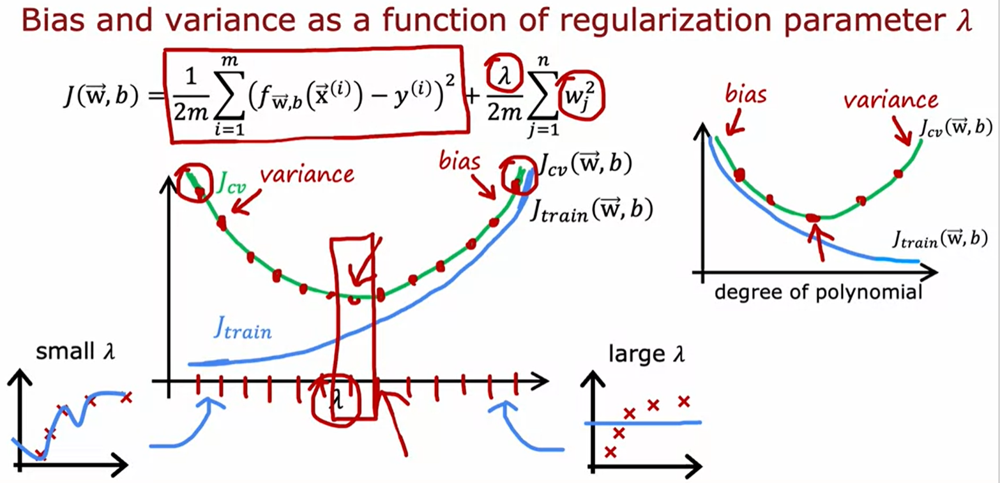
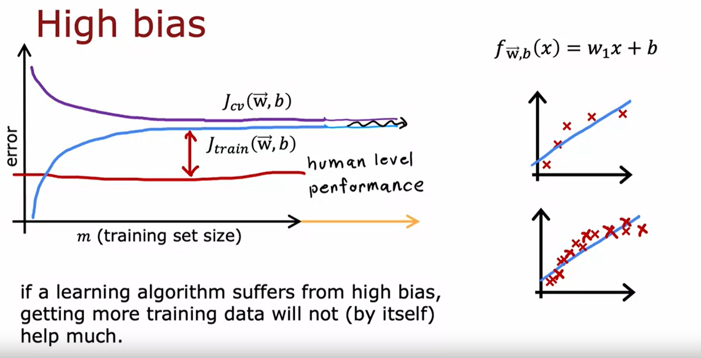
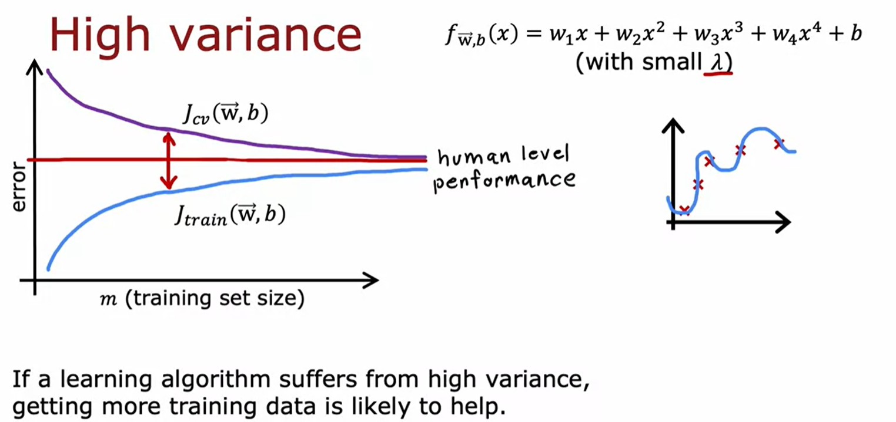

# Course 2 Week 3: Machine Learning Diagnostic

**Diagnostic**: A test that you run to gain insight into what is/isn't working with a learning algorithm, to gain guidance into improving its performance

## Evaluating a model
E.g.: 70% data set as training set, 30% data set as test set
$m_{train}$ = number of training examples
$(x^{(m_{train})}, y^{(m_{train})})$: Training set
$(x^{(m_{test})}_{test}, y^{(m_{test})}_{test})$: test set

### Train/test procedure for linear regression
+ Fit parameters by minimizing cost function $J(\overrightarrow{w},b)$ (with regulization)
  + $J(\overrightarrow{w},b) = [\frac{1}{2m_{train}}\sum^{m_{train}}_{i=1}(f_{\overrightarrow{w},b}(\overrightarrow{x}^{(i)})-y^{(i)})^2+\frac{\lambda}{2m_{train}\sum^n_{j=1}w_j^2}]$  
+ Compute test error:
  + $J_{test}(\overrightarrow{w}, b) = \frac{1}{2m_{test}}[\sum^{m_{test}}_{i=1}(f_{\overrightarrow{w},b}(\overrightarrow{x}^{(i)}_{test})-y^{(i)}_{test})^2]$  
+ Computer training error: 
    + $J_{train}(\overrightarrow{w},b_ = \frac{1}{2m_{train}}[\sum^{m_{train}}_{i=1}(f_{\overrightarrow{w},b}(\overrightarrow{x}^{(i)}_{train})-y^{(i)}_{train})^2]$

### Model selection
Try different models and see which gives the better result with the function above

#### training/cross validation/test sets
E.g.: 60% training set, 20% cross validation, 20% test set
$(x_{cv}^{(m_{cv})}, y_{cv}^{(m_{cv})})$: cross validation/development set/dev set
+ In this case, pick the model with lowest $J_{cv}$, and estimate generalization error using test set $J_{test}$

## Diagnosing Bias/Variance
+ High bias (underfit): $J_{train}$ is high, $J_{cv}$ is high
+ High variance(overfit): $J_{train}$ is low, $J_{cv}$ is high ($J_{cv} >> J_{train}$)
+ Just right: $J_{train}$ is low, $J_{cv}$ is low 
+ High bias and High variance: $J_{train}$ is high, and $J_{cv} >> J_{train}$

### Choose the regularization parameter $\lambda$

### Establishing a baseline level of performance
+ Human level performance
+ Competing algorithms' performance
+ Guess based on experience

E.g.: High Variance
Baseline performance: 10.6%
Training error($J_{train}$): 10.8%
Cross Validation Error($J_{cv}$): 14.8%
10.8%-10.6% = 0.2%, 14.8%-10.8% = 4% ---> High variance
E.g.: High Bias
Baseline performance: 10.6%
Training error($J_{train}$): 15.0%
Cross Validation Error($J_{cv}$): 15.5%
15.0%-10.6% = 4.4%, 15.5%-15% = 0.5% ---> High bias
E.g.: High variance & High Bias
Baseline performance: 10.6%
Training error($J_{train}$): 15.0%
Cross Validation Error($J_{cv}$): 19.7%
15.0%-10.6% = 4.4%, 19.7%-15% = 4.7% ---> High bias and High variance

### Learning Curve

### Debugging a learning
+ Get more training examples: fixes high variance
+ Try smaller sets of features: fixes high variance
+ Try getting additional feature: fixes high bias
+ Try adding polynomial features($x^2_1, x^2_2, x_1x_2,$ etc.): fixes high bias
+ Try decreasing $\lambda$: fixes high bias
+ Try increasing $\lambda$: fixes high variance

## Iterative loop of ML development
Choose Architecture (model, data, etc.) -> Train -> Diagnostic(Bias, variance and error analysis)

### Error analysis
Manually analyze misclassified data

### Adding data
+ add more data for everything
+ add more data of the types where error analysis has indicated it might help
+ Beyond getting brand-new training examples (x, y), another technique: data augmentation

#### Data Augmentation
Apply a distortion or transformation to the input X

E.g.: To recognize letter 'A'
Input: make 'A' bigger, rotate A, mirror A, rotate 'A', wrap A ...
E.g.: Speech recognition:
Original audio + noisy background(crowd, car) + audio on bad cellphone connection

## Transfer learning (pre-training)
To assume there's 5-layers neural network: Using first 4 layers to:
Option 1: only train output layers parameters(suitable for only have very few data)
Option 2: train all parameters
E.g.: by learning 1 million not really related images to learn to recognize handwriting

### Full cycle of a machine learning project
Scope project -> Collect data -> Train model -> Deploy in production
+ Scope project: define project
+ Collect data: Define and collect data
+ Train model: training, error, analysis & iterative improvement
+ Deploy production: Deploy, monitor and maintain system