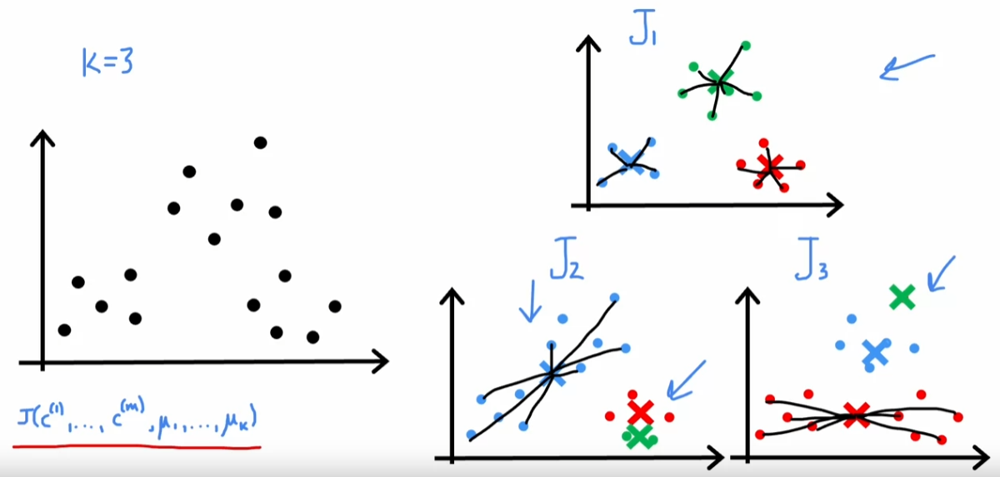

# Course 3 Week 1: Unsupervised learning

## Clustering

### K-means algorithm
+ assign points to cluster centroids
+ find new cluster centroids

#### Implementation:
Repeat{
    &emsp;# assign points to cluster centroids
    &emsp;for i = 1 to m
    &emsp;$c^{(i)}$ := index (from 1 to $K$) of cluster
        &emsp;&emsp;centroid closest to $x^{(i)}$
    &emsp;# Move cluster centroid
    &emsp;for $k$=1 to $K$
        &emsp;&emsp;$\mu_k$ := averange(mean) of points assigned to cluster $k$
}
Distinct: $\min_k ||x^{(i)} - \mu_k||^2$

#### Cost function for K-means
$c^{(i)}$ = index of cluster to which example $x^{(i)}$ is currently assigned
$\mu_k$ = cluster centroid $k$
$\mu_{c^{(i)}}$ = cluster centroid of cluster to which example $x^{(i)}$ has been assigned 
**Cost function: distortion function**
$J(c^{(1)}, ..., c^{(m)},\mu_1, ..., \mu_K) = \frac{1}{m} \sum^m_{i=1}||x^{(i)} - \mu_k||^2$

#### Random initialization: 
Choose $K < m$
Randomly pick $K$ training examples.
Set $\mu_1, ..., \mu_k$ equal to these $K$ examples.
**Disadvantage and cost function**

#### Choosing the value of K
Elbow method(not good):
Use different K to calculate cost function and choose the one with 'Elbow' (decrease from sharply to smoothly)

Evaluate K-means based on a metric for how well it performs for that later/downstream purpose.试多个K值，结合实际用途考虑

