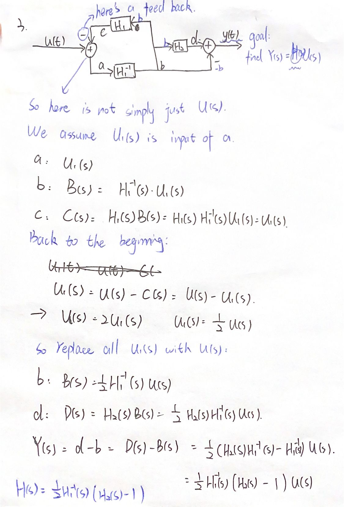

# Interconnected systems(Chapter 4.10)
Firstly do transform, then go along the graph.  
Think of it as an electric current (if )

## Cascade interconnection:
U(s) -> System1($H_1(s)$) -> System2 ($H_2(s)$) -> Y(s)  
$Y(s) = H_2(s)H_1(s)U(s)$  

## Parallel interconnection
U(s) -> System1($H_1(s)$) ----> Y(s)    
 |____> System2 ($H_2(s)$) _____↑  
$Y(s) = (H_1(s)+H_2(s))U(s)$  

## Feedback interconnection
Don't need to remember any fomula. Just minors the current branch from the main branch if you see a "-" notation in this branch.  
Will be seen in example.

## Example: exercise 21.3
