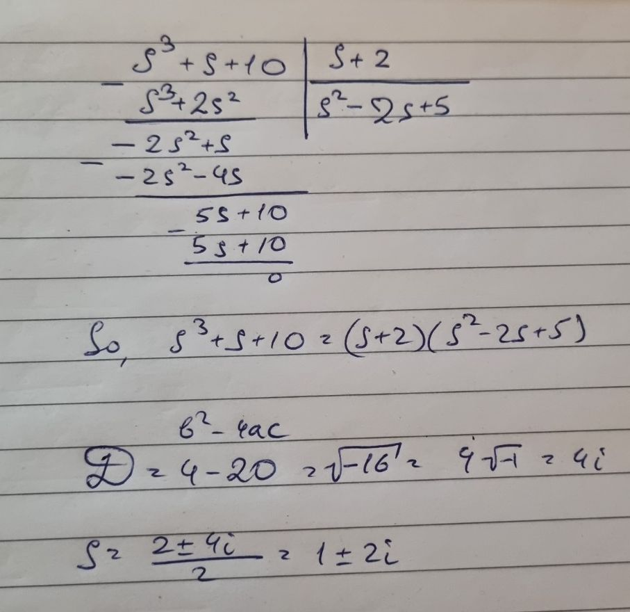
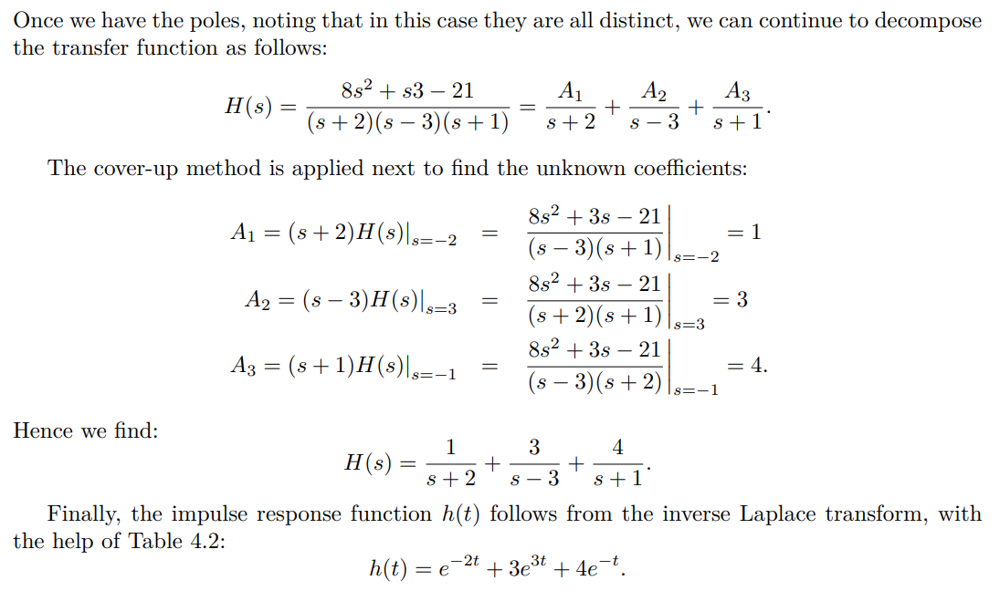

# Laplace Transform (Chapter 4.1)
Transfer function representation of **continuous** time linear systems

## Differential equations of continuous time systems
$y^{(n)}(t)+a_1y^{(n-1)}(t) + ... +a_ny(t) = b_0u^{(n)}(t)+b_1u^{(n-1)}(t)+...+b_nu(t)$  
### Derivative expression
E.g. second order derivative = $y''(t) = y^{(2)}(t)$

## Laplace transfer function (4.1.2)
$s^nY(s) + a_1s^{n-1}Y(s) + ... + a_nY(s) = b_0s^nU(s) + b_1s^{n-1}U(s) +...+b_nU(s)$  
==>  
$(s^n + a_1s^{n-1} + ... +a_n) Y(s) = (b_0s^n +b_1s^{n-1} + ... +b_n)U(s)$
==> 
$Y(s) = H(s) U(s)$, where **Transfer function(4.1.3):** $H(s) = \frac{b_0s^n +b_1s^{n-1} + ... +b_n}{s^n + a_1s^{n-1} + ... +a_n}$ 

### Example(exercise 6.1):
Differential equation: $y''(t) + 7y'(t) + 6y(t) = u(t)$  
Transfer function: $H(s) = \frac{1}{s^2+7s+6}$

## Poles and zeros, the order of a system, causality (4.1.3)
+ **zeros**: the roots of the numerator polynomial
+ **poles**: the roots of the denominator polynomial
+ **proper**: the degree of the numerator is less than or equal to the degree of the denominator
  + strictly proper: proper and $b_0 = 0$
+ **causal** LTI system: an LTI system with a proper transfer function

## Stability (4.2.1)
A continuous-time LTI causal dynamical system of finite order is BIBO stable if and only if the real part of each of its poles is negative. (Theorem 4) 
(*Notice: for continuous system*)

## partial fraction expansion (PFE) (4.2.2)
### PFE without repeated poles
$p_i$: poles  
$H(s) = \frac{A_1}{s-p_1} + \frac{A_2}{s-p_2} +...+ \frac{A_k}{s-p_k}$  
$A_i = (s-p_i)H(s)|_{s = p_i}$  

### **!!!Tricky things**

#### If the degree of numerator and denominator are the same:  
$H(s) = A_0 + \frac{A_1}{s-p_1} + \frac{A_2}{s-p_2} +...+ \frac{A_k}{s-p_k}$  
And then assign $A_0$ to be 1

#### How to turn the complex part to be sin/cos
Euler's formula: $e^{ix} = cos(x) + i sin(x)$  

#### How to find poles:
E.g. denominator: $s^3+s+10$

#### Calculation example:

### PFE with repeated poles ($(s-p_i)^k$ appear in nume)
E.g. exercise 5:  
$\frac{s^3-s^2-4s+4}{s^3+5s^2+7s+3} = \frac{s^3-s^2-4s+4}{(s+3)(s+1)^2}$  
Notice that degree of deno and nume are the same  
1. $H(s) = A_0 + \frac{A_1}{s+3}+\frac{B_{1,1}}{s+1}+\frac{B_{1,2}}{(s+1)^2}$   
2. Then $A_0 = 1$, $A_1, B_{1,2}$ are calculated in the same way of PFE without repeated poles  
3. But $B_{1,1}$ is calculated as: $B_{1,1} = ((s+1)^2H(s))'|_{s = -1}$   
   + Multiply the highest degree, and then find the derivative

## Obtaining the impulse response function
$Y(s) = H(s) U(s)$
1. Turn $u(t)$ to be $U(s)$
2. Find $Y(s)$
3. PFE
4. Inverse Laplace transform to turn $Y(s)$ to be $y(t)$

### E.g. exercise 7.1
Transfer function $G(s) = \frac{3}{s+2}$  
Input $u(t) = 10$
1. $U(s) = \frac{10}{s}$
2. $Y(s) = \frac{30}{(s+2)s}$
3. PFE: $Y(s) = \frac{-15}{s+2} + \frac{15}{2}$
4. Inverse Laplace transform: $y(t) = -15e^{-2t} + 15$