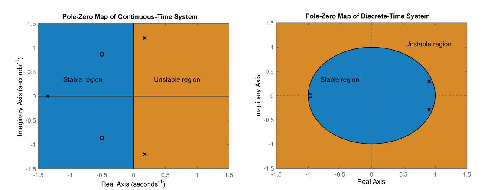

# Note & exercises order:

1. Laplace_Trans (continuous time transform)
   + Exercise 2-8
2. Z_Transform (discrete time transform)
   + Exercise 10-12
3. State_space
   + Representation: exercise 13-14
   + (Exam) From state-space systems to transfer functions: exercise 17
4. Interconnected_system
   + Exercise 18-21 (especially 21)
5. Sinusoidal Fidelity
   + continuous: exercise 22-23, 26
   + discrete: exercise 24-25
6. Digital control
   + exercise 31-36

## BASIC knowledge
Euler's formula: $e^{ix} = cos(x) + isin(x)$  

## Some important figures
Stability:  

Sinusoidal Fidelity transform in discrete plate:  

### some tips
+ The system which is controllable and observable is therefore minimal, so there are no pole-zero cancellations and the numerator and denominator polynomials of its transfer function both are of degree n.
+ Since $|z_k| = e^{Re(s_k)T_s}$, a discrete-time pole is stable if and only if the corresponding
continuous-time pole is stable.
+ If the system was uncontrollable, some poles (corresponding to the uncontrollable part of the system) could not be moved.
+ Continuous-time stable poles are always mapped to discrete-time stable poles, and continuous-time unstable poles to discrete-time unstable poles.
+ If a discrete-time system is unstable, its inverse system can be stable or unstable.
+ Every system in controllable canonical form is controllable.