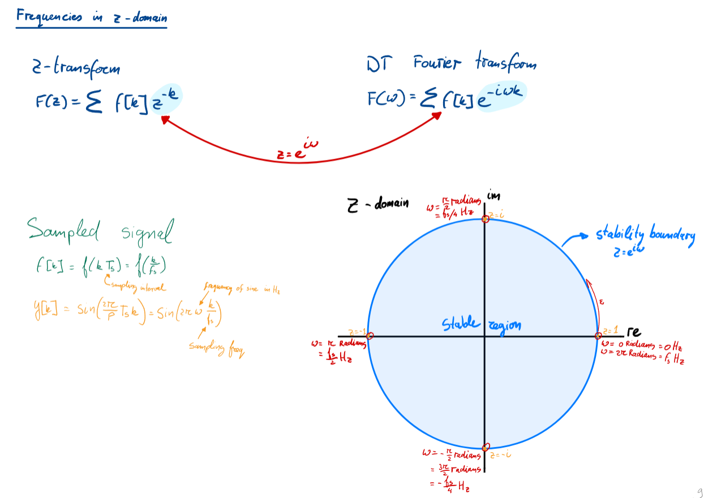

# Note & exercises order:

1. Laplace_Trans (continuous time transform)
   + Exercise 2-8
2. Z_Transform (discrete time transform)
   + Exercise 10-12
3. State_space
   + Representation: exercise 13-14
   + (Exam) From state-space systems to transfer functions: exercise 17
4. Interconnected_system
   + Exercise 18-21 (especially 21)
5. Sinusoidal Fidelity
   + continuous: exercise 22-23, 26
   + discrete: exercise 24-25
6. Digital control
   + exercise 31-36

## BASIC knowledge
Euler's formula: $e^{ix} = cos(x) + isin(x)$  

## Some important figures
Stability:  

Sinusoidal Fidelity transform in discrete plate:  
