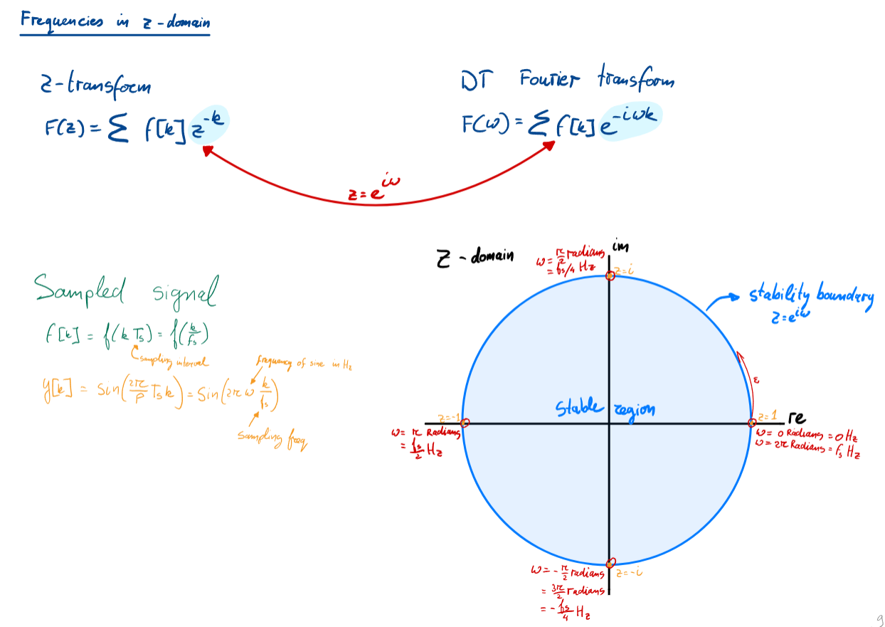
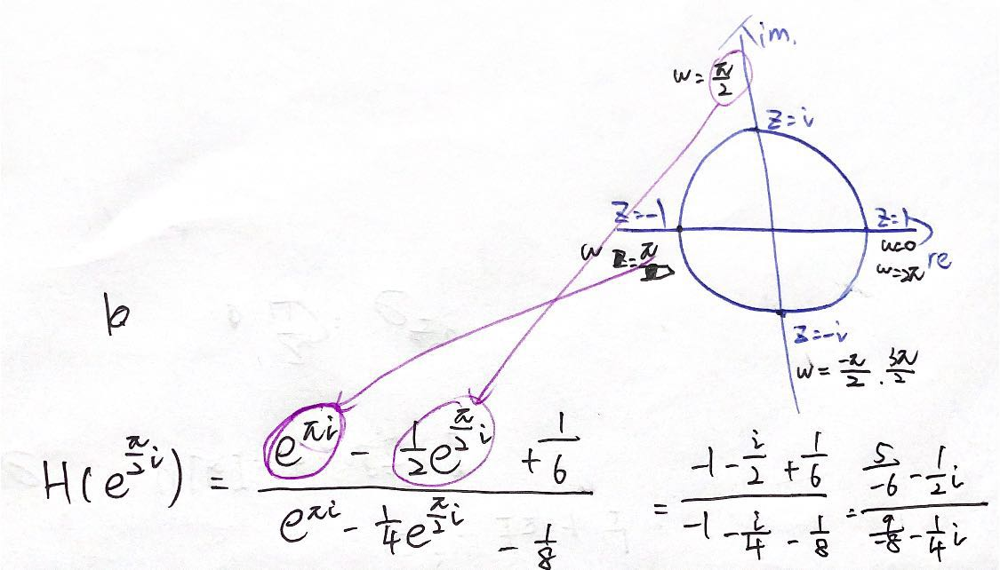

# Sinusoidal fidelity
input: $u(t) = sin(\omega t)$  
output: $y_s(t)$ -> should be a sinusoid of the same frequency  

$y_s(t) = Ksin(\omega t + \phi)$  
$K$: amplitude gain  
$\phi$: phase shift  

## Continuous-time sinusoidal fidelity
For stable LTI system:  
+ When $u(t) = sin(\omega t)$
  + $y_s(t) = |H(i\omega)| sin(\omega t + \angle H(i\omega))$
+ When $u(t) = cos(\omega t)$
  + $y_s(t) = |H(i\omega)| cos(\omega t + \angle H(i\omega))$
+ Notations:
  + $T$: period
  + $f$: frequency
  + $f = \frac{1}{T}$
  + $\omega = \frac{2\pi}{T}$

### Solving steps:
For $u(t) = c sin(\omega t)$  
1. Calculate $H(i\omega)$ and find it's module
2. Turn $H(i\omega)$ to be the form like $a + bi$
3. Calculate $\angle H(i\omega)$ using `atan2` in formula sheet.
   + Notice: find $atan2(b,a)$
   + Remember to set your calculator to be **Radian** when calculating `arctan`
4. $y_s(t) = c |H(i\omega)| \ sin(\omega t + actan2(b,a))$

#### Tricky thing:
Remember that these are just **trigonometric functions**. The periodicity of trigonometric functions still applies to these functions.  
So if you get $y_s(t) = 2cos(t - \frac{\pi}{2})$, notice that it is the same with $y_s(t) = 2cos(t - \frac{\pi}{2} + 2\pi) = 2cos(t + \frac{3\pi}{2})$  

### Example: exercise 22
$H(s) = \frac{s^2-3s+2}{s^2+4s+3}, u(t) = 5cos(3t)$  
$y_s(t) = |H(i\omega)| cos(\omega t + \angle H(i\omega))$  
1. $\omega = 3$
2. $H(3i) = \frac{-9-9i+2}{-9+12i+3} = \frac{-7-9i}{-6+12i} = \frac{-11}{30} + \frac{23}{30}i$, $|H(3i)| \approx 0.85$
3. $atan2(\frac{23}{30}, \frac{-11}{30}) = arctan(\frac{23}{-11}) + \pi = -1.12+\pi = 2.077$
4. $y_s(t) = 5\times 0.85 cos(3t + 2.017) = 4.25cos(3t+2.017)$

## Discrete-time sinusoidal fidelity
+ When $u[k] = sin(\Omega t)$
  + $y_s[k] = |H(e^{i\Omega})| sin(\Omega k + \angle H(e^{i\Omega}))$
+ When $u(t) = cos(\Omega t)$
  + $y_s[k] = |H(e^{i\Omega})| cos(\Omega k + \angle H(e^{i\Omega}))$
+ $\Omega = \omega T_s = 2\pi fT_s$

### Solving steps:
Almost the same with continuous one. BUT:  
Turn $\omega$ to be z as below(see example).  

### Example: exercise 24
$u[k] = 3sin[\frac{2\pi k}{4}], H(z) = \frac{z^2-z/2+1/6}{z^2-z/4-1/8}$  
1. 
2. Eventually: $H(e^{\pi i/2}) = \frac{612-204i}{765}$, $|H(e^{\pi i/2})| \approx 0.8433$
3. $\angle H(e^{\pi i/2}) = actan2(\frac{-204}{765}, \frac{612}{765}) \approx -0.3217$
4. $y_s[k] = 3\times 0.8433 sin(\frac{\pi}{2} k - 0.3217) = 2.5298sin(\frac{\pi}{2} k - 0.3217)$