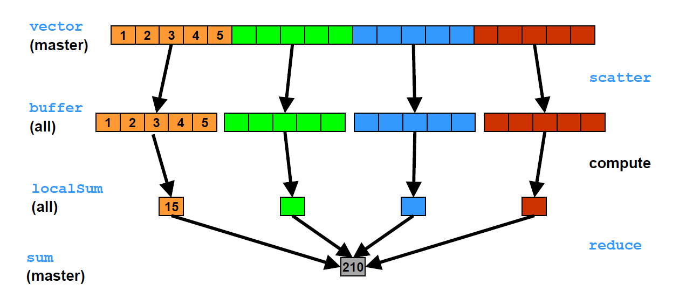

# MPI
+ MPI means Message Passing Interface
+ Messages are data packets exchanged between processes
  
## Basic Concepts of MPI
Parallel processes with local address spaces  
Goal: optimize the trade off between computations and communications in parallel applications  

### Parallelization Issues
+ Process handling
  + MPI: Communicators, Groups, Rank, Collective Commands
+ Message handling
  + MPI: Blocking, non blocking, synchronous, asynchronous; send and receive, wait
+ Data handling
  + Various datatypes and memory handling
+ IO handling
  + Large file and memory handling

### Group
+ A group is an ordered set of processes
+ Each process in a group is associated with a unique integer rank

## MPI Grammar:
*指针 &a是a的地址
+ int message[length]
+ Initialize: `int MPI_Init(int* argc, char ***argv)`
  + e.g.: `MPI_Init(&argc, &argv);`
  + Predefined Communicators: They are properly defined after `MPI_Init` has been called
  + `MPI_COMM_WORLD`: includes all of the started processes
  + `MPI_COMM_SELF`: includes only the process itself
+ Finalize: `int MPI_Finalize();`
+ Error handling: `int error = MPI_Xxxx (parameter list)`
  + `error = MPI_Comm_rank(MPI_COMM_WORLD, &procRank)`
+ Size: Number of processes within a group `int MPI_Comm_size(MPI_Comm comm, int *nprocs)`
  + e.g.: `MPI_Comm_size(MPI_COMM_WORLD, &procCount);`
+ Rank: Identifies processes within a group `int MPI_Comm_rank (MPI_Comm comm, int *myrank)`
  + e.g.: `MPI_Comm_rank(MPI_COMM_WORLD, &procRank);`

### Send and Recieve
+ Send: `int MPI_Send(void *buf, int count, MPI_Datatype datatype, int dest, int tag, MPI_Comm comm)`
  + buf: starting address of the message
  + count: number of elements
  + datatype: type of each element
  + dest: rank of destination in communicator *comm*
  + tag: message identification
  + comm: communicator
  + e.g.: MPI_Recv(message, length, MPI_INT, i, tagSend, MPI_COMM_WORLD, MPI_STATUS_IGNORE)
+ Receive: `int MPI_Recv(void *buf, int count, MPI_Datatype datatype, int dest, int tag, MPI_Comm comm, MPI_Status *status)`
  + status: envelope information (message information)
+ MPI Data Types:
  + `MPI_CHAR`, `MPI_INT`, `MPI_LONG`, `MPI_UNSIGNED`, `MPI_FLOAT`, `MPI_DOUBLE`
+ Requirements:
  + Sender specifies a valid destination. Receiver specifies a valid source.
  + Communicator, tags, datatypes match.
  + Receiver’s buffer(cache) large enough
+ It is possible to receive messages from any other process and with any message tag by using `MPI_ANY_SOURCE` and `MPI_ANY_TAG`
+ `Status` Variable contains Envelope information:
  + Source rank: `int src = status.MPI_SOURCE;`
  + Tag: `int tag = status.MPI_TAG;`
  + Message size(element count of data): `MPI_Get_count(MPI_Status *status, status, MPI_Datatype datatype , int *count)`
+ Receiving Messages of unknown Length:
  + `MPI_Probe` is a call that returns only after a matching message has been found (test for incoming messages 检查传入消息而不实际接收它): `int MPI_Probe(int source, int tag, MPI_Comm comm, MPI_Status *status)`
  + Processes can find out the message length using the status variable

### Collective Communication:
#### Barriers:
+ Synchronizes all processes in a communicator: `int MPI_Barrier(MPI_Comm comm)`
+ Each process must wait until all have reached the barrier
+ Usually never needed as all synchronization is done by data communication. Used for debugging, profiling or time measurement
+ Usage: `MPI_Barrier(MPI_COMM_WORLD);`

#### Time Measurement:
+ To measure the runtime one can use: `double MPI_Wtime(void)`
+ Returns a floating point number of seconds representing elapsed wall clock
time since some time in the past

#### Broadcast (One-to-All):
+ **Called by all processes**
+ Root(rank of broadcast) distributes a message among all processes
+ `int MPI_Bcast(void *buf, int count, MPI_Datatype datatype, int root, MPI_Comm comm);`
+ Usage: `MPI_Bcast(&message,1, MPI_INT, 0, MPI_COMM_WORLD);`


#### MPI_Scatter (One-To-All):
+ Scatters an array of data to many processes
+ Array index is rank number:
+ `int MPI_Scatter(void* sendbuf, int sendcount, MPI_Datatype sendtype, void* recvbuf, int recvcount, MPI_Datatype recvtype, int root, MPI_Comm comm)`
+ Usage: `int error = MPI_Scatter(data, 5, MPI_INT, &localData, 5, MPI_INT, 0, MPI_COMM_WORLD);`

#### MPI_Gather (All-To-ONe)
+ Inverse operation of MPI_Scatter
+ `int MPI_Gather(void* sendbuf, int sendcount, MPI_Datatype sendtype, void* recvbuf, int recvcount, MPI_Datatype recvtype, int root, MPI_Comm comm)`

#### Reduce (All-To-One)
+ Collects data and combines it with a reduction operation
+ `int MPI_Reduce(void* sendbuf, void* recvbuf, int count, MPI_Datatype datatype, MPI_Op op, int root, MPI_Comm comm)`
+ `MPI_Op`: Predefined MPI reduction operations: `MPI_MAX`, `MPI_MIN`, `MPI_SUM`, `MPI_PROD`, `MPI_LAND`(logical AND), `MPI_LOR`(logical OR)
+ Usage: `int sum = 0; MPI_Reduce(&result , &sum , 1, MPI_INT, MPI_SUM, 0, MPI_COMM_WORLD);`


#### Allreduce (All-To-All):
+ Computes the same result as reduce and returns the result in all processes
+ `int MPI_Allreduce(void* sendbuf, void* recvbuf, int count, MPI_Datatype datatype, MPI_Op op, MPI_Comm comm)`

## Examples:
+ `int *ptr = &x;`: Declare a pointer and assign the address of x to it
+ `int k; MPI_Get_count(&status, MPI_INT, &k);int* message = (int*)malloc(k * sizeof(int));`
  + 为名为 message 且大小为 k 个元素的整数数组分配动态内存。malloc: 分配内存空间，返回指针
  + 数组的大小根据从MPI_Get_count获得的计数确定。
+ `free(message)` 释放内存


## Exercises
### Ping Pong
```
#include <stdio.h>
#include <stdlib.h>
#include <mpi.h>

int main(int argc, char* argv[])
{
  int procRank,procCount;
  MPI_Init(&argc,&argv);
  MPI_Comm_size(MPI_COMM_WORLD,&procCount);
  MPI_Comm_rank(MPI_COMM_WORLD,&procRank);

  printf("Start[%d]/[%d], error %d \n", procRank, procCount, error);

  int procPartner = 1-procRank; // this is the communication partner (double processes only)
  // int procPartner = (procRank + 1) % procCount;
  enum { tagPingPong = 1 };
  int n = 3; //number of ping-pongs

  if (0==procRank) // first send then recv
  {
    int data=1;
    for (int i=0; i<n; ++i) 
    {
      printf("%d sent: Ping from proc %d\n",data,procRank);
      MPI_Send(&data,1,MPI_INT,procPartner,tagPingPong,MPI_COMM_WORLD);
      MPI_Recv(&data,1,MPI_INT,procPartner,tagPingPong,MPI_COMM_WORLD, MPI_STATUS_IGNORE);
      ++data;
    }
  }
  else if (1==procRank) // first recv then send
  {
    int data=-1;
    for (int i=0; i<n; ++i) 
    {
      MPI_Recv(&data,1,MPI_INT,procPartner,tagPingPong,MPI_COMM_WORLD, MPI_STATUS_IGNORE);
      ++data;
      printf("%d sent: Pong from proc %d\n",data,procRank);
      MPI_Send(&data,1,MPI_INT,procPartner,tagPingPong,MPI_COMM_WORLD);
    }
  }

	MPI_Finalize();
	
	return EXIT_SUCCESS;
}
```
