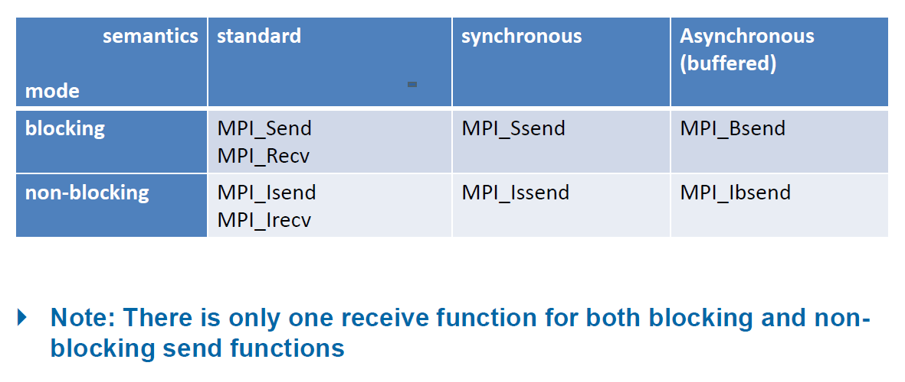

# MPI Part II

## Different Types of Communication
### Blocking and Non-Blocking
+ Blocking:Relates to the completion of an operation in the sense, that used resources,
  + i.e. buffers, are free to use again
+ Non-blocking:Functions return as soon as possible but provided buffers must not be touched until another appropriate call successfully indicates that they are not in use anymore
+ Even read only access may be prohibited


### Completion of Non Blocking Operations
+ In non blocking send variants we need to check for the communication's completion. Two ways:
  + Wait until completing: `int MPI_Wait(MPI_Request *req, MPI_Status *status)`
  + Loop with test until completed: `int MPI_Test(MPI_Request* request, int* flag, MPI_Status* status);`
    + `flag`: Output parameter indicating whether the operation has completed (flag = true) or not (flag = false).
+ Send and Recv:
  + Send: `int MPI_Isend(const void* buf, int count, MPI_Datatype datatype,int dest, int tag, MPI_Comm comm, MPI_Request* request);`
  + `int MPI_Irecv(void* buf, int count, MPI_Datatype datatype, int source, int tag, MPI_Comm comm, MPI_Request* request);`

#### E.g.: 
```
MPI_Request request;
MPI_Status status;
    
// Nonblocking send
MPI_Isend(&data, 1, MPI_INT, (procRank + 1) % procCount, 0, MPI_COMM_WORLD, &request);
//MPI_Irecv(&data, 1, MPI_INT, 0, 0, MPI_COMM_WORLD, &request);

// Perform some computation while the send operation is in progress
int flag = 0;

// Nonblocking test
MPI_Test(&request, &flag, &status);
```
### Synchronous and Asynchronous
+ Relation between Sender and Receiver
+ Synchronous:
  + send call will only start when the destination has started synchronous receive 发送时会等到目标进程收到消息，接收时会等待直到消息可用
  + synchronous communication often implies that the sender blocks until the receiver has acknowledged or received the message
+ Asynchronous(buffered):
  +  operations return immediately, allowing the program to continue with other computations while the communication is in progress
  +  buffered: allow the sender to use a user-specified buffer for the message instead of the system buffer. Requires prior allocation and deallocation of a buffer using `MPI_Buffer_attach` and `MPI_Buffer_detach`

+  *Synchronous generally means an activity that must wait for a reply before the thread can move forward. Blocking refers to the fact that the thread is placed in a wait state (generally meaning it will not be scheduled for execution until some event occurs).*

#### Deadlocks with MPI_Send:
+ `MPI_Send` can be synchronous, asynchronous or both (not declared
in the MPI standard)
E.g.: 用了Ssend，如果发送时接收方没有准备好就会进入deadlock   
```
MPI_Ssend($messageS, 1, MPI_INT, 1-procRank, tagSend, MPI_COMM_WORLD);
MPI_Recv($messageS, 1, MPI_INT, 1-procRank, tagSend, MPI_COMM_WORLD, MPI_STATUS_IGNORE);
```

### Send and Receive in one Operation
+ `MPI_Sendrecv`: combines an asynchronous send and receive, useful for data exchange
+ Send buffer and receive buffer must be disjoint, and may have different lengths and data types
+ `int MPI_Sendrecv(void *sendbuf, int sendcount, MPI_Datatype sendtype, int dest, int sendtag, void *recvbuf, int recvcount, MPI_Datatype recvtype, int source, int recvtag, MPI_Comm comm, MPI_Status *status)`
  + `dest`: Rank of the destination process.
+ `int MPI_Sendrecv_replace(void *buf, int count, MPI_Datatype datatype, int dest, int sendtag, int source, int recvtag, MPI_Comm comm, MPI_Status *status);`
  +  uses a single buffer for both sending and receiving, will overwrite the original data

### Test for Incoming Messages
+ Also possible in a non
blocking mode: `int MPI_Iprobe(int src, ing tag, MPI_Comm comm, int* flag, MPI_Status* status)`
+ `flag`: Pointer to an integer that will be set to 1 if a matching message is found, 0 otherwise.
+ `int flag; MPI_Iprobe(0, MPI_ANY_TAG, MPI_COMM_WORLD, &flag, &status);`
+ 允许进程检查与指定源、标记和通信器匹配的消息是否可用于后续接收操作

## Complex Data Structures

### Committing and Freeing a Data Type
+ Before a data type handle is used in communication, it needs to be committed: `int MPI_Type_Commit(MPI_Datatype *datatype)`
+ After use, a self defined data type can be deallocated: `int MPI_Type_free(MPI_Datatype *datatype)`

### Contiguous Data Type
+ Creates a new data type consisting of contiguous elements of another data type: `int MPI_Type_contiguous(int count)`

#### Transfer of Contiguous Data
```
MPI_Type_contiguous(count, datatype, &newtype)
MPI_Type_commit(&newtype)
MPI_Send(&buffer, 1, newtype, dest, tag, comm)
```  
E.g.: Transfer 24 MPI_INT to be 8 cont_type  
```
MPI_Type_contiguous(3, MPI_INT, &cont_type); // make type: 24 = 8*3
MPI_Type_commit(&cont_type);
if(0 == procRank){
    for(int i=0; i<24; i++) buffer[i] = i;
    MPI_Send(buffer, 8, count_type, 1, tagSendBuffer, MPI_COOM_WORLD);
}
...
```

### Vector Data Type
+ `int MPI_Type_vector(int count, int blocklength, int stride, MPI_Datatype oldtype, MPI_Datatype *newtype)`
+ `MPI_Type_vector` is fine for sending rectangular blocks from 2D
arrays
+ Stride: the distance between columns in the original array
 
#### Example: Vector Data of Basic Type
```
MPI_Type_vector(3, 6, 9, MPI_INT, $vec_type); // 3 blocks, length 6, stride 9
MPI_Type_commit(&vec_type);
if(p == procRank){
    for(int i = 0; i<24; i++) buffer[i] = 2*i;
    MPI_Send(buffer, 1, vec_type, 1, tagSendBuffer, MPI_COMM_WORLD);
}
```

#### Exercise 16:
```
int cols = 10;
MPI_Datatype row_type;
MPI_Type_vector(cols, 1, 1, MPI_INT, &row_type);
MPI_Type_commit(&row_type);

int *local_row = malloc(cols * sizeof(int));
MPI_Scatter(&A[0][0], 1, row_type, local_row, cols, MPI_INT, 0, MPI_COMM_WORLD);

MPI_Gather(local_row, cols, MPI_INT, &A[0][0], 1, row_type, 0, MPI_COMM_WORLD);
```