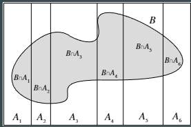

# Conditional Probability

## Definition
$P(A|B) = \frac{P(A \cap B)}{P(B)} $

+ $P(B) > 0$
+ $P (A|B)$ is the probability of A given the evidence B, not the probability of some entity called $A|B$ -> is not an event

## Bayes' rule
$P(A|B) = \frac{P(A \cap B)}{P(B)} = \frac{P(B|A)P(A)}{P(B)}$  
$P(B|A) = \frac{P(A \cap B)}{P(A)}$

## Bayes' rule Law of total probability
$P(B) = \sum^n_{i=1}P(B|A_i)P(A_i)$

## Independence of two events
Events A and B are independent if $P(A \cap B) = P(A)P(B)$
If $P(A) > 0$ and $P(B) >0$, this is equivalent to $P(A|B) = P(A)$, and also equivalnt to $P(B|A) = P(B)$
-> No matter how you change the event B, it won't affect event A
