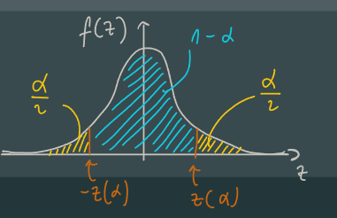

# Population, Sample, and Confidence Intervals

## Population
a set of similar items or events which is of interest for some question or experiment

### Definations
E.g.: The population consists of $N =393$ short-stay hospitals  
+ Let $x_i$ denote the number of patients discharged from the $i$th hospital  
+ **Population mean**: $\mu = \frac{1}{N}\sum^N_{i=1}x_i$  
+ **Population total**: $\tau = \sum^N_{i=1}x_i = N\mu$  
+ **Population variance**: $\sigma^2 = \frac{1}{N}\sum_{i=1}^N(x_i-\mu)^2$  

## Sample
The population is all the data:
$x_1,...,x_N$  
A simple random sample is a subset of n (n < N) picked without replacement:
$X_1,...,X_n$  

### Dafinations
+ sample mean: $\overline{X_n} = \frac{1}{n} \sum_{i=1}^nX_i$   
+ Estimate population total: $T = N\overline{X}$    

## Unbiased Estimator
+ $\overline{X}$ is random  
+ $E(\overline{X}) = \mu$ is called unbiased estimator: it is true on average    

In general:  
If an estimator $\hat{\theta}$ of a population parameter $\hat{\theta}$ is $E(\hat{\theta}) = \theta$,    
then we say that $\hat{\theta}$ is **unbiased**

### Variance of the Sample Mean
+ sampling with replacemen: $Var(\overline{X}) = \frac{1}{n^2} \sum_{i=1}^nVar(X_i) = \frac{\sigma^2}{n}$  
+ sampling without replacement:$Var(\overline{X}) = \frac{\sigma^2}{n}(1-\frac{n-1}{N-1})$  

## Confidence Interval
+ A confidence interval for a population parameter $\theta$, is a random interval, calculated from the sample, that contains $\theta$ with some specified probability  
+ For $0 \leq a \leq 1$, let $z(\alpha)$ be the number such that the area under the standard normal density function to the right $z(\alpha) is \alpha$  
  + $P(-z(\alpha/2) \leq Z \leq z(\alpha/2))$

## Central Limit Theorem
+ If n is large, but still small relative to N , then $\overline{X_n}$, the mean of a simple random sample, is approximately normally distributed  
+ We can approximate the probability that the error made in estimating $\mu$ by $\overline{X}$ is less than some constant $\delta$  
+ From the central limit theorem, $(\overline{X}-\mu)/\sigma_{\overline{X}}$ has approximately a standard normal distribution, so  
  + $P(-z(\alpha/2) \leq \frac{(\overline{X}-\mu)}{\sigma_{\overline{X}}} \leq z(\alpha/2))$  