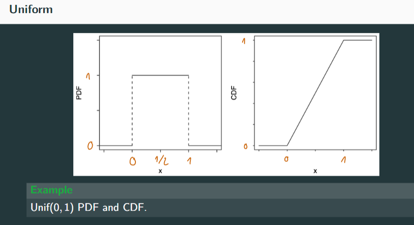

# Bernoulli distribution
Discrete, 0-1 distribution. Random variables either True or False independently. 只有两种可能，试验结果相互独立且对立
$P(X = 1) = p$  
$P(X = 0) = 1 - p$  
where $0<p<1$, we write this as:
$X ~ Bern(p)$  

#### PMF
$$
\begin{equation}
P(x) = p^x(1-p)^{1-x} = 
\begin{cases}
p& \text{if x=1}\\
1-p& \text{if x=0}
\end{cases}
\end{equation}
$$

#### Expectation and Variance
$E(x) = 0*(1-p) + 1*p = p$  
$Var(x) = E[(x-E(x))^2] = \sum(x-p)^2P(x) = p(1-p)$  

# Binomial distribution
n个独立的伯努利
$X ∼Bin(n,p)$  
$X$ has the Binomial distribution with parameters n and $p$, where $n$ is a positive integer and $0 
 0$, if the PMF of X is:
$P(X = k) = \frac{e^{-\lambda}\lambda^k}{k!}, k = 0,1,2,...$  

#### Expectation and Variance
$E(X) = \lambda$  
$Var(X) = \lambda$  

# Uniform Distribution 均匀分布
### Dirscrete Uniform Distribution
$C$ is a finite, nonempty set of numbers. CHoose one number from C randomly and uniformly $X$.  
$X ∼DUnif(C)$  

#### PMF:
$P(X = x) = \frac{1}{|C|}$  
for $x \in C$  

### Continious Uniform Distribution
We denote this by $U \sim Unif(a,b)$  

#### PDF:
A continuous r.v. U is said to have the Uniform distribution on the interval $(a,b)$ if its
PDF is
$$
\begin{equation}
f(x) = 
\begin{cases}
\frac{1}{b-1}& \text{if a<x<b}\\
0& \text{otherwise}
\end{cases}
\end{equation}
$$

#### CDF:

#### Expectation and Variance
$E(X) = \int^{+\infin}_{-\infin}xf(x)dx = \int^{b}_{a}x*\frac{1}{b-1}dx = \frac{a+b}{2}$  
$E(X^2) = \int^{+\infin}_{-\infin}xf(x)dx = \int^{b}_{a}x^2*\frac{1}{b-1}dx = \frac{a^2+ab+b^2}{3}$  
$Var(X) = E(X^2) - [E(X)]^2 = \frac{a^2+ab+b^2}{3} - (\frac{a+b}{2})^2 = \frac{(b-a)^2}{12}$  

# Normal

### Standard Normal distribution
$Z \sim N(0,1)$  
#### PDF:
$\phi(z) = \frac{1}{\sqrt{2\pi}}e^{-z^2/2}, -\infin < z < \infin$  
#### CDF:
$\Phi(z) = \int^z_{-\infin}\phi(t)dt = \int^z_{-\infin}\frac{1}{\sqrt{2\pi}}e^{-z^2/2}dt$  
#### Properties:
+ $\phi$ is a valid PDF by proving that $\int^z_{-\infin}e^{-z^2/2}dt = \sqrt{2\pi}$.   
  + Also means: $\Phi(z) = 1$  
+ $E(Z) = 0$  
+ $Var(Z) = 1$  

### Normal distribution
If $Z \sim N(0,1)$, then $X = \mu + \sigma Z$  
is said to have the Normal distribution with mean $\mu$ and variance $\sigma$, for any real $\mu$ and $\sigma^2$ with $\sigma >0$. We denote this by $X \sim N (\mu,\sigma^2)$.

#### Properties:
$E(\mu+\sigma Z) = E(\mu) + \sigma E(Z) = \mu$  
$Var(\mu + \sigma Z) = Var(\sigma Z) = \sigma^2Var(Z) = \sigma^2$  

# Joint distribution
## Discrete Joint distribution
$P(X=x_i, Y=y_j) = p_{ij}$  