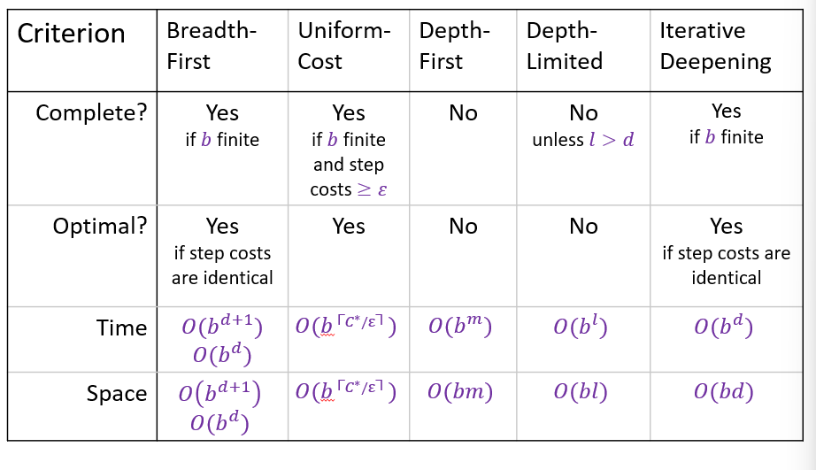

# Problem solving and search

## Problem-solving agents
+ Simple reflex agents
+ Model-based reflex agents
+ Goal-based agents
+ Utility-based agents

### Problem types
+ Fully observable vs. partially observable
+ Single-agent vs. multi-agent
+ Deterministic vs. nondeterministic
+ Episodic vs. sequential
+ Static vs. dynamic
+ Discrete vs. continuous
+ Known vs. unknown
  
### Problem-solving process:
1. Formulate goal
2. Formulate problem
3. Search for solution (= sequence of actions)
4. Execute sequence of actions

### Single-state problem formulation
1. initial state
2. actions
3. successor function
   1. 1,2 and 3 define the state space of the problem
4. goal test
5. path cost(additive)

## Uninformed search strategies
### Breadth-first search
+ go through layer by layer
+ When a node is investigated, it's children are created
+ frontier: a FIFO queue, i.e., new successors go at end
### Uniform-cost search
Expand the unexpanded node with the lowest path cost 𝑔(𝑛)
### Depth-first search
+ go through branch by branch
+ When a node is investigated, the nodes having the same parent with it are all created
+ frontier: LIFO queue, i.e., put successors at front
### Depth-limited search
= depth-first search with depth limit 𝑙,  
i.e., nodes at depth 𝑙 have no successors
### Iterative deepening search
+ limit = 1,2,...
+ Directly recognize the search tree as a subtree with first n layers.
### Summary 
