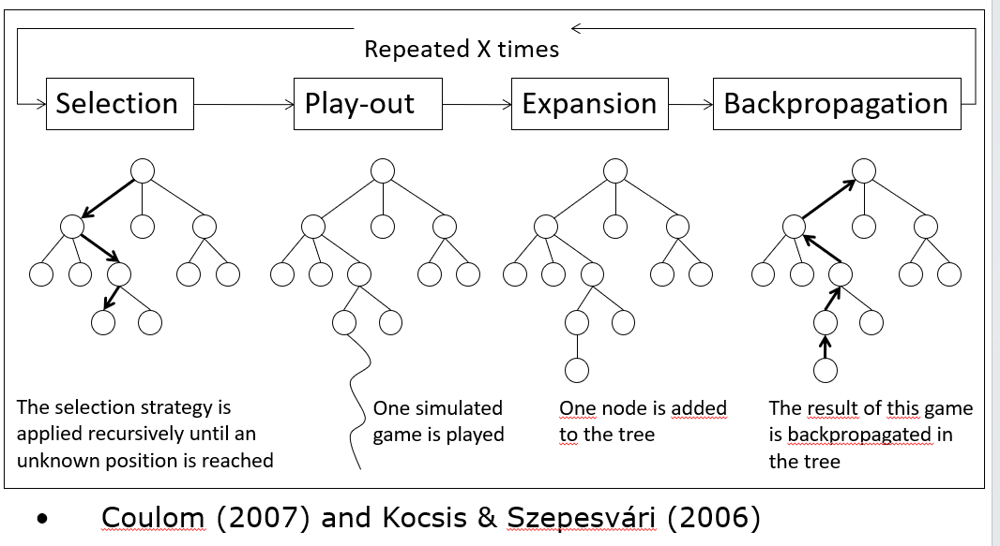

# Game Playing

## Minimax
+ choose move to position with highest **minimax value** = best achievable payoff against best play

### α-β pruning
https://blog.csdn.net/Sacredness/article/details/93124338
A way to solve a problem:
+ For node X, one of it's child set its value's range
+ Find parent node for X and its range. If it doesn't have yet, recognize it as infinite.
+ If the intersection  of X's range and its parent's range is None or has only one element, the prune all other X's children

#### Digression: Exact values don't matter
+ Behavior is preserved under any monotonic transformation of EVAL
+ Only the order matters:
  + payoff in deterministic games acts as an ordinal utility function
+ 其实这点在剪枝里也能看出来，剪枝并不影响结果，被剪掉的枝里的

## Monte Carlo Tree Search (MCTS)
