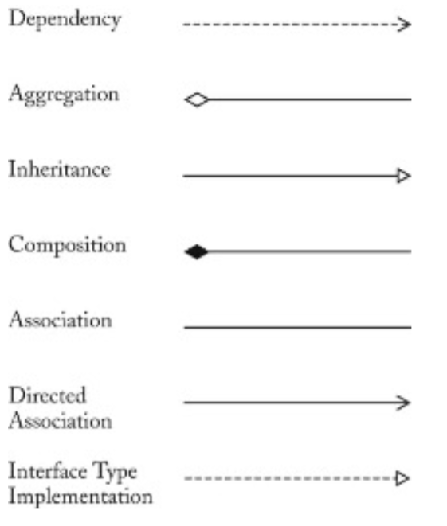
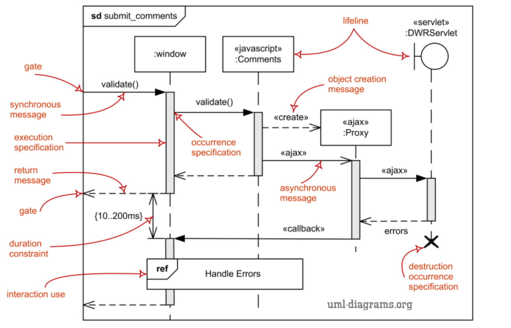

# UML modelling

## Classes
1. Class name
2. Class variables:
   + \+ public
   + \- private
   + \# protected
3. Class Method:
   + \+ public
   + \- private
   + \# protected
4. name of an abstract class: *italic_name*
5. Cardinality / Multiplicity
   indicator|Meaning
   :---:|:---:|
   *|any number(0 or more)
   0..1|Zero or One
   1|One Only
   0..*|Zero or More
   n|Only n (n>1)
   0..n|Zero to n (n>1)
   1..n|One to n(n>1)

## Association
A relationship to show: classifiers could be either linked to each other or combined logically or physically into some aggregation
+ drawn as solid line
+ bidirectional: A <-> B can navigate from A to B and B to A
+ directed: A -> B can only navigate from A to B

### Relations (cheat-sheet provided in exam):
+ **Realization**/Interface Type Implementation: A relation between class and interface. 
  + class -> 《interface》
  + class realizes interface
+ **Inheritance**: Java:Extends
  + A -> B = A extends B = A is B
+ **Aggregation**: Class 1 has a class 2/ Class 2 is part of class 1. 
  + A -> B = A has B
+ **Composition**: The **containing** object is responsible for the creation and life cycle of the **contained** object
  + e.g.: message queues is contained in mail box
  + Mailbox <- MessageQueue
  + A -> B = **B** owns **A** 
+ **Dependency**: A--->B is A uses B
  + A's object uses B's variables
  + A's method uses B's objects
  + A's method uses B's methods
  

## UML Sequence Diagrams
+ lifelines: Individual participant in the interaction
+ Execution: 
  + Executing: a unit of behavior/ action with in the lifeline (rectangles in lifelines)
  + Sending: a signal to another participant (solid arrow from another lifeline to the beginning of executing rectangle)
  + Waiting: for a reply message from another participant (dotted arrow from the end of executing rectangle to another lifeline)
+ Sequences: between lifelines of actors (↑those arrows)
+ Message:
  + Synchronous: wait for reply (one solid arrow to execution and one dotted arrow back)
  + Asynchronous: does not wait for reply (only one solid arrow to execution)
  + create: Instantiates a new message (e.g.: `<< create >> 1: New Order` on the arrow)
  + Guard: form conditions. (draw an oval across the arrow, write condition inside)

## UML State Diagrams
More abstract diagram describing classes with different states