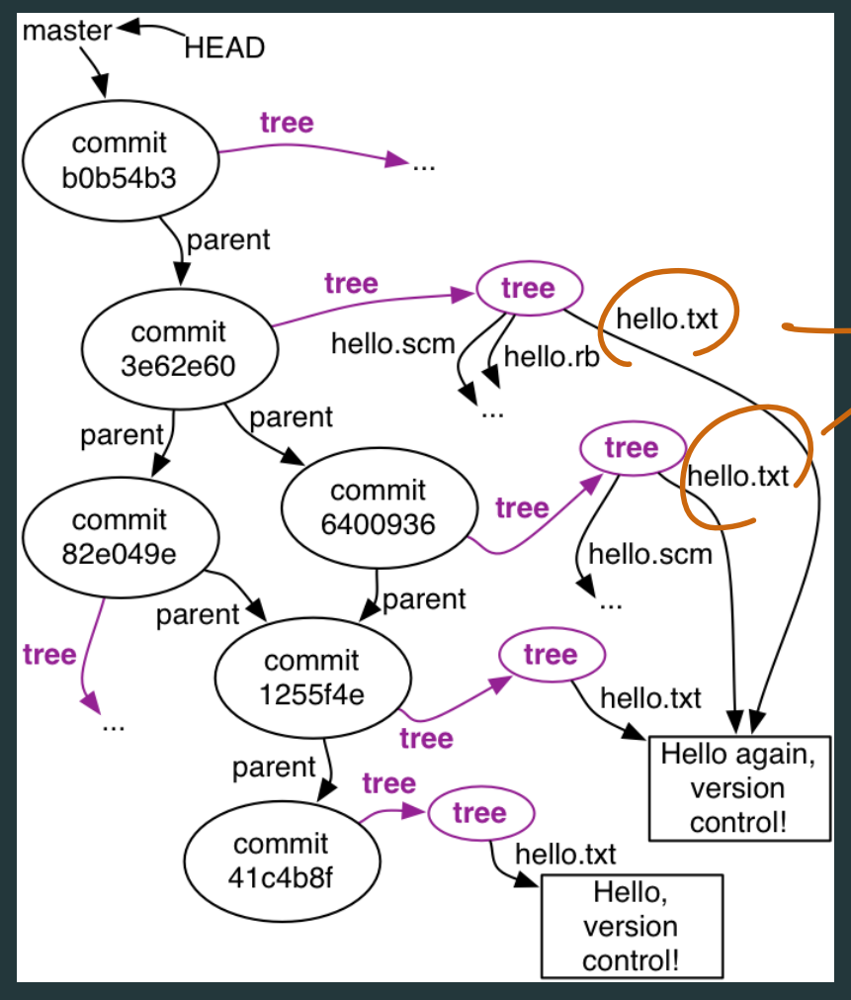

# Version Control

Centralized systems (CVS and Subversion):
+ One master server
+ Copies that only communicate with the master
Distributed systems (Git and Mercurial):
+ Not one master server
+ Multiple repositories are created equal
+ Subsets of teams can experiment easily with alternate versions of code and history

## GIT
- create empty local directory .git
- Copy the object graph from remote location to .git
- Check out the current version
- code changing
- `git add` add to staging area 
- `git commit` put in .git 
- `git push` change up to the **remote**

### The Three States
+ Modified: code changing on **working directory**
+ Staged:  marked a modified file in its current version to go into your next
commit snapshot (**staging area**)
+ Committed: stored in **local** database**git directory** (repository)

### History Graph: Directed Acyclic Graph (DAG)

## Visual control in exam:
To know hot to read `git status`
+ File in remote:
  + `.class` files: Probably in .gitignore. If it is in repositories: committed and up to dated
  + `.java`, `.md` etc. flies: In repositories: committed and up to dated

+ File is in staging area:
    `Changes to be committed:`
  - `new file` => this file most likely never be committed, but it is staged in staging area (In repositories, staged)
  - `modified:` => file has been changed since its last commit and staged in staging area (In repositories, changed, staged)
  
+ File is not in staging area:
    `Changes not staged for commit:`
     + `modified:` => file has been changed since its last commit, and not staged in staging area (In repositories, changed, not staged)

    `Untracked files:` this file most likely never be committed, and it is not staged in staging area (Not in repositories, not staged)