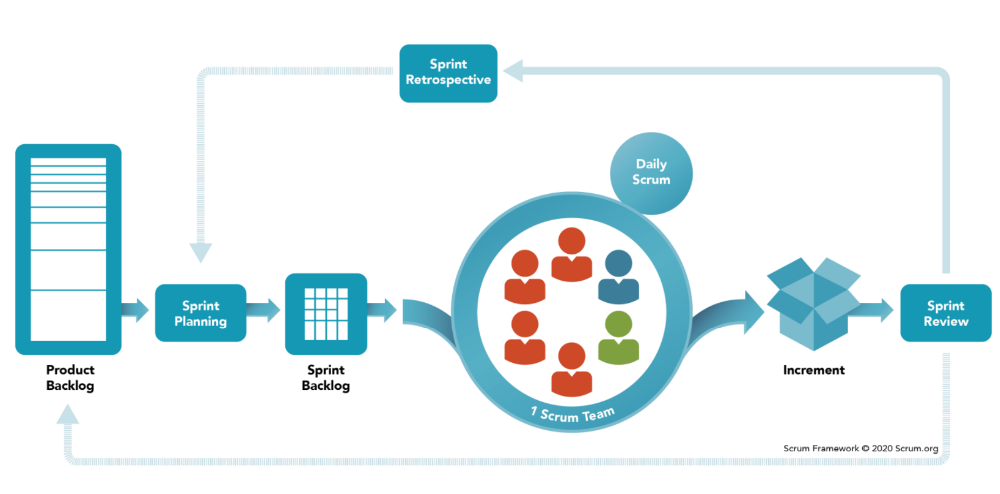

# Design Pattern

## Creational patterns
### ! The Factory Method
+ Creator → <\<Interface>> Product
+ Creator: returns new product
+ Concrete Products: are different implementations of the product interface.
+ Concrete Creators: override the base factory 
method so it returns a different type of product
### Singleton
There's only one instance with global access point to this instance. 
+ private constructor
### Prototype
Copy existing objects without making your code dependent on their classes
+ key method: clone

## Structural patterns
### Iterator
Various data structures can be traversed over (iterated) in different patterns.
e.g.: TreeCollection -> BFS|DFS
### ! Observer
+ Observers depend on subject
+ Observers are notified when subject is updated
### Visitor
Represents operation to be performed on an object
- Moves operation logic out of the object
- Can define new ops without changing object
Visitor class: Specifies what to do when visiting each object
e.g.: shopping cart
### Strategy
Define a family of algorithms, put each of them into a separate class, and make their objects interchangeable
+ e.g.: going to airport: bus/train/car/bike, choose according to strategy
### Command
Turns a request into a stand-alone object that contains all information about the request
+ e.g.: Button 1, Button 2, Button 4 -> commandSave

## Behavioural patterns
### ! Decorator
attach new behaviors to objects by placing these objects inside special wrapper objects that contain the behaviors
+ e.g.: a robot to update its functions
### Adapter
Allows objects with incompatible interfaces to collaborate
+ e.g.: SquarePeg -> SquarePegAdapter <- RoundHole

# SOLID
- Low/Loose coupling
- Abstraction
- Design by contract

## S: Single Responsibility Principle
A class should have one purpose
## O: Open/Closed Principle
Write your code so that you will be able to add new functionality without changing the existing code
Closed: existing code cannot be changed (e.g.: Java library)
Open: any new class may use it as parent
## L: Liskov Substitution (LS)
Objects of a superclass shall be replaceable with objects of its subclasses without breaking the application.
+ LS guarantees that every object of subclasses behaves just 
like superclass
## I: Interface Segregation
Interface should only contain what clients need.
## D: Dependency Inversion Principle (DIP)
+ A Class should depend on Abstraction, not Implementation
+ High-level modules/implementations should not depend on lower level modules/implementations.
+ General ways to avoid DIP:
  + No variable should hold a reference to the concrete class
  + No class should derive from concrete class
  + No method should override an implemented method of any of its subclasses

# Software Development Process Management

Functional Requirements: 
+ Business Rule
+ Certification requirements
+ Historical Data
+ Administrative functions
+ Authentication
  ...

Non-functional requirements:
+ Performance
+ Stability
+ Maintainability
+ Security
  ...

## Plan-Driven and Agile Processes !!!
Plan-driven processes: 
- Activities are planned in advance 
- Progress is measured against this plan
Agile processes: 
- Planning is incremental 
- Easier to change the process to reflect changing customer requirement
- Working software is the primary measure of progress

The Waterfall Method (Plan-Driven): Better for fixed requirements, small project
1. Analyses problem, gather requirements 
2. Draft functional, technical and test 
specifications 
3. Implement modules and perform unit testing 
4. Integrate modules and perform system testing 
5. Release and maintain

Iterative Incremental Model (Plan Driven)
Do waterfall method -> discuss with clients -> do again -> discuss again ... final program

### Scrum

Sprint: is a short, time-boxed period when a scrum team works to complete a set amount of work
Sprint plan -> Daily Scrum Meeting -> Sprint Review to check increment
Product Backlog: a list of user stories

## Project Management
+ A project generally has a clearly defined set of goals called **deliverables**

### Project manager: to achieve a goal given resources
A project manager tracks progress, deadlines, budget and resources over time

### Project Management
For software specifically:
- Prototyping
- Integration
- Testing
- Releases
- Reviews
Two things need strict management:
- Budget / Resources
- Time
Dependencies
1. Finish-to-Start:
– A must finish before B starts (most common)
2. Finish-to-Finish:
– B can’t finish before A finishes
3. Start-to-Start:
– B can’t start before A starts
4. Start-to-Finish:
– B can’t finish until A begins (rare)

