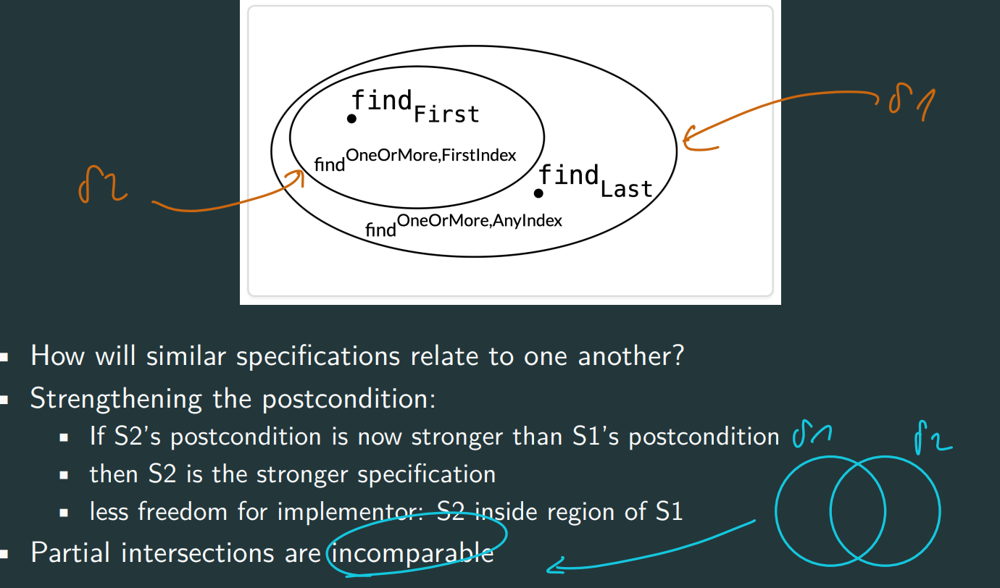

# Specifications
Specifications place demands on both parties

+ Specifications to document mutual assumption
+ Specs are crucial firewall between implementor and client
+ Declarative specs are the most useful in practice
---
A specification of a method consists of several clauses:
+ precondition: indicated by the keyword **requires**
  + @param
+ postcondition: indicated by the keyword **effects**
  + @return
+ Exception
  + @throws

## Designing Specifications !!!
1. Designing Specifications
   + deterministic:
     + Only one return value and one final state is possible
     + There are no valid inputs for which there is more than one valid output
   + undeterministic/not deterministic:
     + Allows multiple valid outputs for the same input
   + nondeterministic: random
2. Declarative & operational
   + Operational: series of steps that the method performs
   + Declarative: just properties of the final outcome, and how it is related to initial state
     + Easier to change implementation
     + Easier to understand
3. Stronger & Weaker
   + This implies that (from implementor’s perspective):
     + you can always weaken the precondition (范围更广)
     + you can always strengthen the postcondition （范围更小）
    when pre is weaker, post is stronger: stronger than before(fewer implementations satisfy it, more clients can use it)
    when pre is stronger, post is weaker: weaker than before
    when pre is weaker and post is weaker: incomparable
    
