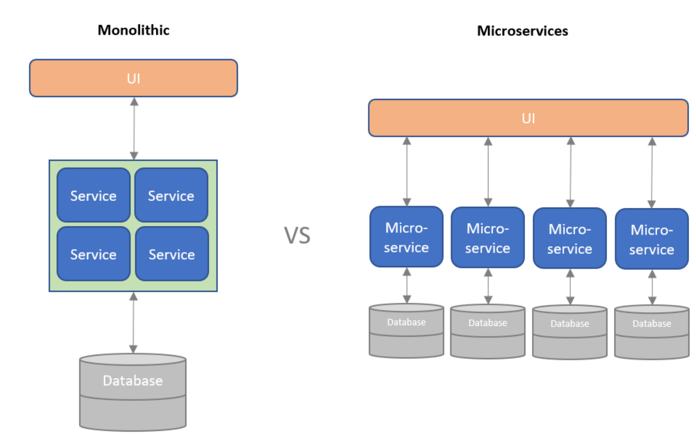

# Software architecture
Good software design requires high cohesion and low coupling.

## Module
### REP: The Reuse/Release Equivalence Principle
+ Modules must be separately released to be able to reuse
+ The author must organize the classes into reusable modules and then track them with the release
+ Without release numbers, there would be no way to ensure that all the reused modules are compatible with each other
### CCP: The common Closure Principle
+ classes are rarely reused in separation
+ Classes that are not tightly coupled to each other should not be kept in the same module
+ If code changes, we would prefer that all of the changes occur in one module
### CRP: The common Reuse Principle
+ We shouldn’t force our users to depend on things that they are not going to use
+ Make sure that the classes that we put into a module are inseparable
+ Do not include classes that are not related to the module.

## Modules and Cohesion
+ Goal: avoiding circular dependencies
+ Remember: A class (and therefore a package) should have one reason to change.

## Software Architecture !!!
*Separation of Concens (SoC)*
- software should be separated based on the kinds of work it performs. 
- As such each part can be developed independently and integrated through interfaces and protocols
- e.g.: Frontend -> Backend -> Database
- Therefore, changes in lower layers should thus never “break” the upper ones

### Multi-Layered Architecture
+ Model
  + directly manages the data, logic and rules of the application.
+ View
+ Controller: Accepts input and converts it to commands for the model or view
+ 
Advantages: 
+ Simultaneous development 
+ High cohesion 
+ Loose coupling
+ Ease of modification
Disadvantages:
- May be hard to scale
- Is not applicable to all types of software 
- Excessive boilerplate 
- Pronounced learning curve
- Closed-form, new functionality must be adjusted to MVC patterns

### Service-Oriented Architecture
SOA, defines a way to make software components reusable via service interfaces. 

A service has four properties:
1. It logically represents a business activity with a specified outcome.
2. It is self-contained.
3. It is a black box for its consumers, meaning the consumer does not have to be aware of the service's inner workings.
4. It may consist of other underlying service

#### Microservices

SoC is achieved by splitting software into loosely-coupled independent services that each have their own responsibility
+ Developers can quickly define and launch an architecture based on these barebone microservices
+ Services are independently deployable.
+ Can be implemented using different programming languages, databases, hardware and software environment, depending on what fits best.

Cloud platforms such as Azure, Google Cloud and AWS are built on this architecture
### Event Driven Architecture
+ Components create, detect, consume, and react to events
+ Common components: publishers, subscribers, sources, and sinks
+ Create and respond to a large number of events in real time
+ Well-suited for loosely coupled software, such as microservices
