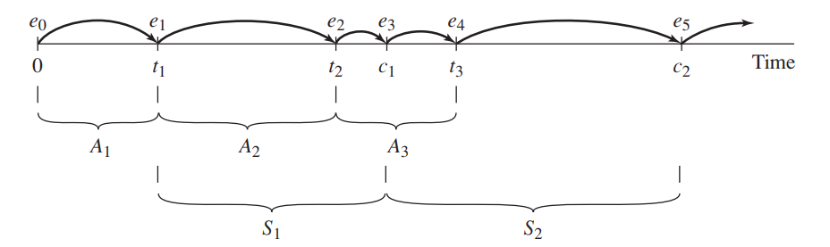

# Simulation of Systems
+ The system runs in continuous time
+ For the simulation, we need two aspects:
  + events
  + time

## Discrete Event Simulation (DES)

### Notations (Time-Advance Mechanisms)
+ $t_i$ = time of arrival of the $i$th customer ($t_0 = 0$)
+ $A_i = t_i - t_{i-1} = $ interarrival time between (i-1)st and ith arrivals of customers
+ $S_i = $time that server actually spends serving ith customer
+ $D_i = $delay in the queue of ith customer
+ $c_i = t_i+D_i+S_i = $ time that ith customer completes service and departs
+ $e_i = $time of occurrence of ith event of any type (ith value the simulation clock takes on, excluding the value $e_0 = 0$)

### Modeling
+ activity-based
+ Event-based
+ Process-based

#### Activity-based
Variable changes because of activity's happening.

#### Process-based
Activity -component (class) - variables
Assign activity to component (let component to do the activity, and variable change following to assignment)

#### Event-based
E.g.: Arrival customer & Departure customer

# Queueing Systems
A queueing system consists of one or more servers that provide service of some kind to arriving customers. Customers who arrive to fi nd all servers busy (generally) join one or more queues (or lines) in front of the servers, hence the name “queueing” system.
## Mathematical model of Queueing Systems
### Notation
+ D: deterministic
+ M: exponential 指数
+ $E_k$: Erlang-k
+ N: Gaussian
+ G: general (service time)
+ GI: general independent (inter-arrival time)

e.g.: Three servers: exp. inter-arrivals, exp. service times
Three total capacity
M | M | 3 | 3

### Modeling
+ $\lambda$: the rate of arrival (e.g.: how many people arrive in an hour)
  + Assume: the rate of arrival does not depend on how many people are in the system
+ $\mu$: The rate of the departure/the rate of the service 
  + Assume: the rate of service does not depend on how many people are in the system
  + E.g.: An agent can provide service to some people in an hour

### Calculation
$\Pi_j = (\frac{\lambda}{\mu})^j\pi_0$