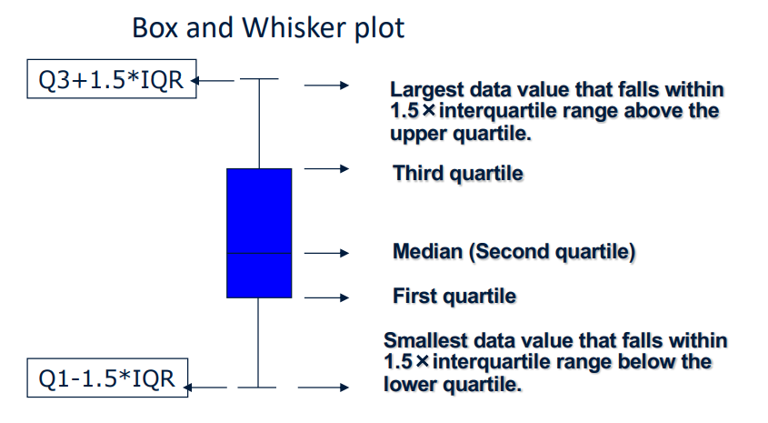
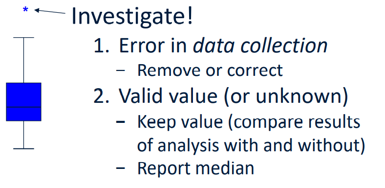
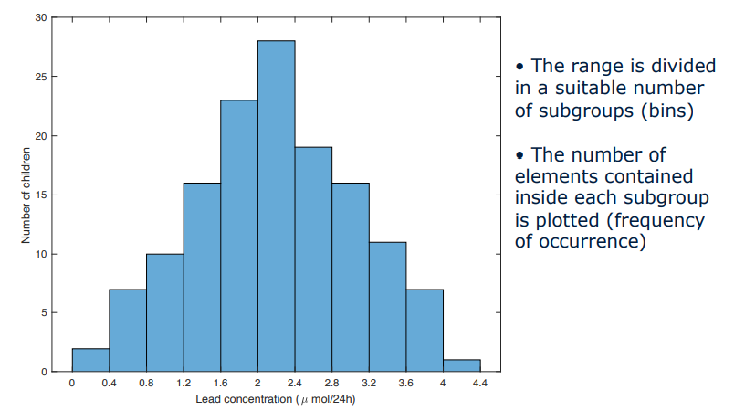
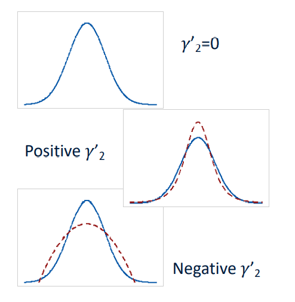

# Data exploration and fitting

## Study Design
+ Study designed to provide answers
  + Meets goals
  + Statistically significant

## Errors and uncertainties 误差和不确定性
+ No measurement can be completely free of uncertainties
+ it is crucially important to be able to **evaluate** these uncertainties. Can’t avoid them, but ensure that errors are as small as reasonably possible.

### Random and Systematic errors
+ Random
  + Different results for seemingly the same repeated measurement
  + Can be noticed by repeating the measurements, and threated by statistical analysis
+ Systematic:
  + Push of the results always in the same direction
  + Cannot be noticed by repeated measurements

## Descriptive statistics
### First glance : max, min and range
### Median:
+ properties:
  + the median is the nearest point to all other points
  + Median absolute deviation: MAD = median$(|X_i-median(X)|)$
    + $\hat{\sigma} =k*MAD$

### Measures of variation:
25%, 50%, 75%: $quartiles (1^{st}, 2^{nd}, 3^{rd})$

### Interquartile range
Interquartile range (IQR): the distance between the first and third quartile
### Seven number summary
+ the 2nd percentile
+ the 9th percentile
+ the 25th percentile or lower quartile or first quartile
+ the 50th percentile or median (middle value, or second quartile)
+ the 75th percentile or upper quartile or third quartile
+ the 91st percentile
+ the 98th percentile
### Mean, Standard deviation
$\sigma^2_n = \frac{\sum x^2}{n} - \overline{x}^2$
### Reference range
### Cleaning Example:
Mean +/- 3 SD is off the chart (literally)

## Data Display
### Bix-whisker plot

#### Error in data collection:

### Data display: Histograms

## Selecting input distributions

### Processes for selecting distributions
- Use data values themselves directly in the simulation
- Define an empirical distribution function from the data values
- Fit a theoretical distribution to the data
- Obviously for random number generators the distribution is known to be U(0,1)

### Useful Probability Distributions
+ Continuous
  + Uniform
  + Exponential
  + Gamma (Erlang)
  + Normal
  + Triangular
+ Discrete
  + Bernoulli
  + Uniform
  + Binomial
  + Poisson

### Shape of distributions: skewness
$skew(X) = E[(\frac{X-\mu}{\sigma})^3]$

### Shape of distributions: kurtosis
$Kurt[X] = E[\frac{X-\mu^4}{\sigma}]$
$\gamma_2 = Kurt[X]-3$

## Fitting probability distributions
### Activity I: Hypothesizing Families of Distributions
+ Histogram
  - Graphical estimate of plot of density function of the distribution
  - Constructed by breaking up values into adjacent intervals of the same width
+ Quantile summary
  - Useful for determining whether the distribution is symmetric or skewed right or left
  - Box plot: its graphical representation

#### Evaluation:
+ Empirical CDF & Theoretical CDF
+ distribution-function difference plot
+ 7 number summary and their differences

### Activity II: Estimating Parameters
- Maximum-likelihood estimators (MLEs) 
  - Find the PDF
  - Find the likelihood function
  - Find log-likelihood function
  - Find the derivation of likelihood function = 0