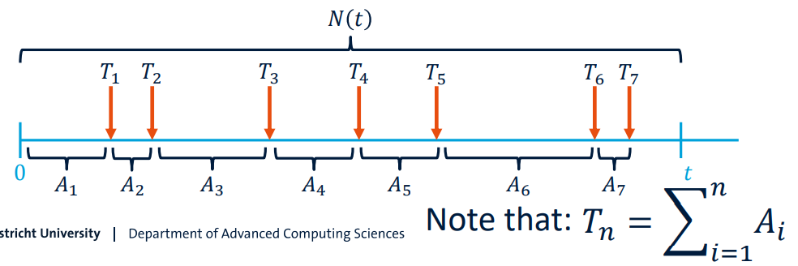

# The Poisson Process

## Counting process 
Mathematical model of Queueing Systems
+ a stochastic process, $\{N(t), t \geq 0\}$, that represents the number of 'events' up to time t is called a counting process
+ A counting process, $\{N(t), t \geq 0\}$, satisfies: 
  + $N(t) \geq 0$
  + $N(t)$ is integer valued
  + If $s < t$ then $N(s) \leq N(t)$
  + For $s < t, N(t) - N(s)$ equals the number of 'events' that occur in the interval $(s,t]$

### Properties of Counting Processes
+ A counting process, $\{N(t), t \geq 0\}$, has:
  + **independent increments** if, given $t_1 < t_2 < t_3$, $N(t_2-t_1)$ and $N(t_3-t_2)$ are independent. 独立增量
  + **stationary increments** if the distribution of $N(t+s) - N(s)$ is independent of s. 静态增量

## Poisson Process
$P[N(t+s) - N(s) = n] = e^{-\lambda t \frac{(\lambda t)^n}{n!}}, n = 0,1,2,...$  
+ A counting process $\{N(t), t \geq 0\}$ is said to be a Poisson Process with rate $\lambda, \lambda > 0$, if
  + N(0) = 0
  + The process has independent increments
  + Divide interval [0,t) into n equal bins. For $n \rightarrow \infin$, implies 0 or 1 arrival per bin with rate $\lambda$, probability of arrival in a bin is $\frac{\lambda t}{n}$.
    + $N(t) \sim Bin(n, \frac{\lambda t}{n})$ as $n \rightarrow \infin$

### The Poisson Process and The Exponential Distribution
#### Exponential Distribution
$X \sim Exp(\lambda)$
+ PDF: $f(x) = \lambda e^{-\lambda x}$
+ CDF: $F(x) = 1-e^{-\lambda x}$
+ $P(X \geq x) = 1- P(X \leq x) = 1 - F(x) = e^{-\lambda x}$
+ Expectation: $E[x] = \frac{1}{\lambda}$
+ Variance: $Var(X) = E[X^2] - (E[X])^2 = \frac{1}{\lambda^2}$

#### Exponential Distribution: Memoryless property
+ Let $X \sim Exp(\lambda)$, it holds that
  + $P(X \leq x + t | X \geq x) = P(X \leq t) = 1 - e^{-\lambda t}$

#### Arrival Process
Two ways of looking at the arrival process:  
+ Number of 'events' (N(t))
+ Arrival times $(T_n)$ and inter-arrival times $(A_n)$

#### Poisson Process & Exponential Distribution
Let $T_1$ denote the time of the first arrival
+ Poisson Process:
  + $P(N(t) = n) = e^{-\lambda t \frac{(\lambda t)^n}{n!}}$
  + $P(T_1 > t) = P(N(t)==0) = e^{-\lambda t}$
+ Exponential Distribution
  + Let $T_1 \sim Exp(\lambda)$, then $P(T_1) = e^{-\lambda t}$
  + Thus $P(T_1 > t) = P(T1 \geq t) = e^{-\lambda t}$

### Inter-arrival times for a Poisson Process
+ Let $\{N(t), t \geq 0\}$ denote a Poisson Process with rate $\lambda$, then the inter-arrival times $(A_n)$ follow an exponential distribution with parameter $\lambda$

### Erlang Distribution
Let $A_1, A_2, ..., A_n \sim Exp(\lambda)$, then $T_n = \sum^n_{i = 1}A_i$  
PDF: $f_{T_n}(t) = \lambda e^{1\lambda t}\frac{(\lambda t)^{n-1}}{(n-1)!}$

## Properties of Poisson Processes

### Conditioning on the number of arrivals
+ For a Poisson Process with rate $\lambda$, we know that $N(t) \sim Bin(n, \lambda t /n)$ as $n \rightarrow \infin$.
+ If in an interval $[0,t)$, the number of observed 'events' $N(t) = k$, these $k$ arrivals follow a $U(0,t)$ distribution.

### Random Selection
+ Suppose we have a Poisson Process with rate 𝜆 and we select each arrival with probability 𝑝. The result is a Poisson Process with rate 𝜆p.
+ This procedure is called a thinning algorithm

### Superposition
The superposition of two Poisson Processes ($P(\lambda_1)$ and $P(\lambda_2)$ ) constitutes a $P(\lambda_1 + \lambda_2)$.

### Random Split
$P(\lambda_1+\lambda_2)$ is randomly split  
$P[X_1 < X_2] = \int^\infin_0 P[X_1 < X_2 | X_1 = x] .* P[X_1 = x] dx = \frac{\lambda_1}{\lambda_1 + \lambda_2}$  

### Steady state analysis
+ State: encapsulates system information
+ Steady state probabilities $(\prod_j)$
  + Long run probability of being in state $j$

###  Poisson Arrival See Time Averages (PASTA)
+ $\prod_j$ the probability that an outside observer sees the system in state $S_j$
+ $\prod_j^*$: the probability that an arriving customer sees the system in state $S_j$
+ Generally speaking: $\prod_j \not ={\prod_j^*}$
+ Poisson Process arrivals: $\prod_j ={\prod_j^*}$

## Hitchhiker paradox
Cars passing point on road according to Poisson process with rate. The average waiting time:  
$\overline{W} = \frac{1}{t} \int^t_0 W(\tau) d\tau = \overline{X}$

## Nonstationary Poisson Process
+ Poisson process with a non-stationary arrival rate $\lambda (t) - a$ function of time

### Simulating Nonstationary Poisson Processes
+ Very similar to Poisson Process
  + On arrival at $t$:
    + Determine current arrival rate $\lambda(t)$
    + Draw from $X \sim Exp(\lambda (t))$
  
#### Compound Poisson Process
A stochastic process $\{X(t), t \geq 0 \}$ is said to be a **Compound Poisson Process** if it can be represented as  
$X(t) = \sum^{N(t)}_{i = 1} Y_i, t \geq 0$  
+ $\{N(t), t \geq 0\}$ is a Poisson process
+ $\{Y_i, i \geq i\}$ are i.i.d. random variables which are also independent of $\{N(t), t \geq 0\}$  

#### Hawkes Process
A Hawkes Process is an extension of the Poisson Process in which  
$\lambda (t) = \mu (t) + \sum_{t_i:t_i<t>} \phi(t-t_i)$  
+ $\mu(t)$ is the intensity of the process 
+ the kernel $\phi(t-t_i)$ is the intensity triggered by the arrival at $t_i$
