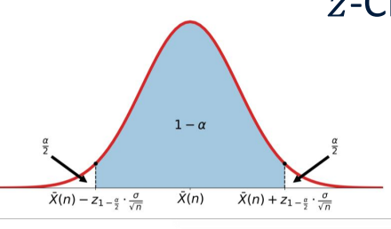
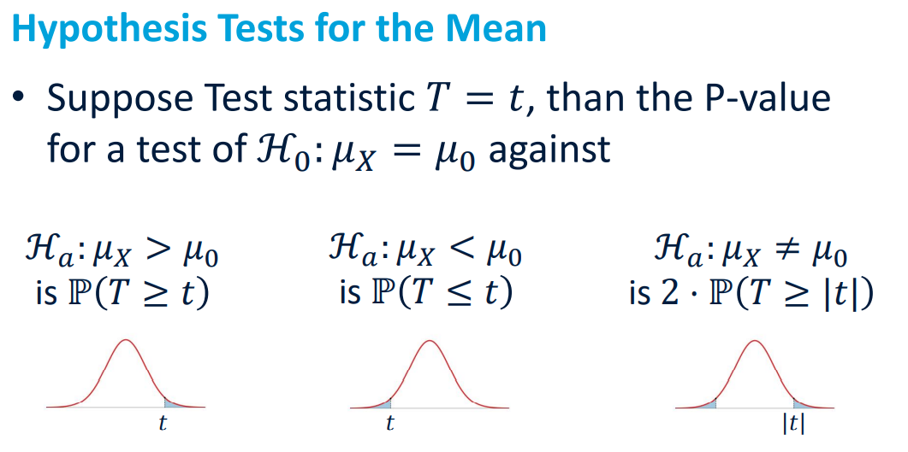

# Output Analysis
## Estimation of Means, Variances, and Correlations
+ Simulation n times independently, we get observations $X_1, X_2, ..., X_n$. Suppose they are i.i.d. RVs and
  + The population mean $(\mu)$ is finite
  + The population variance $(\sigma^2)$ is finite
+ Sample Mean: $\overline{X}(n) = \frac{\sum^n_{i=1}X_i}{n}$
  + $E[\overline{X}(n)] = \mu$
+ Sample Variance: $S^2(n) = \frac{\sum^n_{i=1}(X_i-\overline{X}(n))^2}{n-1}$
  + $E[S^2(n)] = \sigma^2$
+ Standard Error on the Sample Mean: $SE = \hat{\sigma_{\overline{X}}} =S_{\overline{X}} = \sqrt{\frac{S^2(n)}{n}} $

## Confidence Intervals
+ A level 𝐶 confidence interval for the mean 𝜇 is an interval, computed from sample data $𝑋_𝑖, 𝑖 = 1, … , n,$ that contains 𝜇 with probability 𝐶
+ 2 situations:
  + $\overline{X}(n)$ is normally distributed, $\sigma^2$ is known
  + $\overline{X}(n)$ is normally distributed, $\sigma^2$ is unknown

### z-Confidence Interval of the Mean
+ $\overline{X}(n)$ is normally distributed, $\sigma^2$ is known
  + z-CI at $(1-\alpha)·100%$ level: $\overline{X}(n) \pm z_{1-\frac{a}{2}}·\sqrt{\frac{\sigma^2}{n}}$

### 𝑡-Confidence Interval of the Mean
+ $\overline{X}(n)$ is normally distributed, $\sigma^2$ is unknown
+ Estimate variance from data:
  + $S^2(n) = \frac{\sum^n_{i=1}(X_i-\overline{X}(n))^2}{n-1}$
  + 就是用样本方差代替总体方差
+ t-CI at $(1-\alpha)·100%$ level: $\overline{X}(n) \pm t_{1-\frac{a}{2}}·\sqrt{\frac{S^2(n)}{n}} = overline{X}(n) \pm t_{1-\frac{a}{2}}·S_{\overline{X}}$

## Hypothesis tests for the mean
+ Data: $X$
+ Null-hypothesis: $ℋ_0$
+ Test statistic: $T$ 测试统计 就是这些检验
+ significance level: $\alpha$
+ p-value

### Definitions:
+ p-value: The probability, assuming 𝐻0 is true, that the test statistic would take a value as extreme or more extreme than that actually observed is called the 𝒑-value of the test. The smaller the 𝑝-value, the stronger the evidence against 𝐻0 provided by the data.
  + p值表示当前值或比当前值更极端值出现的概率和，通过和小概率事件（总体统计量分布）的临界值$\alpha$比较，从而判定样本中的统计量在总体统计量分布中是否属于小概率事件
+ Statistical Significance: If the 𝑝-value is as small or smaller than 𝛼, we say that the data are statistically significant at level 𝜶.
+ Power: The probability that a level 𝛼 significance test will reject 𝐻0 when a particular alternative value of the parameter is true is called the power of the test to detect that alternative.

### t-test for the Mean
+ Test statistic: $t_n = \frac{\overline{X}(n) - \mu_0}{\sqrt{\frac{S^2(n)}{n}}}$
+ Reject $H_0$ if $|t_n| > t_{n-1,1-\frac{a}{2}}$
  + $\overline{X}(n)$为样本均值，$\mu_0$为总体均值
  + 当p-value < $1-\alpha$时拒绝原假设

## The Bootstrap
从原数据组里有放回的随机抽样来扩充原数据
+ Unknown population distribution
+ Sample data $\{X_i, i = 1,...,n\}$
+ Goal: Determine parameter $\theta$
+ Perform $m$ iterations:
  + Sample $n$ observations with replacement
  + Calculate estimate of parameter $\theta$

### Empirical Bootstrap CI of the mean
+ Create Bootstrap samples $X_{j,i}$
+ Determine Bootstrap means $X_j^*$
+ Determine variability with reference to the mean $\delta_j^* = X_j^* - \overline{X}(n)$
+ Determine percentiles of $\delta_j^*$: $\delta_{\frac{a}{2}}^*$ and $\delta_{(1 - \frac{a}{2})}^*$
+ Construct CI: $[\overline{X}(n) - \delta_{(1-\frac{a}{2})}^*, \overline{X}(n) - \delta_{\frac{a}{2}}^*]$

## Output Analysis of a Single System
### Simulation Output Data and Stochastic Processes
+ Simulation output data are random
+ Progression of output measure over time of a simulation run constitutes a Stochastic Process
+ A discrete-time stochastic process $\{ X_1,X_2, … \}$ is said to be covariance-stationary (weakly stationary) if:
  + $\mu_i = \mu$ for $i = 1,2,...$ and $-\infin < \mu < \infin$
  + $\sigma^2_i = \sigma^2$ for $i = 1,2,...$ and $\sigma^2 < \infin$
  + and autocovariance $C_{i,i+k} = Cov(X_i,X_{i+k}$ is independent of i for j = 1,2,..
+ Single runs are not independent

### Types of Simulations
+ Terminating
  - End of simulation run is naturally specified   
  - Performance measures generally depend on initial conditions
- Non-terminating (steady-state)  
  - There is no natural event to specify run length
  - Performance measures do not depend on initial conditions

#### Statistical Analysis for Terminating Simulations
+ Replication method: Perform 𝑚 simulation runs.
  + Example: Average Delay of first 𝑛 customers in queueing system
  + The outcomes of the $m$ simulations runs are i.i.d. and normally distributed
  + Thus we can construct a $100(1-\alpha)%$ CI of the mean:
    + $\overline{X}(m) \pm t_{m-1, 1-\frac{a}{2}}·\sqrt{\frac{S^2(m)}{m}}$

#### Statistical Analysis for Steady-state Simulations
+ Solution: Replication-Deletion method
+ Where to cut? Welch’s Graphical Procedure
+ Solution: Batch Means Method
+ Split very long run into batches of length k