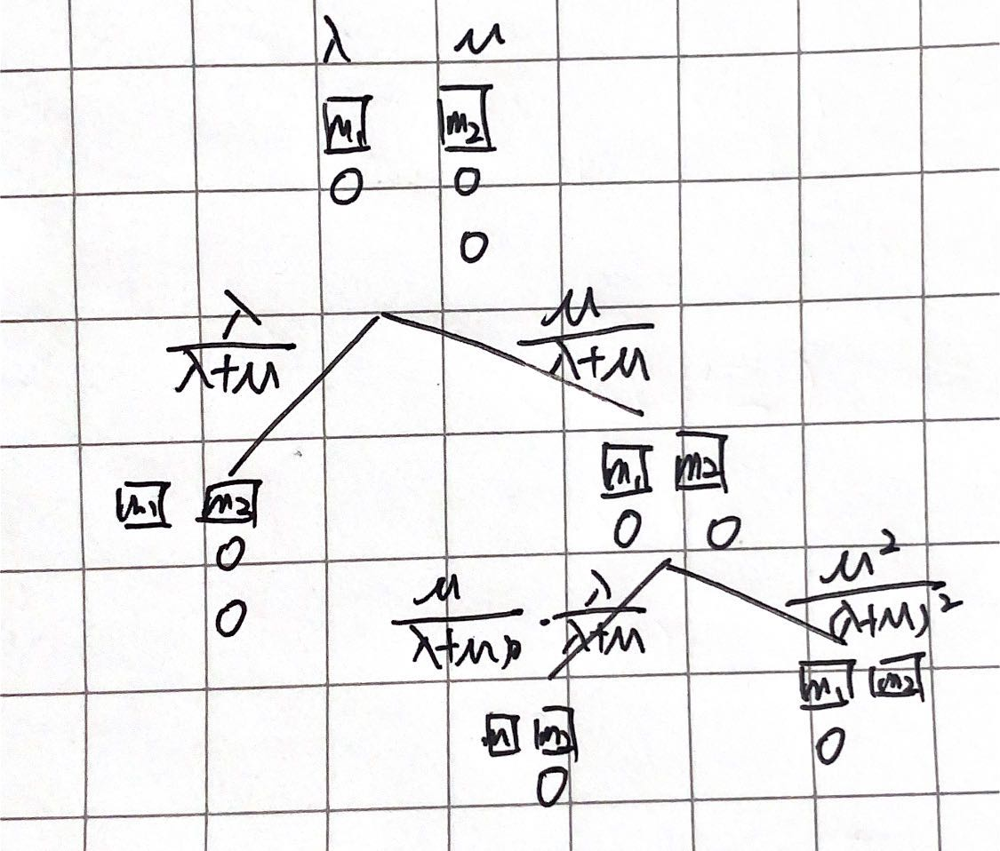

# Cheatsheet for doing exam questions

## 1. Random number generator
### LCG:
$Z_i = (aZ_{i-1}+c)(mod m)$  
a,c,m is given.  
$Z_0$ is given. Using it recursively calculate Z until you find the loop.  

### LFSR:
$b_i = (b_{i-r}+b_{i-q})(mod 2)$
$q,r$ is given.  
+ Step 1: turn initial integer to Binary
  + E.g.: initialized with 42
  + 42/2 = 21 + 0  **0**
  + 21/2 = 10 + 1  **1**
  + 10/2 = 5 + 0   **0**
  + 5/2 = 2 + 1    **1**
  + 2/2 = **1** + **0**
  + So binary of 42: 101010 (from bottom left to top)
  + Fill it to be 8 bit(required by question): 00101010
+ Step 2: Find the $r$th and $q$th digits counting from right to left and add them up, and then $mod 2$
  + E.g.: q = 8: $0$, r = 3: $0$
  + 0+0 mod 2 = 0
+ Step 3: Remove the first number from the left side
  + E.g.: Now it should be 0101010_
+ Step 4: fill the _ with the value from Step 2
  + E.g.: Now it should be 01010100
+ Repeat Step 2 to Step 4 until the last number is moved to the first position
+ Last: Turn this binary to be decimal integer

## 2. Testing Random number generators and input distribution
### General process
+ Step 1: Write down $H_0$ Null hypothesis: this dataset follows xxx distribution with parameters xxx = nnn
+ Step 2: Calculate the probability $p$ according to the distribution in the hypothesis
+ Step 3: Use the following data and original dataset to calculate **test statistic**
+ Step 4: Check the table to find **critical point**. DOF = number of bins-1
+ Step 5: If test statistic > critical point, we reject $H_0$

### chi-square tests
+ Follow general process
+ Test statistic: $\chi^2 = \sum^k_{j=1} \frac{(N_j-np_j)^2}{np_j}$
+ n: population size

### KS tests
+ Sort the original dataset from small to large
+ Calculate expected **cumulative** probability: y_actual = [1/n,2/n,3/n,...,1] (n is size of original dataset)
+ From general process Step 2 we can get a series: y_expect = cdf[x] (where x is original dataset)
+ $D^+$[i] = y_actual[i] - y_expect[i]
+ $D^-$[i] = y_expect[i+1] - y_actual[i]
+ **Test statistic**: Find the largest number in $D^+$ and $D^-$
+ Note: don't use absolute difference

### Poker tests
+ Follow general process
+ probability in Step 2 is from table in formula sheet
+ **Test statistic**: chi-square

### Runs tests (Not using critical point)
+ a = the number of numbers above the mean
+ b = the number of numbers below the mean
+ $\mu_r = \frac{2ab}{n} + 0.5$
+ $\sigma^2_r = \frac{2ab(2ab-n)}{n^2(n-1)}$
+ Test statistic: $R = \frac{r-\mu_r}{\sqrt{\sigma^2_r}}$
+ Region of acceptance: $-z_{\alpha/2} \leq R \leq z_{\alpha/2}$
  + This $z_{\alpha/2}$ is from Normal Distribution table 
  + 95% confidence: z = 1.96
  + 90% confidence: z = 1.64

#### t-test for the Mean
Follow the general progress
+ $H_0$: the sample mean is the same with population mean
+ Test statistic: $t_n = \frac{\overline{X}(n) - \mu_0}{\sqrt{\frac{S^2(n)}{n}}}$
+ Reject $H_0$ if $|t_n| > t_{n-1,1-\frac{a}{2}}$
  + $\overline{X}(n)$为样本均值，$\mu_0$为总体均值
  + 当p-value < $1-\alpha$时拒绝原假设

## 3. Poisson process
+ From question:
  + **rate** means $\lambda$ in formulas
  + **mean** means $\frac{1}{\lambda}$ in formulas

### Exponential Distribution
$X \sim Exp(\lambda)$
+ PDF: $f(x) = \lambda e^{-\lambda x}$
+ CDF: $F(x) = 1-e^{-\lambda x}$
+ $P(X \geq x) = 1- P(X \leq x) = 1 - F(x) = e^{-\lambda x}$
+ Expectation: $E[x] = \frac{1}{\lambda}$
+ Variance: $Var(X) = E[X^2] - (E[X])^2 = \frac{1}{\lambda^2}$

#### E.g.:
+ 4 people in queue, service rate = $\lambda$, waiting time = $4\lambda$ (from expectation)
+ Probability of a person waiting more than $t_1$: $P(X \geq t_1) = e^{-\lambda t_1}$

### Random split:
$P(\lambda_1+\lambda_2)$ is randomly split  
$P[X_1 < X_2] = \int^\infin_0 P[X_1 < X_2 | X_1 = x] .* P[X_1 = x] dx = \frac{\lambda_1}{\lambda_1 + \lambda_2}$  
#### E.g.: Calculate probability of a situation
Machine 1's rate: $\lambda$  
Machine 2's rate: $\mu$  
They are both working, and there is 1 in the queue of machine  
Probability of each situation:  

## 4. Random variate
### PDF provided, find CDF
+ By changing the coefficients, adding constants to the CDF to make CDF valid
  + CDF $F(x)$ = 0 in the beginning, = 1 at the end
  + $F(x)$ has to be **continuous**
#### Steps: If there are two functions in the pdf (excluding 0)
+ Assume 2 pdf: $f_1(x)$ when $0 \leq x < 1$, $f_2(x)$ when $1 \leq x < a$
+ Step 1: Calculate $g_1(x) = \int^x_{0} f_1(x) dx$
  + $g_1(x)$ is CDF when $0 \leq x < 1$
  + Calculate $g_1(1)$
+ Step 2:  Calculate $g_2(x) = \int^x_{1} f_2(x) dx + g_1(1)$
  + $g_2(x)$ is CDF when $0 \leq x < 1$
  + $g_2(a)$ must be 1
+ Step 3:
  + $F(x) = 0$ when $x < 0$
  + $F(x) = g_1(x)$ when $0 \leq x < 1$
  + $F(x) = g_2(x)$ when $0 \leq x < a$
  + $F(x) = 1$ when $x > a$

### ITM - inverse transformation method
+ Calculate the inverse function of every CDF function
  + Let $U = F(X)$
  + Find X = a function of U
  + Put U in range of X to get a new range
#### E.g.:
one of function in CDF is $x^3$ when $0 \leq x < 1$
1. $U = x^3$
2. $x = \sqrt[3]{U}$
3. $0 \leq \sqrt[3]{U} < 1$
4. Since $\sqrt[3]{U}$ is increasing, we can find $0 \leq U < 1$
5. So ITM of this part of CDF is $\sqrt[3]{U}$, where $0 \leq U < 1$

### Composition method
1. Find CDF
2. Find ITM
3. Write down these:
   1. generate $U \sim U(0,1)$
   2. return $x = ITM$ when $... \leq U < ...$ 

### Acceptance-rejection method:
1. Find the max value $k$ of PDF
2. let $t(x) = k$ in the range of PDF, $t(x) = 0$ in other ranges
3. Calculate $c = \int^\infin_{-\infin} t(x)dx$, change infinite to be the range of PDF
4. let $r(x) = t(x) / c$
5. Write down these:
   1. Generate $Y$ having density $r$
   2. Generate $U \sim U(0,1)$, independent of Y 
   3. If $U \leq f(Y)/t(Y)$, return X = y
   4. Else, go back to step 1

## 5. Output analysis of single system
### Find Confidence interval
1. Calculate mean $\mu$ and variance $\sigma^2$ of dataset, let $n$ = size of dataset
2. Find $z_{1-\alpha/2}$ in normal distribution table
   1. E.g.: if interval is 90%, $\alpha = 0.05 ((1-0.9)/2)$, so we have to find **$z_{0.95}$**
   2. Go through the whole table to find the one which is the closest to **0.95**
   3. We can find $0.9495$, and then plus its column head **0.04** and row head **1.6**
   4. $z_{0.95} = 1.64$
   5. Common interval: $90\%: 1.64$, $95\%: 1.96$
3. Interval: $[\mu - z_{1-\alpha/2}\sqrt{\frac{\sigma^2}{n}}, \mu + z_{1-\alpha/2}\sqrt{\frac{\sigma^2}{n}}]$

### Empirical bootstrap method
n is the size of the original data set. This method is picking n random numbers from original dataset, and repeating several times, to calculate confidence intervals. Each column is a group of picking.  
1. Calculate mean $X^*_j$ of each column (group of bootstrap data)
2. Calculate $\delta^*_j = X^*_j - \overline{X}(n)$, which means using mean of each column minors original dataset's mean, and then **sort** them from low to high
3. Find $\delta^*_{\frac{\alpha}{2}}, \delta^*_{1-\frac{\alpha}{2}}$
   1. If 90% confidence, and the number of groups is 100, then we found 5%th and 95%th number, which is 5th and 95th
   2. If 90% confidence, but the number of groups is 10, we can only use the 1st and 10th number as 5%th and 95%th
4. Construct CI: $[\overline{X}(n) - \delta^*_{1-\frac{\alpha}{2}},\overline{X}(n) - \delta^*_{\frac{\alpha}{2}}]$

#### Percentile method (Should not be used but appeared in exercise's answer)
1. Calculate mean $X^*_j$ of each column (group of bootstrap data) and **sort** them
2. Find 5%th and 95%th mean value of each column 
   1. E.g.: 90% confidence, 10 column:
   2. Find $X^*_1$ and $X^*_{10}$
3. Construct CI: $[\overline{X}(n) - X^*_1，\overline{X}(n) - X^*_{10}]$ (a example)

### Batch Means Method
The data is segmented and then calculated by averaging each segment.  
+ CI: $\overline{Y} \pm t_{m-1,1-\alpha/2} \sqrt{\frac{Y.variance}{len(Y)}}$

### Addition: CI for Normal Distribution
#### z-Confidence Interval of the Mean
+ $\overline{X}(n)$ is normally distributed, $\sigma^2$ is known
  + z-CI at $(1-\alpha)·100%$ level: $\overline{X}(n) \pm z_{1-\frac{a}{2}}·\sqrt{\frac{\sigma^2}{n}}$

#### 𝑡-Confidence Interval of the Mean
+ $\overline{X}(n)$ is normally distributed, $\sigma^2$ is unknown
+ Estimate variance from data:
  + $S^2(n) = \frac{\sum^n_{i=1}(X_i-\overline{X}(n))^2}{n-1}$
  + 就是用样本方差代替总体方差
+ t-CI at $(1-\alpha)·100%$ level: $\overline{X}(n) \pm t_{1-\frac{a}{2}}·\sqrt{\frac{S^2(n)}{n}} = overline{X}(n) \pm t_{1-\frac{a}{2}}·S_{\overline{X}}$

## 6. Comparing alternative system configuration
### How many additional tests
+ $n_0$: the original sample size
+ $S_i^2(n_0)$: the variance of original sample i
+ $k$: how many systems (groups of data) there are 
+ $P*$: certainty
+ $d*$: not caring differences (should be the same unit with datasets)
+ $h_1$: the value found from D&D table with $P*, n_0, k$
+ Use D&D sample size formula to calculate
+ Note: remember to minors $n_0$ in the end

### Confidence interval
$H_0: \mu_1 = \mu_2$
#### Paired-t confidence interval (same sample size)
+ Original 2 dataset: $t1$ and $t2$ (don't sort)
+ let $Z$ to be the series that
  + `Z[i] = t1[i] - t2[i]`
+ $n$: sample size, dof: n-1
+ Find $t_{1-\alpha/2, dof}$ in t-distribution table
+ CI: $\overline{Z} \pm t_{1-\alpha/2, dof} * \sqrt{\frac{Z.variance}{n}}$
+ If CI cross 0, we reject $H_0$

#### matching unpaired, unpooled variance t-test
Follow the general progress in Part 2.
+ Test statistic: $t = \frac{\overline{X_1}-\overline{X_2}}{\sqrt{\frac{S_1^2}{n_1} + \frac{S_2^2}{n_2}}}$
+ dof is the first formula in Comparing Alternative System Configurations in formula sheet

#### The independent t-test (pooled two-sample t-test, Equal population variance) (NEVER APPEARED IN exercises)
+ Test statistic: $t = \frac{\overline{X_1}-\overline{X_2}}{S_p\sqrt{\frac{1}{n_1} + \frac{1}{n_2}}}$
+ $S_p = \sqrt{\frac{((n_1-1)s_1^2(n_1) +(n_2-1)s_2^2(n_2))}{n_1+n_2-2}}$

## 7. Monte Carlo
1. Set $h(x,y) = $ the function in the integral
2. Set $X \sim U(upper limit,lower limit)$, $Y \sim U(upper limit,lower limit)$
3. If $X,Y \leq h(x,y)$, return x,y = X,Y
4. Else, go back to step 2

## 8. Variance reduction
### Useful formulas:
+ $Cov(X_{1j},X_{2j}) = E(X_{1j}*X_{2j}) - E(X_{1j})E(X_{2j})$
+ $Var(X) = E(X^2)-(EX)^2$
+ $E(X + Y) = E(X) + E(Y)$
+ $E(cX) = cE(X)$
+ $Var(X - Y) = Var(X) + Var(Y)$ (ind)
+ $Var(X\pm Y) = Var(X) + Var(Y) \pm 2Cov(X,Y)$ (CRN)

### Methodology
1. Directly put $X_{1j}$ and $X_{2j}$ into formulas
   1. E.g.:  $X_{1j} = U^5$ -> $E(U^5)$
2. $E(U^k) = \frac{1}{k+1}$  
   1. E.g.: $E(U^5) = \frac{1}{6}$
3. Use this fact and formulas to get **Cov**, **Var(ind)**, **Var(CRN)**
4. Conclusion: If **Var(CRN) > Var(ind)** (Cov is positive), our data is more reliable.
