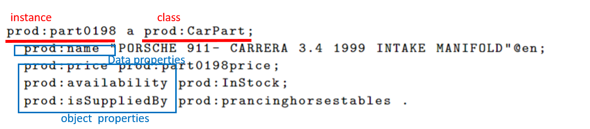
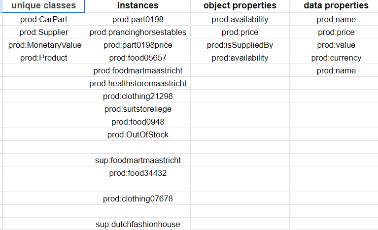

#### 1.a Definition of Ontology
- A historical definition of ontology from philosophy (preferably including an etymological description of the term)
  - In philosophy, ontology, originating from the Greek "ontos" (being) and "logos" (study), delves into the nature of existence and reality.
- A modern definition of the term ("formal ontology") in Computer Science (Here you can make reference to logic, semantics (removing ambiguity in the meaning of represented knowledge), Description Logics etc.)
  - In computer science, formal ontology is a structured, logically defined representation of knowledge, often employing Description Logics (DLs) to remove ambiguity and enable automated reasoning.
- A description of its function in the Semantic Web vision. Here you can make reference to OWL (based on DLs) and the fact that OWL provides a syntax for representing ontologies that builds on existing Web standards (e.g. XML) – you can tell this from the syntax (the way OWL documents look).
  - In the Semantic Web vision, ontologies, often represented in the Web Ontology Language (OWL), serve to provide a standardized framework for sharing structured knowledge on the internet. They enable data interoperability, semantic annotation, and automated reasoning, supporting the realization of a more semantically enriched and interconnected web.
  
#### 1.b benefits of using OWL
Using the Web Ontology Language (OWL) for representing knowledge about the company offers benefits such as:

1. **Formal Semantics:** OWL provides a precise and standardized way to describe data, making its meaning explicit.

2. **Automated Inference:** OWL enables automated reasoning, helping discover implicit relationships and insights.

3. **Shared Understanding:** It establishes a common language and conceptual framework for better collaboration.

4. **Explainability:** The ontology makes the rationale behind data and conclusions transparent, aiding in compliance and trust-building. 

This makes OWL a valuable choice compared to traditional relational databases for knowledge representation.

#### 1.c formulate OWL axioms
1. Product subClassOf (hasName exactly 1 Thing) and (hasPrice exactly 1 Thing)
2. Product subClassOf hasSupplier some (Supplier and (isLocatedIn only (BelgianCity or DutchCity or GermanCity)))
3. Supplier subClassOf (hasName exactly 1 Thing) and (isLocatedIn exactly 1 Thing)
4. CarPart subClassOf hasSupplier only (Supplier and isLocatedIn some (GermanCity))

#### 1.d natural language explanation and OWL axioms
1. A Chief Intelligence Officer (CIO) is a person who works for a company and is the head of information technology matters.
   + Cio equivalentTo Person and (worksFor some Company) and (headOf some ITMatter)
2. A consultant is a person that provides professional advice in a particular area of management, operations or technology.
   + Consultant equivalentTo Person and (provides some (ProfessionalAdvice and (concerns some (ManagementMatter or OperationsMatter or TechnologyMatter))))
3. A backend developer develops codes of server but not user interface.
   + BackendDeveloper equivalentTo codes (Server and not (GUI) )

#### 2.a find classes, instances, object properties and data properties

data properties后面跟的是具体值
object properties后面跟的还是object

#### 2.b RDF syntax errors
1. Line 1, 3, 9: invalid URI -> http://mycompany.org/productgraph/ontology/
2. Line 18: incorrect datatype -> xsd:float or xsd:double
3. Line 22: could split name of product into three separate triples using different language tags
4. Line 24-25 use Turtle abbreviation for prod:isSuppliedBy
5. Line 30: no datatype specified -> xsd:float or xsd:double
6. Line 37: a potential problem - multiple namespaces used for same instance i.e. sup: and prod: -> choose one of these or add a triple such as sup:foodmartmaastricht owl:sameAs prod:foodmartmaastricht to the graph to indicate that they represent the same instance
7. Similar problem to 5. with sup:suitstoreliege
8. At various points in the graph Turtle abbreviations are not used - minor issue

#### 2.c method for adding new truth
RDF Reification
("Reify" means to take an abstract idea, and to make it concrete.)

#### 2.d implement 2.c
@prefix schema: \<http://schema.org/> .

:product_availability_assertion1 rdf:type rdf:Statement;
rdf:subject prod:food05657;
rdf:predicate prod:price;
rdf:object prod:food05657fallprice .

prod:food05657fallprice a prod:MonetaryValue;
prod:value "7.49"^^xsd:double;
prod:currency "EUR" .

:product_availability_assertion1 
schema:validFrom "2020-09-22"^^xsd:date;
schema:validUntil "2020-12-21"^^xsd:date;
schema:name "Fall Peach Promotion"@en .

#### 2.e add a new relationship
@prefix prod : \<http :\// mycompany.org / productgraph / ontology /> .
@prefix rdfs : \<http :\// www.w3.org /2000/01/ rdf - schema #> .

\# domain
prod:isSuppliedBy rdfs:domain prod:Product .
\# range
prod:isSuppliedBy rdfs:range prod:Supplier .
\# subClassOf
prod:CarPart rdfs:subClassOf prod:Product .

#### 3.a SPARQL query
@prefix prod:\<http://mycompany.org/productgraph/ontology/> .
@prefix dbr:\<http://dbpedia.org/resource/> .

SELECT ?name
WHERE {
?product a prod:Product ;
&emsp; prod:isSuppliedBy ?supplier;
&emsp; prod:availabiliy prod: InStock .
?supplier prod:name ?name ;
&emsp; :isLocatedIn dbr:Maastricht.
}

#### 3.b order modifier
ORDER BY ASC (?price)

#### 3.c group modifier
GROUP BY ?supplier

#### 3.d SPARQL query
@prefix prod: \<http://mycompany.org/productgraph/ontology/> .

WHERE {
?product a prod:Product;
&emsp;prod:price ?prodPrice;
&emsp;prod:isSuppliedBy ?supplier .
}
GROUP BY ?supplier
HAVING(AVG(?prodPrice) >= 7.50)

#### 4.a:
Wikidata products are of type \<https://www.wikidata.org/wiki/Q2424752> and the company products are of type prod:Product. However, there is no relation specified between these classes to state that they refer to the same class of entities in the domain. I.e., the triples from the two graphs use different vocabulary to describe products.

#### 4.b link wiki and local data
@prefix wiki: \<https://www.wikidata.org/wiki/> .
wiki:Q2424752 owl:equivalentClass prod:Product .
wiki:Q46765731 owl:equivalentClass prod:CarPart .

#### 4.c:
No. We don't know if prod:price is also used to indicate prices of products in Wikidata. There needs to be an alignment between the vocabularies of the two graphs on this property first. We can do this alignment by, for example, mapping prod:price as an equivalent property (e.g. using owl:equivalentProperty) to the price predicate used in Wikidata for Wikidata products.
