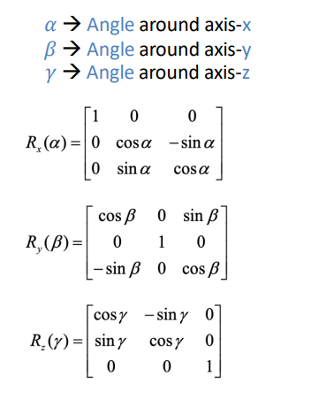

# Computer Vision

## Introduction
+ Low Level Vision
  + Measurements
  + Enhancements
  + Region Segmentation
  + Features
+ Mid Level Vision
  + Reconstruction
  + Depth
  + Motion Estimation
+ High Level Vision
  + Category detection
  + Activity recognition
  + Deep understandings
  + Pose estimation

## Pinhole camera model
+ Pinhole model 小孔成像
  + Captures **pencil** of rays - all rays through a single point
  + the point is called **Center of Projection (focal point)**
  + the image is formed on the Image Plane
+ camera obscura 暗箱
  + image is inverted
  + **depth of the room** is the **focal length**
+ aperture 光圈
  + Aperture size↑: sharpness↓ brightness↑
  + more clear if shrink the aperture
  + too small: less light, diffraction
+ Focal length: from lens(aperture) to sensor(image plain)
  + focal length↓:Object size (shrinking)↓, Field of view (more things fit the image)↑
  + focal length↑:Object size (magnification)↑, Field of view (less things fit the image)↓
+ Projection: world coordinates to image coordinates

## Projection matrix
  + Z: perpendicular to image plain
  + 3D -> 2D: $p = [X, Y, Z]^T -> p'=[f\frac{X}{Z}, f\frac{Y}{Z}]^T$, f:focal length
    + -> virtual image $p_v' = [f\frac{X}{Z}, f\frac{Y}{Z}, -f]^T$

### Homogeneous Coordinates
+ Cartesian Coordinates: 2D: $[X, Y]^T$ 3D: $[X, Y, Z]^T$ 
  + Rotation, Scaling, NOT Translation
+ Homog -> Cartesian: $[X,Y,W] => [X/W, Y/W]$ $[X,Y,Z,W] => [X/W, Y/W, Z/W]$
+ Car -> Homog: $(X,Y) => [X,Y,1]$, $(X,Y,Z) => [X,Y,Z,1]$
+ 2D image rotation: $\begin{bmatrix}  cos(\theta) & -sin(\theta) & 0 \\ sin(\theta) & cos(\theta) & 0 \\ 0 & 0 & 1 \end{bmatrix}$
+ Affine is any combination of translation, scale, rotation and shear:
  + $\begin{bmatrix} a & b & c\\ d & e & f \\ 0 & 0 & 1 \end{bmatrix}$
  + keep straight and ratio, but not angle and length

### 3D→2D Projection Matrix
+ $\bf{x = K[I\text{ }0]X}$
+ $[I\text{ }0]$ Extrinsic Matrix: $[R∣t]$
  + R: Rotation (3*3)
    + R=I: no rotation
    + 3 DoG
    + 
  + t: translation (3*1)
    + t=0: no translation
  + +7 units along the x-asis: t=[-7,0,0]^T
  + 描述相机在世界坐标系中的位置和朝向 Where the camera is
+ K: Intrinsic Matrix, 描述相机成像的内部参数 How the camera project from 3D to 2D
  + $K = \begin{bmatrix} f_x & s & u_0 \\ 0 & f_y & v_0 \\ 0 & 0 & 1 \end{bmatrix}$
  + $f_x, f_y$: focal length: y: vertical x:horizontal
  + $u_0, v_0$: optical/principal point, normally in the middle of projection image
  + $s$  skew
  + Rotation:$K = \begin{bmatrix} 1 & 0 & 0 \\ 0 & cos(\theta) & -sin(\theta) \\ 0 & sin(\theta) & cos(\theta) \end{bmatrix}$

## Image Representation
+ f: X -> Y, X:Pixel coordinates, Y:possible value for each pixel
  + e.g.: binary image Y = {0, 1} 0: dark 1: light
  + Grayscale image: Y = {0, 1, ... , 255}
+ Quantization level: how many bits are used to represent a single pixel (1-bit: black and white)
+ Spatial Resolution: the number of pixels composing the image

## Color
+ Four main factors influence image intensity values
  + Illumination
  + Geometry
  + Reflection
  + Camera (view & optics)

+ What makes for an image?
  + Light source
  + Object (s)
  + Observer / Sensor

+ Object Colors
  + Incident light – Illumination
  + Object’s Reflectance

+ Bayer filter
  + Green fills in half of checkerboard
  + Red and Blue: 1/4

+ Light-Sensitive Cells
  + Cones 6-7 million
    + Sense Colors
    + 3 types: 64% red, 32% green, 2% blue
  + Rods 120 million
    +  Sense B/W brightness in low illumination
    +  1000X more light-sensitive tha
 +  Averted vision 边缘有更多的rod
    +  Peripheral vision-areas on retina have more rod cells that are sensitive in low-light conditions

+ **Retina**
  + Photosensors (rods & cones) lie outermost in the retina
  + Ganglion cells (retina’s output  neurons) lie innermost in the retina closest to the lens & front of the eye
    + Responds maximally to light increments @ center (Excitatory + region)
    + light decrements in the surround (Inhibitory - region)
  + receptive fields:
    + Central light: ON-center ↑ / OFF-surround cell↓
    + Surrounded light: ON-center ↓/ OFF-surround cell↑
    + Center: excitement
    + peripheral: inhibition
    + for edge detect
    + have no orientation preference

### Calculations
+ Intensity: $I = \frac{X+Y+Z}{3}$
+ Chromaticity values: $x = \frac{X}{X+Y+Z}, y = \frac{Y}{X+Y+Z}, z = \frac{Z}{X+Y+Z}$
+ HUE:
  + Point out on CIE graph
  + Connect S(sunlight) and A (given point)
  + find the cross point to CIE graph
+ Saturation:
  + 哪个点更靠近光谱边界，就更“纯”，饱和度大
  + 哪个点更靠近白点，就更“灰”，饱和度小
+ Colors produced through the mixture of S and A: the line between S and A

## Color System
+ RGB color drawbacks
  +  Strongly correlated channels
  +  Perceptually non-meaningful
+ HSV Color Space
  + Hue, Saturation, Value
    + Higher Saturation → More intense colors
    + Higher Value → Brighter colors
    + Change Hue → Change Colors
+ chromaticity diagram 
  + with wavelengths in nanometers
  + e colors depicted depend on the color space of the device on which the image is viewed
+ sRGB Primaries
  + Not all colors can be represented with RGB
+ Monitor / Printer / Scanner Gamut
  + gamut: a triangle
  + All colors a device generates are positive linear combinations from 3 light sources
  + 3 light sources are the triangle’s vertices
