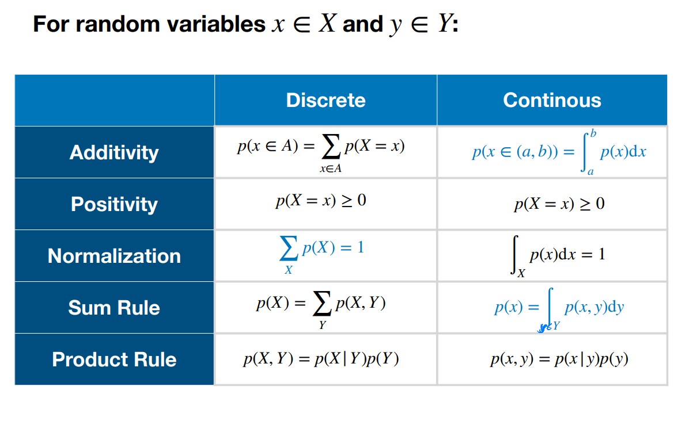

# Intro to Machine Learning, Probability Theory, Linear Regression

## Machine Learning
### What is machine learning
+ E - experience
+ T - tasks (classification, regression, clustering)
+ P - performance measure

### Supervised learning
+ Dataset: 
  + features: $\{\mathbf{x_1, ..., x_N}\}$
  + targets: $\{t_1, ..., t_N\}$
+ Task: Find function $f$ such that $f(\mathbf{x} \approx t)$ or all known and unknown pairs $(\mathbf{x},t)$

### Unsupervised learning Unsupervised 
+ clustering

### Other types of learning
+ Semi-supervised learning
  + data points: $\{x_1, ..., x_k, x_{k+1}, ..., x_N\}$
  + targets: $\{t_1, ..., t_k\}$
  + Not all data points have a known target/label
  + Use all data, also those with unknown target, to create predictor
+ Reinforcement Learning

## Probability theory
+ Frequentist interpretation (data-driven)
  + Probability of event: fraction of times event occurs in experiment
+ Bayesian approach (model-driven)
  + Probability: quantification of plausibility or the strength of the belief of an event

### Random variables
+ Stochastic variable sampled from a set of possible outcomes
+ Discrete or continuous
+ Probability distribution p(X)
+ e.g.: flipping a coin: X = {head, tail}

#### Two discrete random variables
+ N trials: sample both X and Y.
+ Joint probability: $p(X = x_i, Y = y_i) = \frac{n_{ij}}{N}$
+ Marginal probability: let $c_i = \sum^n_{j=1}$ then $p(X=x_i)$
+ Sum rule: $p(X = x_i) = \sum_j p(X=x_i, Y=y_j)$
+ Conditional probability: $p(Y=y_i|X=x_i) = \frac{n_{ij}}{c_i}$
+ Product rule $p(X=x_i, Y=y_i) = \frac{n_{ij}}{N} = p(Y=y_j|X=x_i)p(X=x_i)$

#### Continuous Random Variables
+ Probability of $x \in \mathbb{R}$ falling in the interval $(x, x+dx)$ is given by $p(x)dx$
+ $p(x)$: probability density over x
+ Probability over finite interval $p(x \in (a,b)) = \int^b_a p(x)dx$
+ positivity: $p(x) \geq 0$
+ Normalization: $x \in \mathbb{R} = \int^{\infin}_{-\infin}p(x)dx = 1$
+ Change of variables $x = g(y)$, probabilities in $(x, x+dx)$ must be transformed to $(y,y+dy)$
  + $p_x(x)dx = p_y(y)dy$
+ Cumulative distribution: $P(x) = p(X \leq x) = \int^\infin_{-\infin} p(x)dx$

## Bayes Theorem
+ Product rule: $p(x,y) = p(x|y)p(y)$
+ Symmetry property: $p(x,y) = p(y,x)$
+ Bayes rule: $p(y|x) = \frac{p(x|y)p(y)}{p(x)}$
  + $p(x) = \sum_y p(x,y) = \sum_y p(x|y)p(y)$ (refers to [Law of total probability](../../../ProSta/Lec2.md))

# probability + independent random variables
## Expectations
+ For discrete：  
  + $E(X) = \sum^{\infin}_{j=1} x_j P(X=x_j)$  
  + $E(X) = \sum^{\infin}_{k=1} x_kp_k$  
+ For continuous： 
  + $E(X) = \int_{-\infin}^{\infin}xf(x)dx$  
+ For N points drawn from p(X): $\mathbb{E}[f] \approx \frac{1}{N} \sum^n_{n=1} f(x_n)$
+ Conditional expectation: 
  + $\mathbb{E}[f|y] = \mathbb{E}_{x \sim p(X|Y+y)}[f(x)]$
    + discrete: $=\sum_{x \in X} f(x)p(x|y)$
    + continuous: $\int f(x)p(x|y)dx$
  
## Variance
+ The expected quadratic distance between f and its mean $\mathbb{E}[f]$
  + $Var(X) = E(X - EX)^2$
  + $Var(X) = E(X^2)-(EX)^2$
  + X -> $f(x)$
+ $cov[x] := cov[x, x]$
+ $cov[x,y] = 0$ between independent variables

## Normal distribution
+ PDF: $N(x|\mu ,\sigma^2) = \frac{1}{\sqrt{2\pi \sigma^2}}e^{-(x-\mu)^2/2 \sigma^2}$  
+ If $Z \sim N(0,1)$, then $X = \mu + \sigma Z$ is said to have the Normal distribution with mean $\mu$ and variance $\sigma$, for any real $\mu$ and $\sigma^2$ with $\sigma >0$. 
+ $X \sim N (\mu,\sigma^2)$.

#### Properties:
$E(\mu+\sigma Z) = E(\mu) + \sigma E(Z) = \mu$  
$Var(\mu + \sigma Z) = Var(\sigma Z) = \sigma^2Var(Z) = \sigma^2$  

## Maximum Likelihood Principle
+ Dataset $D = \{(x_1,t_1), (x_2, t_2)...\}$ of N independent observations
+ $D \sim p(D|\mathbf{w})$: D as a random variable, distributed to a model with parameters **w**
  + **likelihood**: $p(D|\mathbf{w})$
+ **Maximum likelihood principle**: 
  + likelihood function: $L(\mathbf{w}) = p(D|\mathbf{w})$
  + the most likely explanation of D is given by model parameters $\mathbf{w_{ML}}$ which maximizes the likelihood function
  + assume $x_i \in D$ are i.i.d, $p(D|\mathbf{w}) = \prod^N_{i=1} p(x_i|\mathbf{w})$
  + $\mathbf{w_{ML}} = \argmax_w p(D|\mathbf{w}) =\argmax_w \prod^N_{i=1} p(x_i|\mathbf{w})$
  + argmax: 在这个参数下方程达到最大值
### Problem: numerical underflow/overflow
+ Maximize: $\mathbf{w_{ML}} = \argmax_w \log \prod^N_{i=1} p(x_i|\mathbf{w})$
+ or Minimize negative log-likelihood function: $E(D|\mathbf{w}) = -log p(D|\mathbf{w})$