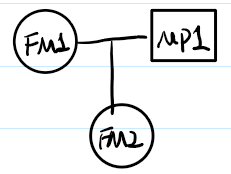
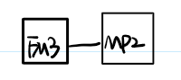
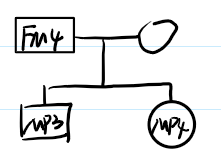
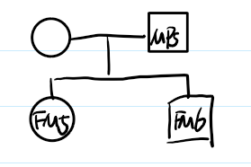
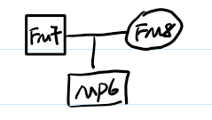

# DVI assignment
Ankie Fan, 15369048
Excel Sheet 11, UI 3&6

## Screen tests:
Female: FM1, FM2, FM5, FM8, MP4, UI5
Male: FM3, FM4, FM6, FM7, MP 1,2,3,5,6

MP1: UI as parent/father of FM2
MP2: UI as sibling/brother of FM3
MP3: UI as child/son of FM4
MP4: UI as child/daughter of FM4
MP5: UI as parent/father of FM5 and FM6
MP6: UI as child/son of FM7 and FM8

According to gender, UI5 could only be MP4.

## Kinship tree and DNA-profiles compare:
### MP1: husband of FM1 and father of FM2

This UI, together with FM1, should produce FM2 at every locus. At many loci, FM2 has one allele that FM1 cannot provide. That allele must come from the father.

FM1: D3 15,18; vWA 14,17; D16 11,13; D2 23,24; D8 13,14; D21 29,30; D18 13,15; D19 14,15; THO 9,9.3; FGA 24,25
FM2: D3 18,18; vWA 14,19; D16 11,12; D2 19,24; D8 13,13; D21 30,30; D18 13,17; D19 14,15; THO 8,9; FGA 25,26
Candidate UI = UI1, UI2, UI3, UI4, UI6 (UI5 excluded immediately because female)

#### For vWA: 
FM1 = 14,17; FM2 = 14,19;
FM1 can provide 14 but not 19. So the father must have allele 19.
So we can exclude:
+ UI2 = 15,17
+ UI3 = 14,18
+ UI4 = 16,18

#### For D16S539:
FM1 = 11,13; FM2 = 11,12
Father must have 12. Exclude: UI1 = 10,11
So we have only **UI6** remains.

#### Check the remaining loci:
+ D3S1358: FM1 15,18 + UI6 16,18 can produce FM2 18,18
+ D2S1338: FM1 23,24 + UI6 17,19 can produce FM2 19,24
+ D8S1179: FM1 13,14 + UI6 12,13 can produce FM2 13,13
+ D21: FM1 29,30 + UI6 29,30 can produce FM2 30,30
+ D18S51: FM1 13,15 + UI6 17,20 can produce FM2 13,17
+ THO: FM1 9,9.3 + UI6 8,8 can produce FM2 8,9
+ FGA: FM1 24,25 + UI6 21,26 can produce FM2 25,26

#### Conclusion: UI6 is MP1, the husband of FM1 and the father of FM2.

### MP2: brother of FM3

This is the weakest pedigree for direct manual comparison because only one sibling is typed. A full sibling of FM3 does not have to share an allele at every locus. Full siblings can share: 2/1/0 alleles IBD. Will discuss later in the end of this part.

### MP3: son of FM4

#### Exclusions:
+ vWA: FM4 = 16,17. UI1 = 19,20; UI3 = 14,18; UI6 = 18,19. None shares a paternal allele with FM4 here, so all three are excluded
+ D2S1338: UI4 = 19,26 does not share 23 or 25 with FM4, so UI4 is excluded.
+ All other locus are possible for UI2.

#### Conclusion: UI2 is MP3, the son of FM4.

### MP4: daughter of FM4

Only UI5 is female, and UI5 shares one allele with FM4 at every locus. 
#### Conclusion: UI5 is MP4, the daughter of FM4.

### MP5: father of FM5 and FM6

The candidate father must be able to sire both FM5 and FM6 with one and the same unknown mother. 

#### Exclusions:
+ D3S1358: Both children are 15,15, so the father must carry 15. UI2 = 16,18; UI3 = 18,18; UI6 = 16,18 are excluded
+ vWA: Children: FM5 = 15,19; FM6 = 18,19. UI4 = 16,18: 16 cannot from FM5 or FM6 so excluded.
+ All other locus are possible for UI1.

#### Conclusion: UI1 is MP5, the father of FM5 and FM6.

### MP6: son of FM7 and FM8

This is the strongest pedigree because both parents are known. At each locus, the child must be explainable by one allele from FM7 and one allele from FM8.

#### Exclusions:
+ D3S1358: FM7 = 18,18 and FM8 = 18,18. UI1 = 15,18; UI2 = 16,18; UI4 = 15,18; UI6 = 16,18 are all excluded
+ All other locus are possible for UI3.

#### Conclusion: UI3 is MP6, the son of FM7 and FM8.

### MP2: brother of FM3
After those assignments, the only UI left is UI4, so UI4 becomes the putative identification for MP2 by elimination.
#### Conclusion: UI4 is MP2, the brother of FM3.

### Conclusion:
+ MP1 = UI6
+ MP2 = UI4
+ MP3 = UI2
+ MP4 = UI5
+ MP5 = UI1
+ MP6 = UI3

## LR

### UI3: presumed identification as MP6
#### Hypothesis:
+ $H_p$: UI3 is MP6, i.e. the biological son of FM7 and FM8
+ $H_d$: UI3 is an unrelated random person from the population

#### Evidence
The evidence is the joint set of genotypes of FM7, FM8 and UI3.
Under the $H_p$, the numerator is the Mendelian transmission probability of the observed UI3 genotype from the two known parents.
Under the $H_d$, UI3 is unrelated to FM7 and FM8, so the denominator is just the population genotype frequency of the UI3 genotype: homozygote $aa:p^2_a$, or heterozygote $ab:2p_ap_b$

#### Example of how the numerator was obtained
For vWA: FM7 = 14,19; FM8 = 16,18; UI3 = 14,18
To get 14,18, FM7 must pass allele 14 and FM8 must pass allele 18.
Each transmission has probability 1/2, so $P(14,18|14,19 and 16,18) = \frac{1}{2}·\frac{1}{2} = \frac{1}{4}$
For D3S1358 both parents are 18,18, so any true child must be 18,18 with probability 1.

#### Per-locus calculations for UI3

| Locus   | FM7     | FM8   | UI3   | Numerator $P(E_l \mid H_p)$ |                Denominator $P(E_l \mid H_d)$ |      LR |
| ------- | ------- | ----- | ----- | -----------------------: | -------------------------------------------: | ------: |
| D3S1358 | 18,18   | 18,18 | 18,18 | 1 |$p_{18}^2 = 0.167^2 = 0.027889$| 35.8564 |
| vWA     | 14,19   | 16,18 | 14,18 | 1/4 | $2p_{14}p_{18} = 2(0.067)(0.223) = 0.029882$ |  8.3662 |
| D16S539 | 13,13   | 9,12  | 12,13 | 1/2 | $2p_{12}p_{13} = 2(0.279)(0.162) = 0.090396$ |  5.5312 |
| D2S1338 | 20,20   | 20,23 | 20,23 | 1/2 | $2p_{20}p_{23} = 2(0.171)(0.097) = 0.033174$ | 15.0720 |
| D8S1179 | 13,13   | 13,15 | 13,13 | 1/2 | $p_{13}^2 = 0.346^2 = 0.119716$ |  4.1766 |
| D21S11  | 28,32.2 | 30,30 | 28,30 | 1/2 | $2p_{28}p_{30} = 2(0.180)(0.271) = 0.097560$ |  5.1251 |
| D18S51  | 20,21   | 15,16 | 16,20 | 1/4 | $2p_{16}p_{20} = 2(0.152)(0.026) = 0.007904$ | 31.6296 |
| D19S433 | 12,14   | 10,13 | 13,14 | 1/4 | $2p_{13}p_{14} = 2(0.255)(0.359) = 0.183090$ |  1.3654 |
| THO1    | 7,9     | 8,9.3 | 7,9.3 | 1/4 | $2p_{7}p_{9.3} = 2(0.219)(0.307) = 0.134466$ |  1.8592 |
| FGA  | 21,24   | 22,24 | 21,24 | 1/4 | $2p_{21}p_{24} = 2(0.177)(0.158) = 0.055932$ |  4.4697 |

#### Combined LR for UI3
$LR_{UI3} = \prod LR_l \approx 1.92124\times10^8$

**Conclusion**: the DNA findings are about $1.92124\times10^8$ times more probable if UI3 is the son of FM7 and FM8 than if UI3 is an unrelated random person.

### UI6: presumed identification as MP1

#### Hypothesis:
+ $H_p$: UI6 is MP1, i.e. the biological father of FM2 (with FM1 as the known mother)
+ $H_d$: UI6 is an unrelated random man; FM2’s true father is an unknown unrelated man

#### Example of how the denominator was obtained
For vWA: FM1 = 14,17; FM2 = 14,19.
FM1 can provide allele 14, but not 19, so a random true father must provide allele 19.
FM1 passes 14 with probability 1/2, and a random father transmits allele 19 with probability $p_19=0.110$. Thus $P(14,19∣FM1 and random father)=1/2⋅0.110=0.055$

For D19S433, FM2 = 14,15 and FM1 = 14,15, so the mother could pass either 14 or 15: mother passes 14 and random father passes 15, or mother passes 15 and random father passes 14. Thus $P(14,15∣FM1 and random father)= \frac{1}{2}p_15 + \frac{1}{2}p_14 = 0.5·0.165+0.5·0.359 = 0.262$

#### Per-locus calculations for UI6
| Locus   | FM1   | UI6   | FM2   | Numerator $P(E_l \mid H_p)$ | Denominator $P(E_l \mid H_d)$ |      LR |
| ------- | ----- | ----- | ----- | --------------------: | -------------------: | ------: |
| D3S1358 | 15,18 | 16,18 | 18,18 | 1/4 | $(1/2)p_{18} = (1/2)(0.167) = 0.0835$ |  2.9940 |
| vWA     | 14,17 | 18,19 | 14,19 | 1/4 | $(1/2)p_{19} = (1/2)(0.110) = 0.0550$ |  4.5455 |
| D16S539 | 11,13 | 12,13 | 11,12 | 1/4 | $(1/2)p_{12} = (1/2)(0.279) = 0.1395$ |  1.7921 |
| D2S1338 | 23,24 | 17,19 | 19,24 | 1/4 | $(1/2)p_{19} = (1/2)(0.128) = 0.0640$ |  3.9063 |
| D8S1179 | 13,14 | 12,13 | 13,13 | 1/4 | $(1/2)p_{13} = 0.1730$ |  1.4451 |
| D21S11  | 29,30 | 29,30 | 30,30 | 1/4 | $(1/2)p_{30} = 0.1355$ |  1.8450 |
| D18S51  | 13,15 | 17,20 | 13,17 | 1/4 | $(1/2)p_{17} = (1/2)(0.141) = 0.0705$ |  3.5461 |
| D19S433 | 14,15 | 13,15 | 14,15 | 1/4 | $(1/2)p_{15} + (1/2)p_{14} = (0.5)(0.165) + (0.5)(0.359) = 0.2620$ |  0.9542 |
| THO1    | 9,9.3 | 8,8   | 8,9   | 1/2 | $(1/2)p_{8} = (1/2)(0.104) = 0.0520$ |  9.6154 |
| FGA     | 24,25 | 21,26 | 25,26 | 1/4 | $(1/2)p_{26} = (1/2)(0.028) = 0.0140$ | 17.8571 |

#### Combine LR and conclusion

$LR_{UI6} = \prod LR_l \approx 1.47577\times10^5$

**Conclusion**: the DNA findings are about $1.47577\times10^5$ times more probable if UI6 is the biological father of FM2 than if FM2’s father were an unrelated random man.
